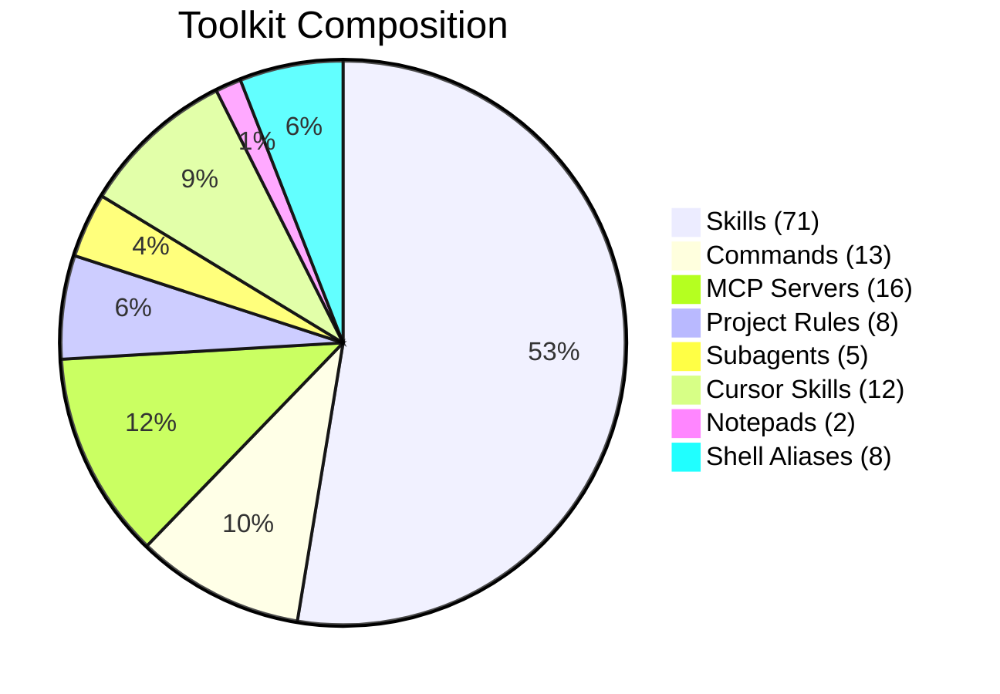
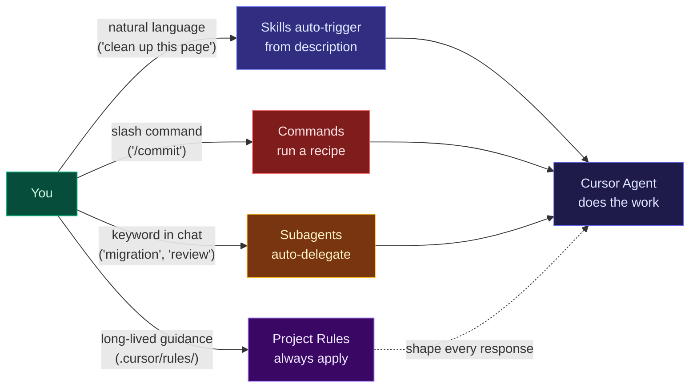
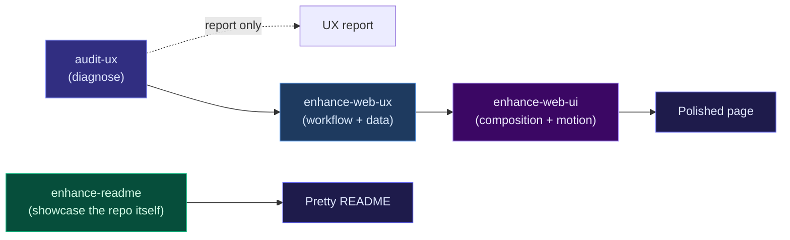
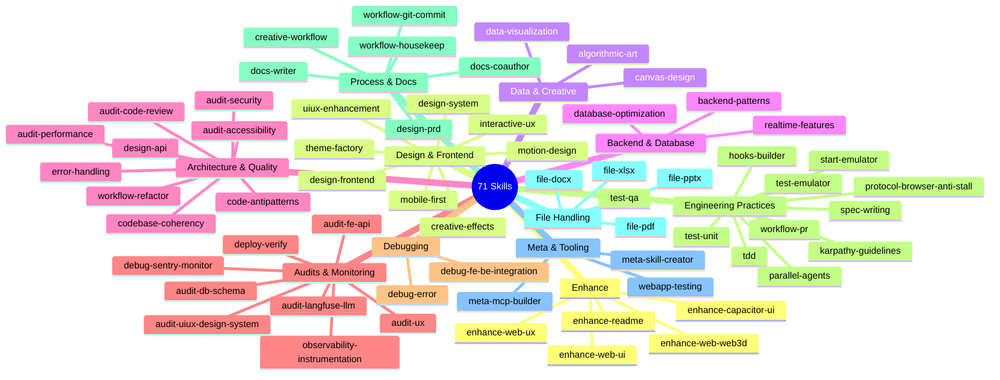
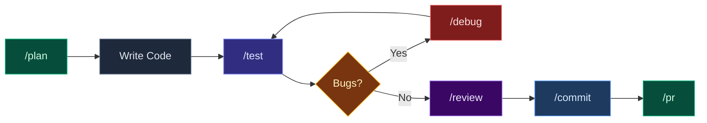
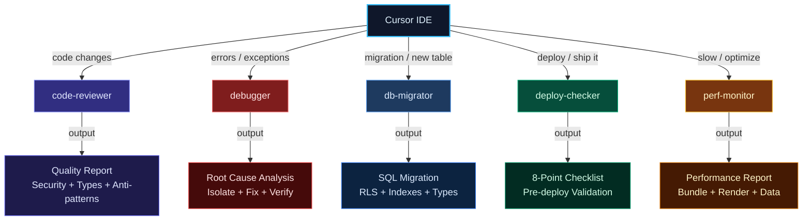
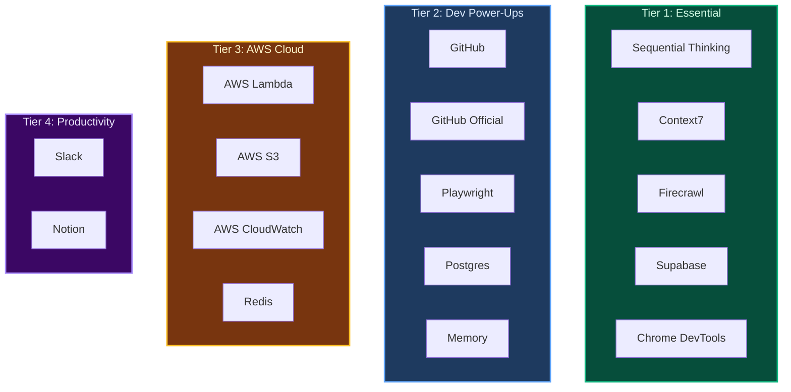
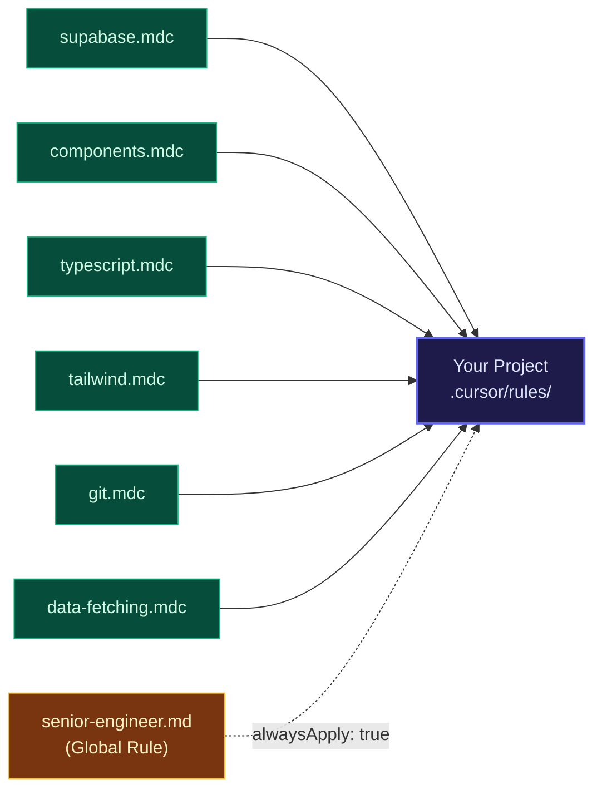
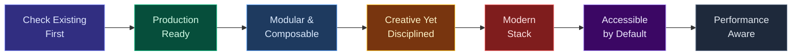

<p align="center">
  
</p>

<h1 align="center">cursor-kenji</h1>

<p align="center">
  <strong>A curated toolkit of Cursor AI Agent Skills, Commands, MCP configs, Subagents, and Rules</strong><br/>
  <em>Designed for modern full-stack development with React, Next.js, Supabase, and Tailwind</em>
</p>

<p align="center">
  <a href="#quick-start"></a>
  <a href="#how-to-use-this-toolkit"></a>
  <a href="#skills-71"></a>
  <a href="#subagents-5"></a>
  <a href="#commands-13"></a>
  <a href="#mcp-servers-16"></a>
  <a href="#project-rules-starter-pack"></a>
</p>

<p align="center">
  
  
  
  
  
  
</p>

---

> **Living repository** — skills evolve with the ecosystem. Every update is versioned.

---

## How It All Fits Together


---

## What's New in 2026

> Based on [Cursor's official agent best practices](https://cursor.com/blog/agent-best-practices) and the latest Cursor features (Jan-May 2026).

### May 2026 — PDCA Browser Testing & npm Release <sup>Latest</sup>

> *Two generic skills that close loops agents habitually skip — the post-implementation "did you actually drive it as a user?" check, and the end-to-end npm release chain.*

| Addition | Type | Why It Matters |
|:---------|:-----|:---------------|
| `test-playwright` | Skill | Closes the PDCA loop after you ship a change. Scopes to the current session's diff + blast radius, drives the live localhost app through the Playwright MCP **manually like a real user**, and **fixes** pain points/errors as it goes (full-stack: UI/UX + API + DB), using Sentry/Supabase/Firecrawl. Red-teams the work and suggests enhancements. Distinct from `test-qa` (full-app crawl that only reports) |
| `deploy-npm` | Skill | End-to-end release workflow for a Changesets + GitHub Actions + npm Trusted Publisher (OIDC) monorepo — green CI → merge release PR → resolve the `github-actions[bot]` anti-loop → dispatch publish → verify on npm and GitHub Releases |

### May 2026 — Native RN Loop & Cross-Surface UI

> *Two skills + two rules from real RN/Capacitor + Supabase shipping sessions — the "no-Mac dev loop" and the "looks great on web, atrocious on phone" patterns.*

| Addition | Type | Why It Matters |
|:---------|:-----|:---------------|
| `start-emulator` | Skill | Boots Metro + Android emulator in the right order — kills duplicate ports, picks fresh-cache vs fast-iteration, defaults to 1080×4000 for tall QA screenshots, polls `/status` before deeplink to avoid "Cannot connect to Expo CLI" races. Pairs with `test-emulator` |
| `enhance-capacitor-ui` | Skill | Architecture skill for hybrid web/iOS/Android apps (Capacitor / Tauri / Expo Web / Ionic). Establishes three orthogonal axes — form factor, platform, pointer capability — so a UIUX sweep on one surface cannot silently degrade another. Catches axis conflation, viewport-as-form-factor abuse, hover-only affordances on touch shells |
| `full-stack-ship-discipline.mdc` | Rule | `alwaysApply: true` — prevents the "local migration file never deployed" failure mode. Forces UI tasks to inventory backend deps (schema, RPC, RLS, edge functions) in the same chat, deploy via Supabase MCP, and verify against the remote DB |
| `shell-first-search.md` | Rule | Workspace-wide rule routing routine search to `Shell` (`grep`/`find`/`ls`) instead of the `Grep`/`Glob` tools, which have hung for minutes on this Windows host. Keeps `SemanticSearch` and `Read` as the correct tools for their use cases |

### May 2026 — Housekeep & Direct-Tone Pass

> *Library housekeep aligning with Cursor's official skill spec and direct-tone description guidance.*

| Change | Type | Why It Matters |
|:-------|:-----|:---------------|
| 11 skills renamed | Skill | `name:` frontmatter now matches folder names per Cursor spec — auto-loader was silently failing on `accessibility-audit`, `code-review`, `performance-audit`, `security-audit`, `api-design`, `frontend-design`, `doc-coauthoring`, `mcp-builder`, `skill-creator`, `git-workflow`, `refactoring` |
| 22 descriptions tightened | Skill | Verbose `description: >` blocks (some 280+ words) reduced to direct-tone single-sentence WHAT + concrete trigger list, matching Cursor's canonical example pattern |
| 9 commands demoted to pointers | Command | `/commit`, `/debug`, `/pr`, `/readme`, `/refactor`, `/review`, `/test`, `/uiux`, `/update-deps` now point to their skill equivalents instead of duplicating the playbook. Skills handle natural language; commands handle explicit slash invocation |
| `audit-ux` cross-reference | Skill | Fixed broken pointer (`audit-ui-design-system` → `audit-uiux-design-system`) |

### Jun 2026 — Anti-Vibe-Coding Spine + Platform Depth

> *Skills that attack LLM code-correctness (not just visual slop) across web / RN / Capacitor / backend. Researched against the 2026 ecosystem ([awesome-claude-skills](https://github.com/ComposioHQ/awesome-claude-skills), [obra/superpowers](https://github.com/obra/superpowers), [cap-go/capgo-skills](https://github.com/cap-go/capgo-skills), [callstack/agent-skills](https://github.com/callstackincubator/agent-skills)). Observability instrumentation grounded in the 2026 [OpenTelemetry GenAI semantic conventions](https://opentelemetry.io/docs/specs/semconv/gen-ai/).*

| Addition | Type | Why It Matters |
|:---------|:-----|:---------------|
| `workflow-spec-tdd` | Skill | The anti-vibe-coding spine — brainstorm → spec → plan → RED/GREEN/REFACTOR TDD → self-review before "done". Stack-agnostic; operationalizes `karpathy-guidelines`. Adapted from [obra/superpowers](https://github.com/obra/superpowers) |
| `capacitor-platform` | Skill | Capacitor platform + pipeline depth (plugins, OTA, deep links, push, native build CI, store submission + Apple preflight, security scan, migrations). Complements `enhance-capacitor-ui`. Distilled from [cap-go/capgo-skills](https://github.com/cap-go/capgo-skills) |
| `rn-performance` | Skill | React Native perf/build/upgrade depth (FPS, Hermes, TTI, bundle size, FlashList, Reanimated, Turbo Modules, 16KB alignment, version upgrades). Complements `enhance-rn-screen`. Distilled from [callstack/agent-skills](https://github.com/callstackincubator/agent-skills) |
| `data-pipeline` | Skill | Build-time data-pipeline correctness — idempotency, atomic writes, data contracts, 4-layer staging, windowed backfills, dead-letter, observability. For ETL / edge-function workers / `pg_cron` / queues. Complements the Supabase plugin + `sbc-qa-data-integrity-audit` |
| `observability-instrumentation` | Skill | Build-time observability + logging discipline — correlate error ↔ trace ↔ log via a shared id, structured leveled logs, PII/secret redaction, OTel span design + sampling, LLM trace capture, alert/SLO design. Vendor-neutral (Sentry + Langfuse + OTel). Complements the Sentry/Langfuse plugins, `debug-sentry-monitor`, `audit-langfuse-llm` |

### Jun 2026 — Enhance Family Coherence + Taste/Redesign Skills

> *Adapted anti-slop skills from [Leonxlnx/taste-skill](https://github.com/Leonxlnx/taste-skill), then renamed the whole `enhance-*` family to a surface-first convention so you reach for the right one by surface (web / RN / Capacitor).*

| Addition | Type | Why It Matters |
|:---------|:-----|:---------------|
| `enhance-web-landing` | Skill | Anti-slop frontend for landing pages, portfolios, and marketing sites — brief inference, variance/motion/density dials, real design systems when applicable |
| `enhance-web-redesign` | Skill | Audit-first upgrade of existing sites — 60-second AI-tell triage, then scan/diagnose/fix generic AI patterns without breaking functionality |
| `enhance-web-web3d` | Skill | Audit-first 3D/WebGL + GSAP cinematic-motion elevation of an existing web app — fit check, minimal-stack decision matrix (Three.js / R3F + ScrollTrigger + Motion / React Spring), then ships with a performance budget, mobile + no-WebGL fallbacks, reduced-motion, and SSR/hydration safety. Generalized from `web3d-integration-patterns` ([freshtechbro/claudedesignskills](https://github.com/freshtechbro/claudedesignskills)) |
| Family renamed | Skill | `enhance-page-ui`→`enhance-web-ui`, `enhance-page-ux`→`enhance-web-ux`, `enhance-screen-rn`→`enhance-rn-screen`, `enhance-web-mobile-ui`→`enhance-capacitor-ui`. New `enhance-<surface>-<aspect>` convention + a surface-router block added to every enhance skill |

### Apr 2026 — The Enhance Family

> *Generic, research-grounded skills that turn AI-templated screens into hand-crafted ones, applicable to any web stack.*

| Addition | Type | Why It Matters |
|:---------|:-----|:---------------|
| `enhance-web-ui` | Skill | Composition over decoration — fix hierarchy, grouping, spacing, motion before adding visual flourish. NN/g visual hierarchy + Laws of UX grounded |
| `enhance-web-ux` | Skill | Replace generic "stacked" UI with semantic data — every change cites a Nielsen heuristic, uses existing primitives, verified at 3 viewports via browser MCP |
| `enhance-readme` | Skill | Theme-aware hero + tour grid + animated GIF — turns plain READMEs into showcases via Playwright MCP screenshot capture |
| `audit-ux` | Skill | Deep UX audit grounded in NN/g 10 heuristics, Laws of UX, Intuit Content Design, and Google HEART — generic across any webapp |
| `split-to-prs` | Cursor Skill | Slice a single chat / branch / PR into small reviewable PRs with safe snapshot, no destructive git ops |
| Updated `canvas` | Cursor Skill | Live React canvas SDK — refreshed primitives, better SDK type hints, additional design guidance |
| Updated `/commit` | Command | Lint, Sentry pre-check, build verify, auto-detect scope, conventional commit, push — full pre-commit pipeline |
| Updated `/research` | Command | Three-phase Firecrawl deep research with gap analysis, fallback to WebSearch, sequential thinking for complex changes |
| Updated `/readme` | Command | End-of-session doc sync — detect convention, smart change detection, stale reference cleanup |
| Updated `/review`, `/fix-issue`, `/update-deps` | Commands | More thorough, safer, more actionable |

### Earlier 2026

| Addition | Type | Why It Matters |
|:---------|:-----|:---------------|
| `hooks-builder` | Skill | Cursor Hooks — auto-format on edit, block dangerous commands, scan for secrets, create agent loop automation |
| `tdd` | Skill | TDD is Cursor's #1 recommended agent pattern — tests give agents a clear, verifiable goal |
| `spec-writing` | Skill | Writing good specs is the highest-leverage 2026 AI skill — vague prompts produce vague code |
| `parallel-agents` | Skill | Worktrees + cloud agents + multi-model comparison — delegate and compare in parallel |
| `audit-code-review` | Skill | Agent Review + BugBot + manual checklist for thorough pre-merge review |
| 20 new skills | Skill | Audits, debugging, deploy verification, file handling, PRD generation, QA testing, housekeeping, and more |
| 6 new cursor-skills | Cursor | babysit, canvas, create-hook, shell, statusline, update-cli-config |
| `/plan` | Command | Plan Mode (`Shift+Tab`) — Cursor's #1 recommendation: plan before coding |
| `/pr` | Command | Checks pass -> commit -> push -> open PR with description, one workflow |
| `/debug` | Command | Debug Mode — hypothesis-driven, instruments code, pinpoints root cause |

---

## What's Inside



<table>
<tr>
<td width="50%">

### Core

| | Count | Description |
|-|-------|-------------|
|| **Skills** | 71 | AI agent capabilities |
|| **Cursor Skills** | 12 | IDE-specific tools |
|| **Commands** | 13 | Slash commands |
|| **Subagents** | 5 | Autonomous AI agents |

</td>
<td width="50%">

### Configuration

| | Count | Description |
|-|-------|-------------|
|| **MCP Servers** | 16 | External tool integrations |
|| **Project Rules** | 8 | Per-project AI guidance |
|| **Notepads** | 2 | Reusable context templates |
|| **Shell Aliases** | 8 | Terminal productivity |

</td>
</tr>
</table>

<details>
<summary><strong>Full directory tree</strong></summary>

```
cursor-kenji/
├── skills/                  # 71 Agent Skills (each has SKILL.md)
│   ├── algorithmic-art/
│   ├── audit-accessibility/
│   ├── audit-code-review/
│   ├── audit-db-schema/
│   ├── audit-fe-api/
│   ├── audit-langfuse-llm/
│   ├── audit-performance/
│   ├── audit-security/
│   ├── audit-uiux-design-system/
│   ├── audit-ux/              # NEW Apr 2026 — NN/g + Laws of UX + HEART audit
│   ├── backend-patterns/
│   ├── canvas-design/
│   ├── code-antipatterns/
│   ├── codebase-coherency/
│   ├── creative-effects/
│   ├── creative-workflow/
│   ├── data-visualization/
│   ├── database-optimization/
│   ├── debug-error/
│   ├── debug-fe-be-integration/
│   ├── debug-sentry-monitor/
│   ├── deploy-npm/           # NEW May 2026 — Changesets + npm OIDC release loop
│   ├── deploy-verify/
│   ├── design-api/
│   ├── design-frontend/
│   ├── design-prd/
│   ├── design-system/
│   ├── docs-coauthor/
│   ├── docs-writer/
│   ├── enhance-capacitor-ui/  # Capacitor/hybrid cross-surface architecture (web+iOS+Android)
│   ├── enhance-readme/        # hero + tour + GIF for any README
│   ├── enhance-rn-screen/     # React Native screen polish (Expo / bare)
│   ├── enhance-web-landing/   # anti-slop landing/portfolio design (taste-skill)
│   ├── enhance-web-redesign/  # audit-first redesign of existing web sites (taste-skill)
│   ├── enhance-web-ui/        # web composition + hierarchy + motion
│   ├── enhance-web-ux/        # web heuristic-grounded UX enhancement
│   ├── enhance-web-web3d/     # audit-first 3D/WebGL + GSAP cinematic motion on existing web
│   ├── error-handling/
│   ├── file-docx/
│   ├── file-pdf/
│   ├── file-pptx/
│   ├── file-xlsx/
│   ├── hooks-builder/
│   ├── interactive-ux/
│   ├── karpathy-guidelines/
│   ├── meta-mcp-builder/
│   ├── meta-skill-creator/
│   ├── mobile-first/
│   ├── motion-design/
│   ├── parallel-agents/
│   ├── protocol-browser-anti-stall/
│   ├── realtime-features/
│   ├── spec-writing/
│   ├── start-emulator/        # NEW May 2026 — Metro + Android emulator bring-up
│   ├── tdd/
│   ├── test-emulator/
│   ├── test-playwright/      # NEW May 2026 — PDCA: drive localhost as a user + fix
│   ├── test-qa/
│   ├── test-unit/
│   ├── theme-factory/
│   ├── uiux-enhancement/
│   ├── webapp-testing/
│   ├── workflow-git-commit/
│   ├── workflow-housekeep/
│   ├── workflow-pr/
│   ├── workflow-refactor/
│   ├── workflow-spec-tdd/    # anti-vibe-coding spine (spec → plan → TDD → review)
│   ├── capacitor-platform/   # Capacitor plugins, OTA, store submission, CI/CD
│   ├── rn-performance/       # React Native perf, bundle, upgrade depth
│   ├── data-pipeline/        # ETL/edge-function/cron correctness (idempotency, staging, backfills)
│   └── observability-instrumentation/  # build-time logging+tracing; error↔trace↔log correlation
├── skills-cursor/           # 12 Cursor-specific Skills
│   ├── babysit/
│   ├── canvas/                # Updated Apr 2026 — refreshed SDK + design rules
│   ├── create-hook/
│   ├── create-rule/
│   ├── create-skill/
│   ├── create-subagent/
│   ├── migrate-to-skills/
│   ├── shell/
│   ├── split-to-prs/          # NEW Apr 2026 — safely slice work into small PRs
│   ├── statusline/
│   ├── update-cli-config/
│   └── update-cursor-settings/
├── commands/                # 13 Slash Commands
│   ├── commit.md
│   ├── debug.md
│   ├── fix-issue.md
│   ├── mcp.md
│   ├── plan.md
│   ├── pr.md
│   ├── readme.md
│   ├── refactor.md
│   ├── research.md
│   ├── review.md
│   ├── test.md
│   ├── uiux.md
│   └── update-deps.md
├── agents/                  # 5 Subagents
│   ├── code-reviewer.md
│   ├── db-migrator.md
│   ├── debugger.md
│   ├── deploy-checker.md
│   └── perf-monitor.md
├── rules/
│   ├── senior-engineer.md           # Global rule — full-stack execution protocol
│   ├── full-stack-ship-discipline.mdc  # NEW May 2026 — alwaysApply, migrations must deploy
│   ├── shell-first-search.md        # NEW May 2026 — route search to Shell, not Grep/Glob
│   ├── project-starter/             # 6 Project rule templates
│   └── native-rn-monorepo/          # RN + Web monorepo, CI-only iOS bundle
│       ├── components.mdc
│       ├── data-fetching.mdc
│       ├── git.mdc
│       ├── supabase.mdc
│       ├── tailwind.mdc
│       └── typescript.mdc
├── notepads/                # Reusable context templates
│   ├── architecture.md
│   └── design-tokens.md
├── shell-aliases/
│   └── cursor-helpers.sh    # 8 shell commands
├── mcp/                     # MCP server configs
│   ├── README.md
│   ├── mcp.json.template      (Essential 5 servers)
│   └── mcp-full.json.template (All 16 servers)
├── docs/
│   ├── CATALOG.md
│   └── CONTRIBUTING.md
├── install.sh               # One-command installer
├── LICENSE
└── README.md
```

</details>

---

## Quick Start

```bash
git clone https://github.com/kensaurus/cursor-kenji.git
cd cursor-kenji
./install.sh
```

<details>
<summary>Or one-liner install</summary>

```bash
curl -sSL https://raw.githubusercontent.com/kensaurus/cursor-kenji/main/install.sh | bash
```

</details>

### What the installer does


**Post-install steps:**
1. Restart Cursor to pick up new skills
2. Edit `~/.cursor/mcp.json` with your API keys
3. Try: `/commit`, `/test`, `/research` in Cursor
4. Source shell helpers: `source ~/cursor-kenji/shell-aliases/cursor-helpers.sh`

---

## How to Use This Toolkit

> *Five primitives, one mental model: **describe** the task → Cursor **auto-selects** a skill, OR **type** a `/command` for a known workflow.*

### The four ways the agent gets help



| Primitive | When | How to invoke | Example |
|:----------|:-----|:--------------|:--------|
| **Skill** | Specific task with a known workflow (audit, enhance, debug, build) | Just describe the task — Cursor matches keywords from skill descriptions | "make `/dashboard` feel less AI-generated" → triggers `enhance-web-ux` |
| **Command** | Repeatable workflow you run often | Type `/<name>` in chat | `/commit`, `/research`, `/pr` |
| **Subagent** | Background autonomous work (review, migrate, deploy) | Mention a trigger keyword — Cursor auto-delegates | "review this PR" → `code-reviewer` |
| **Rule** | Always-on project conventions | Drop `.mdc` into `.cursor/rules/` of any project | `supabase.mdc`, `typescript.mdc` |

### Common daily flows

```mermaid
flowchart TB
  subgraph FEAT["Building a feature"]
    F1["/research <topic>"] --> F2["/plan"]
    F2 --> F3["Code"]
    F3 --> F4["/test"]
    F4 --> F5["/commit"]
    F5 --> F6["/pr"]
  end

  subgraph FIX["Fixing a bug"]
    B1["/debug or /fix-issue #N"] --> B2["Code"]
    B2 --> B3["/review"]
    B3 --> B4["/commit"]
  end

  subgraph POLISH["Polishing UI"]
    P1["audit-ux skill\n(report)"] --> P2["enhance-web-ux skill\n(implement)"]
    P2 --> P3["enhance-web-ui skill\n(visual polish)"]
    P3 --> P4["/commit"]
  end

  subgraph DOCS["Shipping docs"]
    D1["enhance-readme skill"] --> D2["/readme"]
    D2 --> D3["/commit"]
  end

  style FEAT fill:#1e3a5f,stroke:#60a5fa,color:#dbeafe
  style FIX fill:#7f1d1d,stroke:#f87171,color:#fee2e2
  style POLISH fill:#3b0764,stroke:#a78bfa,color:#ede9fe
  style DOCS fill:#064e3b,stroke:#10b981,color:#d1fae5
```



### How to invoke a skill (without overthinking it)

Skills auto-trigger from **trigger phrases in their description** (the `description:` block at the top of every `SKILL.md`). You don't need to remember names — just describe what you want.

| You say | Skill that fires |
|:--------|:-----------------|
| "this page feels AI-generated, fix it" | `enhance-web-ux` |
| "make `/settings` more polished, less crowded" | `enhance-web-ui` |
| "build a landing page that doesn't look like AI slop" | `enhance-web-landing` |
| "redesign this site to feel premium, keep functionality" | `enhance-web-redesign` |
| "polish this React Native screen, it feels clunky on iOS" | `enhance-rn-screen` |
| "my Capacitor app looks great on web but cramped on mobile" | `enhance-capacitor-ui` |
| "build this feature properly" / "this keeps breaking, do it right" | `workflow-spec-tdd` |
| "add push notifications / deep links / ship an OTA update / submit to App Store" | `capacitor-platform` |
| "the RN app is janky / slow to start / bundle is huge / upgrade RN" | `rn-performance` |
| "build an ingestion pipeline / nightly aggregation / this cron double-counts / backfill" | `data-pipeline` |
| "add logging / instrument this / why can't I debug prod / correlate the error to the trace / redact PII from logs" | `observability-instrumentation` |
| "give the README a hero image and screenshots" | `enhance-readme` |
| "audit the UX of the checkout flow" | `audit-ux` |
| "split this branch into smaller PRs" | `split-to-prs` |
| "show me a canvas with these query results" | `canvas` |
| "the agent keeps hanging on browser steps" | `protocol-browser-anti-stall` |

If you want to force a skill, mention it explicitly: *"use `enhance-web-ux` on `/dashboard`"*.

### How the new "Enhance" family works

The three `enhance-*` skills compose like a pipeline — pick the layer that matches what you want changed:



| Want to... | Use |
|:-----------|:----|
| **Get a heuristic-grounded report** (NN/g + Laws of UX + HEART, no code changes) | `audit-ux` |
| **Replace stacked / templated UI with semantic data** that maps to real backend state | `enhance-web-ux` |
| **Refine layout, hierarchy, spacing, motion** of an already-correct page | `enhance-web-ui` |
| **Visually showcase the repo itself** with hero image + tour + animated GIF | `enhance-readme` |

All four are **generic** — they work in any web stack (Next.js, Remix, SvelteKit, Vite + React, etc.) because they rely on browser MCP for live observation and on inventory of existing primitives rather than assumed framework APIs.

### Setting up a new project

1. **Drop project rules** — copy the `.mdc` files into the project's `.cursor/rules/`:

   ```bash
   mkdir -p .cursor/rules
   cp ~/cursor-kenji/rules/project-starter/*.mdc .cursor/rules/
   ```

2. **Add an `AGENTS.md`** at the repo root if you want the agent to follow specific conventions across the whole repo (Cursor reads it automatically).

3. **Verify MCP keys** in `~/.cursor/mcp.json` — Firecrawl, Supabase, GitHub PAT — only what you actually use.

4. **Try one workflow end-to-end**: `/research "current React Server Components patterns"` → `/plan` → code → `/test` → `/commit` → `/pr`. If anything is missing, run `cursor-sync` to refresh.

### Tips for getting the most out of skills

- **Be specific about scope.** "Enhance the page" is vague. "Enhance `/dashboard` so empty cells get folder-aggregate counts and the toolbar buttons stop wrapping at 1024px" gives the agent a concrete target.
- **Let skills cite heuristics.** `audit-ux` and `enhance-web-ux` insist every change names the heuristic it satisfies — review the citation, not just the diff. If the citation is weak, the change probably is too.
- **Stack a slow-then-fast workflow.** `/plan` first (slow, in Plan Mode) → switch to Agent Mode for execution → `/review` before `/commit` → `/pr` at the end.
- **Compose skills.** Run `audit-ux` → review report → run `enhance-web-ux` for the top 3 issues → run `enhance-web-ui` for visual polish → `/commit`. Each skill leaves clear write-up tables for the next one.
- **Don't fight the rules.** Project rules in `.cursor/rules/*.mdc` constrain the agent; if a rule blocks something legitimate, edit the rule rather than ignoring it.
- **Update often.** `cd ~/cursor-kenji && git pull && ./install.sh`.

---

## Skills (71)

<!-- The skill count is derived from skills/*/SKILL.md and enforced by
     scripts/check-skill-count.mjs (pre-commit hook + CI). Don't hand-edit counts;
     run `npm run fix:skills` if they ever drift. -->

### Skill Categories at a Glance



---

### Enhance <sup>New Apr-Jun 2026</sup>

> *Make pages, screens, and READMEs feel hand-crafted. The family follows an `enhance-<surface>-<aspect>` naming convention so you reach for the right one by surface.*

**Surface router — pick by what you're polishing:**

| Your surface | Use |
|:-------------|:----|
| **Web** product page / dashboard (composition, hierarchy, motion) | `enhance-web-ui` |
| **Web** product page (UX heuristics, flows, data wiring) | `enhance-web-ux` |
| **Web** landing / marketing / portfolio (greenfield, anti-slop) | `enhance-web-landing` |
| **Web** existing site upgrade (audit-first, preserve behavior) | `enhance-web-redesign` |
| **Web** 3D / WebGL / cinematic scroll on an existing site (audit-first) | `enhance-web-web3d` |
| **React Native** screen (Expo / bare) | `enhance-rn-screen` |
| **Capacitor / hybrid** app (one web app on iOS + Android) | `enhance-capacitor-ui` → then a web or rn skill |
| Repo **README** showcase | `enhance-readme` |

> Pure native iOS/Android (SwiftUI / Compose, no web layer) is out of scope — use Apple HIG / Material directly.

| Skill | What it Does |
|:------|:-------------|
| `enhance-web-ui` | Composition before decoration — hierarchy, grouping, spacing, motion. Subtract clutter, group related, pin metadata, soften scroll edges. NN/g + Laws of UX grounded |
| `enhance-web-ux` | Replace stacked / templated UI with semantic data wired to real backend state. Every change cites a Nielsen heuristic, uses existing primitives, verified at 1440/1024/800 viewports |
| `enhance-rn-screen` | Polish an existing React Native screen — safe-area, touch targets, keyboard occlusion, JS-thread animation jank, gesture conflicts, FlatList re-render storms. Bare RN + Expo. Pairs with `start-emulator` / `test-emulator` |
| `enhance-readme` | Theme-aware hero (`<picture>` dark/light auto-swap) + tour grid + optional autoplay GIF via Playwright MCP. Works for any repo with a live URL or local dev server |
| `enhance-capacitor-ui` | Cross-surface architecture for hybrid PWA + iOS + Android apps (Capacitor / Tauri / Expo Web / Ionic). Three orthogonal axes (form factor / platform / pointer) + mode tokens + container-query primitives — so polish on one surface can't degrade another |
| `enhance-web-landing` <sup>Jun 2026</sup> | Anti-slop frontend for landing pages, portfolios, and marketing sites — brief inference, variance/motion/density dials, real design systems. Adapted from [Leonxlnx/taste-skill](https://github.com/Leonxlnx/taste-skill) |
| `enhance-web-redesign` <sup>Jun 2026</sup> | Audit-first upgrade of existing sites — 60-second AI-tell triage, then scan/diagnose/fix generic AI patterns without breaking functionality. Adapted from [Leonxlnx/taste-skill](https://github.com/Leonxlnx/taste-skill) + [anti-slop-ui](https://github.com/awaken7050dev/anti-slop-ui) |
| `enhance-web-web3d` <sup>Jun 2026</sup> | Audit-first elevation of an existing web app with 3D + cinematic motion (Three.js / R3F + GSAP ScrollTrigger + Motion / React Spring). Fit check, minimal-stack decision matrix, then ships the effect with a performance budget, mobile + no-WebGL fallbacks, reduced-motion, and SSR/hydration safety. Generalized from `web3d-integration-patterns` in [freshtechbro/claudedesignskills](https://github.com/freshtechbro/claudedesignskills) |

### Design & Frontend

> *Build distinctive, production-grade interfaces*

| Skill | What it Does |
|:------|:-------------|
| `design-frontend` | Production-grade UI avoiding generic AI aesthetics |
| `enhance-web-landing` | Anti-slop landing/portfolio design with brief inference and configurable design dials |
| `enhance-web-redesign` | Audit-first redesign — remove AI slop patterns from existing sites without full rewrites |
| `design-system` | Component libraries, tokens, variants, CVA patterns |
| `motion-design` | Framer Motion, CSS animations, GSAP micro-interactions |
| `creative-effects` | WebGL, Three.js, shaders, particles, Canvas 2D |
| `uiux-enhancement` | Incremental UI/UX improvements and polish |
| `interactive-ux` | Gamification, Easter eggs, delightful interactions |
| `mobile-first` | Touch-optimized, responsive, PWA patterns |
| `capacitor-platform` <sup>New Jun 2026</sup> | Capacitor platform + pipeline — plugins, OTA/live updates, deep links, push, native build CI/CD, App/Play Store submission + Apple preflight, security scan, web→Capacitor migrations. Distilled from [cap-go/capgo-skills](https://github.com/cap-go/capgo-skills) |
| `rn-performance` <sup>New Jun 2026</sup> | React Native perf/build/upgrade — FPS & re-renders, Hermes, TTI, bundle size, FlashList, Reanimated, Turbo Modules, Android 16KB alignment, RN/Expo version upgrades. Distilled from [callstack/agent-skills](https://github.com/callstackincubator/agent-skills) |
| `theme-factory` | Apply cohesive visual themes across artifacts |

### Data & Creative

| Skill | What it Does |
|:------|:-------------|
| `data-visualization` | Recharts, D3.js, sparklines, real-time charts |
| `algorithmic-art` | Generative art, flow fields, L-systems, circle packing |
| `canvas-design` | Museum-quality visual design in `.png` and `.pdf` formats |

### Backend & Database

| Skill | What it Does |
|:------|:-------------|
| `backend-patterns` | Server Actions, tRPC, Edge Functions, caching, jobs |
| `database-optimization` | Indexes, N+1 fixes, RLS performance, query tuning |
| `realtime-features` | WebSocket, Supabase Realtime, SSE, live data |
| `data-pipeline` <sup>New Jun 2026</sup> | Build-time pipeline correctness — idempotency, atomic writes, data contracts, 4-layer staging, windowed backfills, dead-letter, observability. For ETL / edge-function workers / `pg_cron` / queues. Pairs with the Supabase plugin |
| `observability-instrumentation` <sup>New Jun 2026</sup> | Build-time observability + logging — error↔trace↔log correlation via shared id, structured leveled logs, PII/secret redaction, OTel spans + sampling, LLM trace capture, alert/SLO design. Vendor-neutral (Sentry + Langfuse + OTel) |

### Architecture & Quality

| Skill | What it Does |
|:------|:-------------|
| `design-api` | REST conventions, error schemas, pagination, versioning |
| `error-handling` | Error boundaries, Server Action errors, toast patterns |
| `code-antipatterns` | Detect and fix React, TypeScript, state anti-patterns |
| `audit-code-review` | Thorough PR reviews — correctness, security, perf, a11y checklist |
| `codebase-coherency` | Naming, imports, organization consistency audit |
| `workflow-refactor` | Safe, incremental code transformations |
| `audit-performance` | Core Web Vitals, bundle analysis, runtime profiling |
| `audit-security` | OWASP Top 10, auth flows, RLS, secrets management |
| `audit-accessibility` | WCAG 2.1 AA compliance, screen reader, keyboard, ARIA |

### Engineering Practices <sup>New in 2026</sup>

| Skill | What it Does |
|:------|:-------------|
| `workflow-spec-tdd` <sup>New Jun 2026</sup> | The anti-vibe-coding spine — brainstorm → spec → plan → RED/GREEN/REFACTOR TDD → self-review before "done". Stack-agnostic; fires on "build", "implement", "do it properly", "this keeps breaking". Adapted from [obra/superpowers](https://github.com/obra/superpowers) |
| `tdd` | Test-driven development with AI — Red/Green/Refactor, Vitest patterns, agent-compatible TDD workflow |
| `spec-writing` | Write effective specs and briefs so agents produce correct implementations first time |
| `parallel-agents` | Run agents in parallel via git worktrees, cloud agents, and multi-model comparison |
| `hooks-builder` | Build Cursor Agent Hooks — auto-formatters, security gates, secret scanners, loop automation |
| `karpathy-guidelines` | Behavioral guardrails (Think before coding, Simplicity first, Surgical changes, Goal-driven execution) — distilled from Karpathy's LLM coding pitfalls |

### Process & Documentation

| Skill | What it Does |
|:------|:-------------|
| `workflow-git-commit` | Branching, conventional commits, PRs, releases |
| `docs-coauthor` | Structured co-authoring for specs, PRDs, RFCs |
| `creative-workflow` | End-to-end feature development workflow |

### Audits & Monitoring <sup>New</sup>

> *Deep, MCP-powered audits across the full stack*

| Skill | What it Does |
|:------|:-------------|
| `audit-db-schema` | Database schema audit — naming, types, constraints, indexes, RLS, migrations, security |
| `audit-fe-api` | Frontend API calls vs backend — contract alignment, caching, error handling |
| `audit-langfuse-llm` | PDCA audit for LLM features — traces, prompts, costs, evals, grounding via Langfuse |
| `audit-uiux-design-system` | Visual token compliance vs design system — colors, spacing, components, WCAG |
| `audit-ux` <sup>NEW</sup> | Generic UX audit — NN/g 10 heuristics, Laws of UX, Intuit Content Design, HEART metrics. Stack-agnostic |
| `debug-sentry-monitor` | Sentry issue triage, root cause analysis, noise filtering, architecture audit |
| `deploy-verify` | Post-deploy smoke test — Sentry + Supabase + Langfuse + Playwright, ship-or-rollback verdict |

### Debugging <sup>New</sup>

> *Systematic root cause analysis, not guessing*

| Skill | What it Does |
|:------|:-------------|
| `debug-error` | Systematic debugging workflow — reproduce, isolate, research, fix, verify, prevent |
| `debug-fe-be-integration` | FE/BE integration debug — backend logs, API mismatches, both-side fixes |

### Testing & QA <sup>New</sup>

> *From unit tests to full E2E QA*

| Skill | What it Does |
|:------|:-------------|
| `test-unit` | Auto-detect framework, research patterns, Sentry coverage gaps, write tests |
| `test-qa` | Comprehensive QA via browser MCP — CRUD lifecycle, data pipeline, UX quality audit |
| `test-emulator` | Native build QA on Android emulator — Metro/adb walk + Supabase + Sentry MCPs, three-layer CRUD verification, fixes for white-screen / cache-rehydration / sync-empty-state failure modes |
| `start-emulator` <sup>NEW May 2026</sup> | Boot Metro + Android emulator in the correct order — kills duplicate ports, fresh-cache vs fast-iteration choice, polls `/status` before deeplink to avoid "Cannot connect to Expo CLI" races. Pairs with `test-emulator` |
| `workflow-pr` | PR lifecycle — validation, monitoring, bot feedback, merge criteria |
| `protocol-browser-anti-stall` | Anti-stall protocol for browser automation — timeouts, retries, evidence gathering |

### Product & Documentation <sup>New</sup>

> *From PRD to production docs*

| Skill | What it Does |
|:------|:-------------|
| `design-prd` | Generate PRDs via structured conversation — competitive research, technical feasibility |
| `docs-writer` | Write READMEs, API docs, architecture docs, code comments |
| `workflow-housekeep` | Full-cycle repo maintenance — README sync, dead file cleanup, dependency updates, config audit |

### File Handling <sup>New</sup>

> *Create and manipulate Office documents and PDFs*

| Skill | What it Does |
|:------|:-------------|
| `file-docx` | Word documents — create, edit, tracked changes, comments, text extraction |
| `file-pdf` | PDF processing — extract text/tables, create, merge/split, forms, OCR |
| `file-pptx` | PowerPoint — create from HTML, edit slides, extract content, visual validation |
| `file-xlsx` | Spreadsheets — formulas, formatting, data analysis, financial model standards |

### Meta & Tooling

| Skill | What it Does |
|:------|:-------------|
| `meta-skill-creator` | Guide for creating new Agent Skills |
| `meta-mcp-builder` | Build MCP servers for LLM tool integration |
| `webapp-testing` | Playwright browser automation and E2E testing |

<details>
<summary><strong>Cursor-Specific Skills (12)</strong></summary>

| Skill | What it Does |
|:------|:-------------|
| `babysit` | Keep a PR merge-ready — triage comments, resolve conflicts, fix CI in a loop |
| `canvas` | Live React canvas beside chat — rich data visualizations, audit reports, interactive tools |
| `create-hook` | Create Cursor hooks — scripts/prompts for before/after agent events |
| `create-rule` | Create `.cursor/rules/` for persistent AI guidance |
| `create-skill` | Create new Agent Skills in `~/.cursor/skills/` |
| `create-subagent` | Create custom subagents in `.cursor/agents/` |
| `migrate-to-skills` | Convert rules/commands to Skills format |
| `shell` | Direct shell execution — run `/shell` commands without interpretation |
| `split-to-prs` <sup>NEW</sup> | Slice one pile of work into small reviewable PRs — safe snapshot, no destructive git ops, approval-gated |
| `statusline` | Configure CLI status line — model, context usage, git info |
| `update-cli-config` | Modify CLI settings — permissions, sandbox, vim mode, display |
| `update-cursor-settings` | Modify Cursor/VSCode settings.json |

</details>

---

## Commands (13)

### Development Workflow



### Coding Workflow

| Command | When | What it Does |
|:--------|:-----|:-------------|
| `/plan` | Before coding | Plan Mode — research codebase, clarify requirements, produce an approved plan before writing code |
| `/commit` | After coding | Fix build errors, lint, type check, commit & push |
| `/pr` | Ready to ship | Checks pass -> commit -> push -> open PR with title and description |
| `/fix-issue [#]` | Bug reports | Fetch GitHub issue -> find relevant code -> implement fix -> open PR |
| `/debug` | Tricky bugs | Hypothesis-driven debugging with runtime instrumentation, not guessing |
| `/review` | Before merge | Agent review pass + manual checklist: correctness, security, performance, accessibility |
| `/test` | Before commit | Run full test suite, verify quality, check coverage targets |
| `/update-deps` | Maintenance | Audit and safely update dependencies one at a time with changelog review |

### Research & Documentation

| Command | When | What it Does |
|:--------|:-----|:-------------|
| `/research` | Before coding | Scrape latest docs, patterns, and solutions via Firecrawl |
| `/readme` | End of session | Sync all READMEs to reflect session changes |
| `/refactor` | Long files | Split into clean, modular architecture without losing any code |
| `/mcp` | Dev workflow | MCP-powered development reference and tool guide |
| `/uiux` | UI review | Enforce design system, fix rogue styling, standardize interactions |

### Bundles

> *Drop-in command + rule bundles for specific project shapes*

| Bundle | Path | What it ships |
|:-------|:-----|:--------------|
| `native-rn-monorepo` | `commands/native-rn-monorepo/`<br/>`rules/native-rn-monorepo/` | 9 commands (`/android-*`, `/ios-ci-*`, `/rn-*`) + 5 rules for an RN + Web monorepo where the dev is on Linux/Windows and iOS verification is CI-only |

```bash
# Install the native-rn-monorepo bundle into a project
mkdir -p <project>/.cursor/{commands,rules}
cp ~/cursor-kenji/commands/native-rn-monorepo/*.md  <project>/.cursor/commands/
cp ~/cursor-kenji/rules/native-rn-monorepo/*.mdc    <project>/.cursor/rules/
```

---

## Subagents (5)

> *Autonomous AI agents that Cursor auto-delegates to based on keywords*



| Agent | Auto-triggers On | What it Does |
|:------|:-----------------|:-------------|
| `code-reviewer` | Code changes, "review" | Quality, security, types, anti-patterns |
| `debugger` | Errors, exceptions | Root cause analysis, isolate, fix, verify |
| `db-migrator` | "migration", "new table" | SQL, RLS policies, indexes, type generation |
| `deploy-checker` | "deploy", "ship it" | 8-check validation pipeline |
| `perf-monitor` | "slow", "optimize" | Bundle, render, data fetching audit |

---

## MCP Servers (16)

> *External tool integrations across 4 tiers — pick what you need*



<table>
<tr>
<td>

**Tier 1: Essential**
| Server | Key? |
|:-------|:-----|
| Sequential Thinking | No |
| Context7 | No |
| Firecrawl | Yes |
| Supabase | Yes |
| Chrome DevTools | No* |

</td>
<td>

**Tier 2: Dev Power-Ups**
| Server | Key? |
|:-------|:-----|
| GitHub | PAT |
| GitHub Official | PAT |
| Playwright | No |
| Postgres | Conn |
| Memory | No |

</td>
</tr>
<tr>
<td>

**Tier 3: AWS Cloud**
| Server | Key? |
|:-------|:-----|
| AWS Lambda | Profile |
| AWS S3 | Profile |
| AWS CloudWatch | Profile |
| Redis | URL |

</td>
<td>

**Tier 4: Productivity**
| Server | Key? |
|:-------|:-----|
| Slack | Bot |
| Notion | Yes |
| | |
| | |

</td>
</tr>
</table>

Two templates included:
- `mcp.json.template` — Essential 5 servers
- `mcp-full.json.template` — All 16 servers

See [`mcp/README.md`](mcp/README.md) for setup guides.

---

## Project Rules Starter Pack

> *Drop into any project's `.cursor/rules/` for instant AI guidance*



| Rule | Enforces |
|:-----|:---------|
| `supabase.mdc` | Typed clients, RLS mandatory, migration patterns |
| `components.mdc` | Reuse primitives, Server Components, a11y |
| `typescript.mdc` | No `any`, Zod validation, ActionResult pattern |
| `tailwind.mdc` | Design tokens, `cn()`, mobile-first, motion prefs |
| `git.mdc` | Conventional commits, branch naming, no secrets |
| `data-fetching.mdc` | TanStack Query, prefetch, query key factories |

Plus three **global rules** that always apply across any project:

| Rule | Enforces |
|:-----|:---------|
| `senior-engineer.md` | Full-stack execution protocol with MCP tool usage |
| `full-stack-ship-discipline.mdc` <sup>NEW May 2026</sup> | Every UI task is full-stack until verified end-to-end — deploy migrations via Supabase MCP in the same chat, verify against the remote DB, not the local file |
| `shell-first-search.md` <sup>NEW May 2026</sup> | Route routine search to `Shell` (`grep`/`find`/`ls`) instead of the `Grep`/`Glob` tools, which can hang for minutes on some Windows hosts. `SemanticSearch` stays for meaning-based queries |

```bash
cp ~/cursor-kenji/rules/project-starter/*.mdc your-project/.cursor/rules/
cp ~/cursor-kenji/rules/{senior-engineer.md,full-stack-ship-discipline.mdc,shell-first-search.md} your-project/.cursor/rules/
```

The `native-rn-monorepo/` bundle is also available for React Native + Web monorepos targeting CI-only iOS — see [`rules/native-rn-monorepo/README.md`](rules/native-rn-monorepo/README.md).

---

## Shell Helpers

```bash
source ~/cursor-kenji/shell-aliases/cursor-helpers.sh
```

| Command | What it Does |
|:--------|:-------------|
| `newskill <name>` | Create a new skill with template |
| `lsskills` | List all installed skills with descriptions |
| `cursor-sync` | Pull latest + reinstall |
| `cursor-dev` | Open Cursor + Chrome DevTools |
| `newrule <name>` | Create a project rule with template |
| `newagent <name>` | Create a subagent with template |
| `gc <type> <msg>` | Conventional commit shortcut |
| `gp` | Push current branch |

---

## Design Principles



| # | Principle |
|---|----------|
| 1 | **Check Existing First** — scan before creating. Never duplicate. |
| 2 | **Production-Ready** — no placeholders. Code that ships. |
| 3 | **Modular & Composable** — skills cross-reference. Mix and match. |
| 4 | **Creative Yet Disciplined** — bold aesthetics, solid engineering. |
| 5 | **Modern Stack** — React 19, Next.js 15+, Tailwind v4, strict TS. |
| 6 | **Accessible by Default** — WCAG 2.1 AA is non-negotiable. |
| 7 | **Performance Aware** — every pattern considers Web Vitals. |

---

## Stack Compatibility

| Technology | Version | Key Features |
|:-----------|:--------|:-------------|
| React | 19+ | Server Components, `use()`, Compiler |
| Next.js | 15+ | App Router, Server Actions, PPR |
| TypeScript | 5+ | Strict mode, no `any` |
| Tailwind CSS | v4 | CSS-first config, `@theme` |
| Supabase | Latest | Auth, RLS, Edge Functions, Realtime |
| TanStack Query | v5 | `queryOptions()`, prefetch, hydration |
| Zustand | v5 | Slices, immer, selective persist |
| Zod | v3 | Input validation, type inference |
| Framer Motion | v11 | Animations, gestures, layout |

---

## Keeping Up to Date

```bash
cd ~/cursor-kenji && git pull && ./install.sh
```

<details>
<summary>Auto-sync via crontab</summary>

```bash
0 9 * * * cd ~/cursor-kenji && git pull origin main && ./install.sh --quiet
```

</details>

---

## Contributing

See [`docs/CONTRIBUTING.md`](docs/CONTRIBUTING.md) for how to add skills, commands, and rules.

See [`docs/CATALOG.md`](docs/CATALOG.md) for the full reference with trigger phrases.

---

<p align="center">
  <strong>MIT License</strong> — Use freely, modify freely, share freely.
</p>

<p align="center">
  <em>Built by <a href="https://github.com/kensaurus">@kensaurus</a>. Enhanced continuously.</em>
</p>
