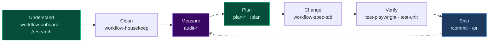

<p align="center">
  
</p>

<h1 align="center">cursor-kenji</h1>

<p align="center">
  <strong>Agent skills, slash commands, and MCP configs for Cursor.</strong><br/>
  90 agent skills · 13 slash commands · 16 MCP servers · 12 Cursor extensions · 5 subagents
</p>

<p align="center">
  <a href="https://www.npmjs.com/package/@kensaurus/cursor-kenji"></a>
  <a href="https://www.npmjs.com/package/@kensaurus/cursor-kenji"></a>
  
  
  <a href="CHANGELOG.md"></a>
  
</p>

---

**cursor-kenji** ships **90 Cursor agent skills**, 13 slash commands, and 5 subagents for React / Next.js / Supabase projects. Install once — describe a task in chat and the matching skill auto-triggers.

```bash
npx skills add kensaurus/cursor-kenji
```

Restart Cursor. Done.

> No Cursor? **[Download Cursor](https://cursor.com)** · No `skills` CLI? `npm install -g skills` first, or use [manual install](#manual-install) below.

---

## Quick Start

| Method | Command |
|:-------|:--------|
| **skills.sh** (recommended) | `npx skills add kensaurus/cursor-kenji` |
| **npm installer** | `npx @kensaurus/cursor-kenji` |
| **Clone** | `git clone … && ./install.sh` |

**npm installer modes:**

```bash
npx @kensaurus/cursor-kenji            # merge — add/overwrite this repo's items
npx @kensaurus/cursor-kenji --clean    # mirror ~/.cursor to match this repo (backup first)
npx @kensaurus/cursor-kenji --dry-run  # preview
npx @kensaurus/cursor-kenji --skill audit-ux   # single skill
npx @kensaurus/cursor-kenji --link     # dev: symlink for live skill authoring
```

From a clone: `npm run install:cursor` · `npm test` validates skills + count + install smoke test.

**Optional — [Mushi Mushi](https://github.com/kensaurus/mushi-mushi)** bug-report triage + AI draft PRs (pairs with `mushi-health`, `test-playwright`):

```bash
npx skills add kensaurus/mushi-mushi
```

**After install:** (1) Restart Cursor (2) Copy `mcp/mcp.json.template` → `~/.cursor/mcp.json`, fill `YOUR_*` keys (3) Describe any task — skills match on keywords.

**Authoring skills?** Each skill must pass [Agent Skills spec](https://agentskills.io/specification) validation (`npm run validate:skills`): `name` matches directory, `description` ≤ 1024 chars, body < 500 lines.

### Manual install

```bash
git clone https://github.com/kensaurus/cursor-kenji.git && cd cursor-kenji && ./install.sh
```

<details>
<summary>One-liner (curl)</summary>

```bash
curl -sSL https://raw.githubusercontent.com/kensaurus/cursor-kenji/main/install.sh | bash
```

</details>

**Keep fresh:** `npx skills add kensaurus/cursor-kenji` or `git pull && ./install.sh`

---

## What's Inside

| | Count | What it does |
|:--|------:|:-------------|
| **Skills** | 90 | Auto-triggering capabilities (audit, enhance, debug, test, build, plan) |
| **Cursor Skills** | 12 | IDE tools (canvas, hooks, rules, PR splitter) |
| **Commands** | 13 | Slash workflows (`/commit`, `/pr`, `/research`) |
| **Subagents** | 5 | Background agents (code-reviewer, debugger, db-migrator…) |
| **MCP Servers** | 16 | Supabase · GitHub · Sentry · Playwright · AWS · Slack |
| **Project Rules** | 9 | Drop-in `.mdc` for `.cursor/rules/` |
| **Notepads** | 2 | Context templates (architecture, design tokens) |
| **Shell Aliases** | 8 | `newskill`, `cursor-sync`, `gc`, `gp` |

Full skill list + trigger phrases → **[docs/CATALOG.md](docs/CATALOG.md)** · Plain lookup → **[docs/TRIGGER-CHEATSHEET.md](docs/TRIGGER-CHEATSHEET.md)**

---

## Workflows

Skills chain: **Understand → Clean → Measure → Plan → Change → Verify → Ship**. Bundled workflows run the full arc; `plan-*` skills audit first — you approve each phase before anything changes.



### Bundled workflows

| Say this | Bundle | What runs |
|----------|--------|-----------|
| "build a feature" | `workflow-build-feature` | spec → TDD → unit → smoke → PR |
| "fix this and ship" | `workflow-fix-and-ship` | debug → fix → regression → PR → deploy |
| "is this ready?" | `workflow-quality-gate` | red-team → security → bundle → perf → unit |
| "prepare for launch" | `workflow-launch-ready` | SEO + PWA + bundle + i18n + quality gate |
| "orient me" | `workflow-onboard` | codebase briefing in ~5 min |

### Plan loops (audit only — approve before execution)

**17 `plan-*` skills** in grouped loops — see **[docs/PLAN-LOOPS.md](docs/PLAN-LOOPS.md)** for diagrams, slash aliases (`/uiux-plan`, `/capacitor-plan`, …), and execution mapping.

| Loop | Skills | When |
|------|--------|------|
| Six-skill | uiux → stub → test-coverage → perf ∥ security → docs-sync | Inherited codebase / UI hardening |
| Pre-launch hardening | input-validation → secrets → RLS → data-integrity → dependency-provenance | Supabase/Stripe, pre-open-source |
| Observability & spend | error-handling + llm-cost-guardrails | LLM features, Sentry/Langfuse gaps |
| Mobile gate | capacitor-hardening → mobile-readiness | Capacitor/hybrid pre-store |
| Growth gate | aeo-readiness | AI citation visibility |

**One-shot (six-skill plan only):**

```
Run the six-skill plan loop — no changes until I approve each phase:
plan-uiux-unification → plan-stub-checker → plan-test-coverage →
plan-perf-audit + plan-security-audit (parallel) → plan-docs-sync.
```

More copy-paste recipes (adopt repo, de-slop a page, pre-launch sweep, split PRs) → **[docs/CATALOG.md#skill-composition-patterns](docs/CATALOG.md#skill-composition-patterns)** · New to Cursor? → **[docs/GETTING-STARTED.md](docs/GETTING-STARTED.md)**

---

## How to Use

| Primitive | Invoke | Example |
|:----------|:-------|:--------|
| **Skill** | Describe the task | "audit my security" → `audit-security` |
| **Command** | `/name` in chat | `/commit`, `/research`, `/pr` |
| **Subagent** | Mention trigger keyword | "review this PR" → `code-reviewer` |
| **Rule** | Copy `.mdc` into project | Always-on conventions |

**Force a skill:** *"use `enhance-web-ux` on `/dashboard`"*

---

## Skill taxonomy

Every skill is `<prefix>-<topic>`. Full entries with triggers → **[docs/CATALOG.md](docs/CATALOG.md)**.

| Prefix | Purpose | Examples |
|:-------|:--------|:---------|
| `audit-` | Read-only assessments | `audit-security`, `audit-performance`, `audit-langfuse-llm` |
| `plan-` | Audit-and-plan burndowns (17 skills) | `plan-stub-checker`, `plan-capacitor-hardening`, `plan-rls-audit` |
| `enhance-` | Improve existing UI/UX/SEO/PWA | `enhance-web-ux`, `enhance-web-ui`, `enhance-pwa` |
| `workflow-` | Process bundles | `workflow-spec-tdd`, `workflow-build-feature`, `workflow-housekeep` |
| `test-` | QA and unit tests | `test-playwright`, `test-red-team`, `test-unit` |
| `debug-` | Failures and integration | `debug-error`, `debug-fe-be-integration` |
| `backend-` | Server patterns | `backend-patterns`, `backend-observability` |
| `mobile-` | RN / Capacitor / emulator | `mobile-rn-screen`, `mobile-capacitor-platform` |
| `design-` | New surfaces | `design-frontend`, `design-prd`, `design-system` |
| `deploy-` | Release verify | `deploy-verify`, `deploy-npm` |
| `docs-` | Documentation | `docs-writer`, `docs-coauthor` |
| `meta-` | Author skills/MCP | `meta-skill-creator`, `meta-mcp-builder` |
| `protocol-` | Session guardrails | `protocol-browser-anti-stall` |
| `mushi-` | Mushi Mushi integration | `mushi-health`, `mushi-integration` |

> **Note:** Anthropic `file-docx/pdf/pptx/xlsx` skills are not in this public repo. Keep personal copies in `~/.cursor/skills/` if needed.

**Cursor-specific skills (12):** `babysit`, `canvas`, `create-hook`, `create-rule`, `create-skill`, `split-to-prs`, … — see [CATALOG.md](docs/CATALOG.md).

---

## Commands (13)

| Command | When | What |
|:--------|:-----|:-----|
| `/plan` | Before coding | Research + approved plan |
| `/commit` | After coding | Lint, typecheck, commit |
| `/pr` | Ready to ship | Push + open PR |
| `/fix-issue [#]` | Bug reports | Issue → fix → PR |
| `/debug` | Tricky bugs | Instrumented debugging |
| `/review` | Before merge | Agent + manual review |
| `/test` | Before commit | Test suite + coverage |
| `/update-deps` | Maintenance | Safe dep updates |
| `/research` | Before coding | Firecrawl doc research |
| `/readme` | End of session | Sync READMEs |
| `/refactor` | Long files | Modular split |
| `/mcp` | MCP workflow | Tool reference |
| `/uiux` | UI review | Design-system enforcement |

**RN monorepo bundle:** copy `commands/native-rn-monorepo/` + `rules/native-rn-monorepo/` into your project (iOS builds on CI, not locally).

---

## Subagents (5)

| Agent | Triggers on | Output |
|:------|:------------|:-------|
| `code-reviewer` | "review", code changes | Quality, security, types |
| `debugger` | Errors, exceptions | Root cause + fix |
| `db-migrator` | "migration", "new table" | SQL, RLS, indexes |
| `deploy-checker` | "deploy", "ship it" | Pre-deploy validation |
| `perf-monitor` | "slow", "optimize" | Perf audit |

---

## MCP servers (16)

```bash
cp ~/cursor-kenji/mcp/mcp.json.template ~/.cursor/mcp.json      # essential 5
cp ~/cursor-kenji/mcp/mcp-full.json.template ~/.cursor/mcp.json  # all 16
```

Replace `YOUR_*` placeholders with real keys. Setup details → **[mcp/README.md](mcp/README.md)**

| Tier | Servers | Keys? |
|:-----|:--------|:------|
| Essential | Sequential Thinking, Context7, Firecrawl, Supabase, Chrome DevTools | Firecrawl + Supabase |
| Dev | GitHub, Playwright, Postgres, Memory | PAT / conn string |
| Cloud | AWS Lambda, S3, CloudWatch, Redis | AWS profile / URL |
| Productivity | Slack, Notion | Bot token / API key |

---

## Project rules

```bash
cp ~/cursor-kenji/rules/project-starter/*.mdc your-project/.cursor/rules/
```

| Rule | Enforces |
|:-----|:---------|
| `supabase.mdc` | Typed clients, RLS, migrations |
| `typescript.mdc` | No `any`, Zod, ActionResult |
| `components.mdc` | Primitives, Server Components, a11y |
| `tailwind.mdc` | Tokens, mobile-first |
| `git.mdc` | Conventional commits, no secrets |

Global rules in this repo: `full-stack-ship-discipline.mdc`, `composer-2.5-execution.mdc`, `skill-workflows.mdc`.

> **Plan with a strong model, execute with Composer 2.5.** The 17 `plan-*` skills are authored/reviewed with a stronger reasoning model; `composer-2.5-execution.mdc` constrains how approved plans are implemented.

**Project constitution:** copy [docs/AGENTS.template.md](docs/AGENTS.template.md) to your app repo as `AGENTS.md` for always-on agent discipline.

---

## Shell helpers

```bash
source ~/cursor-kenji/shell-aliases/cursor-helpers.sh
```

| Command | Action |
|:--------|:-------|
| `newskill <name>` | Skill template |
| `lsskills` | List installed skills |
| `cursor-sync` | Pull + reinstall |
| `gc <type> <msg>` | Conventional commit |

---

## Repository layout

```
cursor-kenji/
├── skills/           # 90 Agent Skills (SKILL.md each)
├── skills-cursor/    # 12 Cursor-specific skills
├── commands/         # 13 slash commands
├── agents/           # 5 subagents
├── rules/            # Global + project-starter rules
├── mcp/              # MCP templates
├── docs/             # CATALOG, PLAN-LOOPS, GETTING-STARTED, …
├── scripts/          # validate-skills, check-skill-count, install tests
└── bin/install.mjs   # npm installer
```

---

## Design principles

| # | Principle | Enforced by |
|---|:----------|:------------|
| 1 | Check existing first | `workflow-housekeep`, `plan-stub-checker` |
| 2 | Production-ready examples | `workflow-spec-tdd`, skill validation CI |
| 3 | Modular & composable | `skill-workflows.mdc`, bundled workflows |
| 4 | Audit before change | 16 `plan-*` skills, `/plan` |
| 5 | Verify end-to-end | `full-stack-ship-discipline.mdc`, `test-playwright` |
| 6 | Accessible by default | `audit-accessibility`, project-starter rules |
| 7 | Performance aware | `audit-performance`, `audit-bundle-size` |

---

## Contributing

```bash
mkdir -p skills/my-skill && vim skills/my-skill/SKILL.md
npm run test   # validate + count + install smoke
```

See [CONTRIBUTING.md](CONTRIBUTING.md), [docs/README.md](docs/README.md), [docs/CATALOG.md](docs/CATALOG.md), [docs/TRIGGER-CHEATSHEET.md](docs/TRIGGER-CHEATSHEET.md).

---

## Alternatives

- [awesome-cursorrules](https://github.com/PatrickJS/awesome-cursorrules) — curated rules collections
- [skills.sh](https://skills.sh) — skills registry
- [agentskills.io](https://agentskills.io) — Agent Skills spec + index

cursor-kenji ships executable skills, MCP configs, commands, and subagents in one installable package — not static rules alone.

---

## Also by @kensaurus

**[Mushi Mushi](https://kensaur.us/mushi-mushi)** — shake-to-report bugs, AI triage, optional draft PR. `npx mushi-mushi` · pairs with `mushi-health`, `debug-sentry-monitor`, `test-playwright`.

| App | Links |
|:----|:------|
| [glot.it — Learn Thai](https://kensaur.us/glot-it/) | [iOS](https://apps.apple.com/us/app/glot-it/id6761582648) · [Android](https://play.google.com/store/apps/details?id=com.glotit.app) |
| [yen-yen — Expense Tracker](https://kensaur.us/yen-yen/) | [iOS](https://apps.apple.com/app/id6764548441) · [Android](https://play.google.com/store/apps/details?id=app.yenyen) |
| [Help Her Take Photo](https://kensaur.us/help-her-take-photo/) | [iOS](https://apps.apple.com/app/help-her-take-photo/id6762513666) · [Android](https://play.google.com/store/apps/details?id=com.kensaurus.helphertakephoto) |
| [The Wanting Mind — Free Book](https://kensaur.us/the-wanting-mind/) | [iOS](https://apps.apple.com/us/app/the-wanting-mind/id6761361305) · [Android](https://play.google.com/store/apps/details?id=us.kensaur.thewantingmind) |

---

<p align="center">
  <strong>MIT License</strong><br/>
  <em><a href="https://github.com/kensaurus">@kensaurus</a> · <a href="CHANGELOG.md">Changelog</a> · <a href="https://github.com/kensaurus/cursor-kenji/discussions">Discussions</a></em>
</p>
