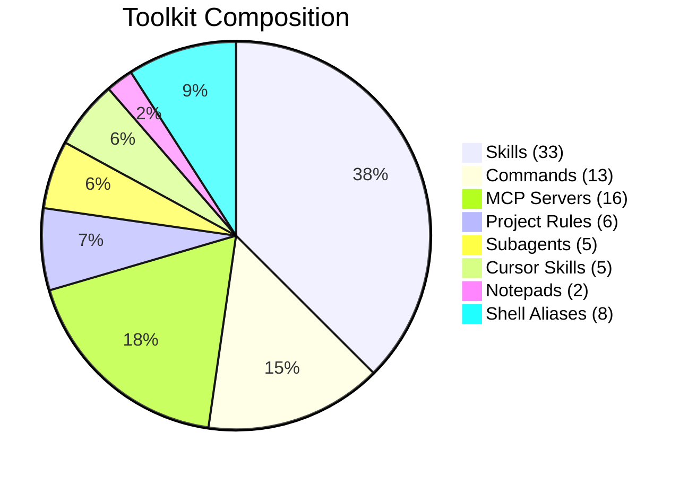
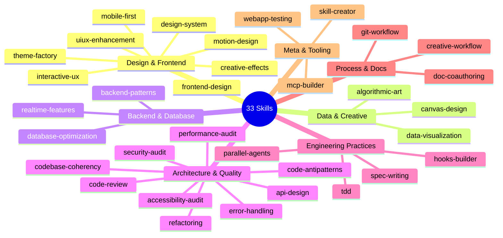
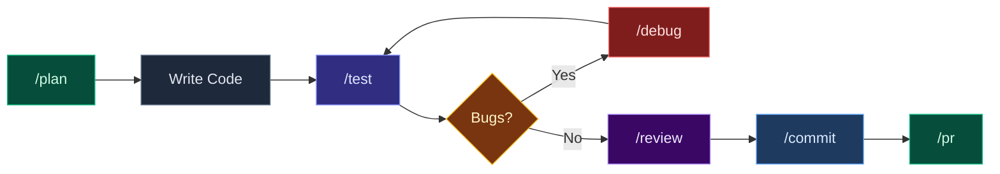
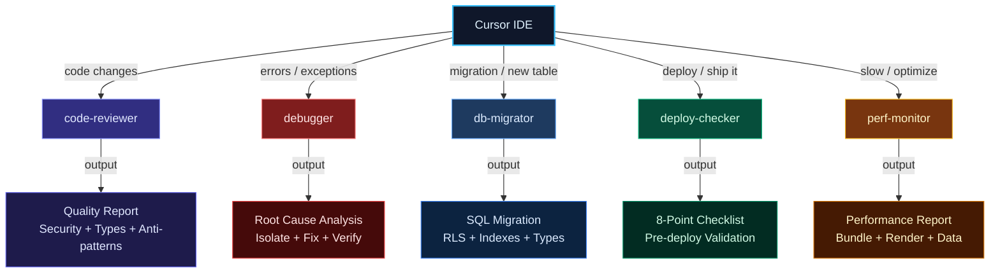
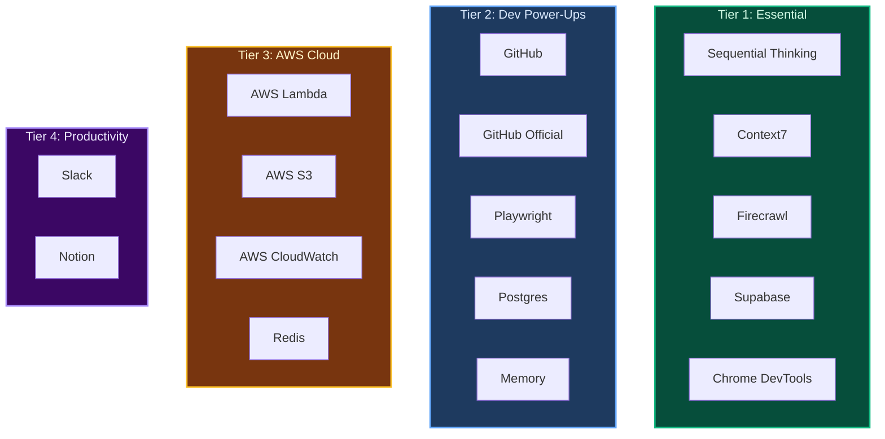
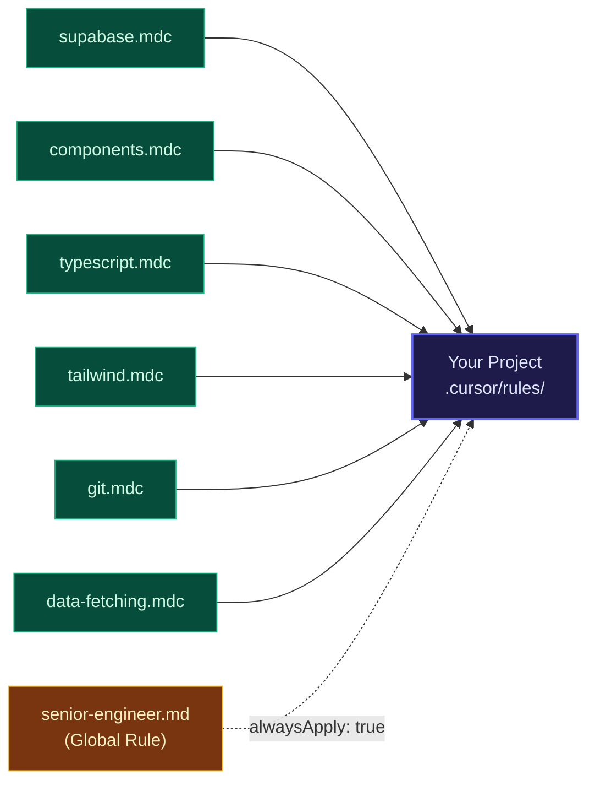
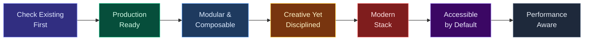

<p align="center">
  
</p>

<h1 align="center">cursor-kenji</h1>

<p align="center">
  <strong>A curated toolkit of Cursor AI Agent Skills, Commands, MCP configs, Subagents, and Rules</strong><br/>
  <em>Designed for modern full-stack development with React, Next.js, Supabase, and Tailwind</em>
</p>

<p align="center">
  <a href="#-quick-start"></a>
  <a href="#-skills-33"></a>
  <a href="#-subagents-5"></a>
  <a href="#-commands-13"></a>
  <a href="#-mcp-servers-16"></a>
  <a href="#-project-rules-starter-pack"></a>
</p>

<p align="center">
  
  
  
  
  
  
</p>

---

> **Living repository** — skills evolve with the ecosystem. Every update is versioned.

---

## How It All Fits Together


---

## What's New in 2026

> Based on [Cursor's official agent best practices](https://cursor.com/blog/agent-best-practices) and the latest Cursor features (Jan-Feb 2026).

| Addition | Type | Why It Matters |
|:---------|:-----|:---------------|
| `hooks-builder` | Skill | Cursor Hooks — auto-format on edit, block dangerous commands, scan for secrets, create agent loop automation |
| `tdd` | Skill | TDD is Cursor's #1 recommended agent pattern — tests give agents a clear, verifiable goal |
| `spec-writing` | Skill | Writing good specs is the highest-leverage 2026 AI skill — vague prompts produce vague code |
| `parallel-agents` | Skill | Worktrees + cloud agents + multi-model comparison — delegate and compare in parallel |
| `code-review` | Skill | Agent Review + BugBot + manual checklist for thorough pre-merge review |
| `/plan` | Command | Plan Mode (`Shift+Tab`) — Cursor's #1 recommendation: plan before coding |
| `/pr` | Command | Checks pass -> commit -> push -> open PR with description, one workflow |
| `/review` | Command | Full code review pass before merging |
| `/debug` | Command | Debug Mode — hypothesis-driven, instruments code, pinpoints root cause |
| `/fix-issue` | Command | GitHub issue -> find code -> implement fix -> open PR end-to-end |
| `/update-deps` | Command | Audit and safely update dependencies one at a time |

---

## What's Inside



<table>
<tr>
<td width="50%">

### Core

| | Count | Description |
|-|-------|-------------|
|| **Skills** | 33 | AI agent capabilities |
|| **Cursor Skills** | 5 | IDE-specific tools |
|| **Commands** | 13 | Slash commands |
|| **Subagents** | 5 | Autonomous AI agents |

</td>
<td width="50%">

### Configuration

| | Count | Description |
|-|-------|-------------|
|| **MCP Servers** | 16 | External tool integrations |
|| **Project Rules** | 6 | Per-project AI guidance |
|| **Notepads** | 2 | Reusable context templates |
|| **Shell Aliases** | 8 | Terminal productivity |

</td>
</tr>
</table>

<details>
<summary><strong>Full directory tree</strong></summary>

```
cursor-kenji/
├── skills/                  # 33 Agent Skills (each has SKILL.md)
│   ├── accessibility-audit/
│   ├── algorithmic-art/
│   ├── api-design/
│   ├── backend-patterns/
│   ├── canvas-design/
│   ├── code-antipatterns/
│   ├── code-review/
│   ├── codebase-coherency/
│   ├── creative-effects/
│   ├── creative-workflow/
│   ├── data-visualization/
│   ├── database-optimization/
│   ├── design-system/
│   ├── doc-coauthoring/
│   ├── error-handling/
│   ├── frontend-design/
│   ├── git-workflow/
│   ├── hooks-builder/
│   ├── interactive-ux/
│   ├── mcp-builder/
│   ├── mobile-first/
│   ├── motion-design/
│   ├── parallel-agents/
│   ├── performance-audit/
│   ├── realtime-features/
│   ├── refactoring/
│   ├── security-audit/
│   ├── skill-creator/
│   ├── spec-writing/
│   ├── tdd/
│   ├── theme-factory/
│   ├── uiux-enhancement/
│   └── webapp-testing/
├── skills-cursor/           # 5 Cursor-specific Skills
│   ├── create-rule/
│   ├── create-skill/
│   ├── create-subagent/
│   ├── migrate-to-skills/
│   └── update-cursor-settings/
├── commands/                # 13 Slash Commands
│   ├── commit.md
│   ├── debug.md
│   ├── fix-issue.md
│   ├── mcp.md
│   ├── plan.md
│   ├── pr.md
│   ├── readme.md
│   ├── refactor.md
│   ├── research.md
│   ├── review.md
│   ├── test.md
│   ├── uiux.md
│   └── update-deps.md
├── agents/                  # 5 Subagents
│   ├── code-reviewer.md
│   ├── db-migrator.md
│   ├── debugger.md
│   ├── deploy-checker.md
│   └── perf-monitor.md
├── rules/
│   ├── senior-engineer.md   # Global AI rules (alwaysApply: true)
│   └── project-starter/     # 6 Project rule templates
│       ├── components.mdc
│       ├── data-fetching.mdc
│       ├── git.mdc
│       ├── supabase.mdc
│       ├── tailwind.mdc
│       └── typescript.mdc
├── notepads/                # Reusable context templates
│   ├── architecture.md
│   └── design-tokens.md
├── shell-aliases/
│   └── cursor-helpers.sh    # 8 shell commands
├── mcp/                     # MCP server configs
│   ├── README.md
│   ├── mcp.json.template      (Essential 5 servers)
│   └── mcp-full.json.template (All 16 servers)
├── docs/
│   ├── CATALOG.md
│   └── CONTRIBUTING.md
├── install.sh               # One-command installer
├── LICENSE
└── README.md
```

</details>

---

## Quick Start

```bash
git clone https://github.com/kensaurus/cursor-kenji.git
cd cursor-kenji
./install.sh
```

<details>
<summary>Or one-liner install</summary>

```bash
curl -sSL https://raw.githubusercontent.com/kensaurus/cursor-kenji/main/install.sh | bash
```

</details>

### What the installer does


**Post-install steps:**
1. Restart Cursor to pick up new skills
2. Edit `~/.cursor/mcp.json` with your API keys
3. Try: `/commit`, `/test`, `/research` in Cursor
4. Source shell helpers: `source ~/cursor-kenji/shell-aliases/cursor-helpers.sh`

---

## Skills (33)

### Skill Categories at a Glance



---

### Design & Frontend

> *Build distinctive, production-grade interfaces*

| Skill | What it Does |
|:------|:-------------|
| `frontend-design` | Production-grade UI avoiding generic AI aesthetics |
| `design-system` | Component libraries, tokens, variants, CVA patterns |
| `motion-design` | Framer Motion, CSS animations, GSAP micro-interactions |
| `creative-effects` | WebGL, Three.js, shaders, particles, Canvas 2D |
| `uiux-enhancement` | Incremental UI/UX improvements and polish |
| `interactive-ux` | Gamification, Easter eggs, delightful interactions |
| `mobile-first` | Touch-optimized, responsive, PWA patterns |
| `theme-factory` | Apply cohesive visual themes across artifacts |

### Data & Creative

| Skill | What it Does |
|:------|:-------------|
| `data-visualization` | Recharts, D3.js, sparklines, real-time charts |
| `algorithmic-art` | Generative art, flow fields, L-systems, circle packing |
| `canvas-design` | Museum-quality visual design in `.png` and `.pdf` formats |

### Backend & Database

| Skill | What it Does |
|:------|:-------------|
| `backend-patterns` | Server Actions, tRPC, Edge Functions, caching, jobs |
| `database-optimization` | Indexes, N+1 fixes, RLS performance, query tuning |
| `realtime-features` | WebSocket, Supabase Realtime, SSE, live data |

### Architecture & Quality

| Skill | What it Does |
|:------|:-------------|
| `api-design` | REST conventions, error schemas, pagination, versioning |
| `error-handling` | Error boundaries, Server Action errors, toast patterns |
| `code-antipatterns` | Detect and fix React, TypeScript, state anti-patterns |
| `code-review` | Thorough PR reviews — correctness, security, perf, a11y checklist |
| `codebase-coherency` | Naming, imports, organization consistency audit |
| `refactoring` | Safe, incremental code transformations |
| `performance-audit` | Core Web Vitals, bundle analysis, runtime profiling |
| `security-audit` | OWASP Top 10, auth flows, RLS, secrets management |
| `accessibility-audit` | WCAG 2.1 AA compliance, screen reader, keyboard, ARIA |

### Engineering Practices <sup>New in 2026</sup>

| Skill | What it Does |
|:------|:-------------|
| `tdd` | Test-driven development with AI — Red/Green/Refactor, Vitest patterns, agent-compatible TDD workflow |
| `spec-writing` | Write effective specs and briefs so agents produce correct implementations first time |
| `parallel-agents` | Run agents in parallel via git worktrees, cloud agents, and multi-model comparison |
| `hooks-builder` | Build Cursor Agent Hooks — auto-formatters, security gates, secret scanners, loop automation |

### Process & Documentation

| Skill | What it Does |
|:------|:-------------|
| `git-workflow` | Branching, conventional commits, PRs, releases |
| `doc-coauthoring` | Structured co-authoring for specs, PRDs, RFCs |
| `creative-workflow` | End-to-end feature development workflow |

### Meta & Tooling

| Skill | What it Does |
|:------|:-------------|
| `skill-creator` | Guide for creating new Agent Skills |
| `mcp-builder` | Build MCP servers for LLM tool integration |
| `webapp-testing` | Playwright browser automation and E2E testing |

<details>
<summary><strong>Cursor-Specific Skills (5)</strong></summary>

| Skill | What it Does |
|:------|:-------------|
| `create-rule` | Create `.cursor/rules/` for persistent AI guidance |
| `create-skill` | Create new Agent Skills in `~/.cursor/skills/` |
| `create-subagent` | Create custom subagents in `.cursor/agents/` |
| `migrate-to-skills` | Convert rules/commands to Skills format |
| `update-cursor-settings` | Modify Cursor/VSCode settings.json |

</details>

---

## Commands (13)

### Development Workflow



### Coding Workflow

| Command | When | What it Does |
|:--------|:-----|:-------------|
| `/plan` | Before coding | Plan Mode — research codebase, clarify requirements, produce an approved plan before writing code |
| `/commit` | After coding | Fix build errors, lint, type check, commit & push |
| `/pr` | Ready to ship | Checks pass -> commit -> push -> open PR with title and description |
| `/fix-issue [#]` | Bug reports | Fetch GitHub issue -> find relevant code -> implement fix -> open PR |
| `/debug` | Tricky bugs | Hypothesis-driven debugging with runtime instrumentation, not guessing |
| `/review` | Before merge | Agent review pass + manual checklist: correctness, security, performance, accessibility |
| `/test` | Before commit | Run full test suite, verify quality, check coverage targets |
| `/update-deps` | Maintenance | Audit and safely update dependencies one at a time with changelog review |

### Research & Documentation

| Command | When | What it Does |
|:--------|:-----|:-------------|
| `/research` | Before coding | Scrape latest docs, patterns, and solutions via Firecrawl |
| `/readme` | End of session | Sync all READMEs to reflect session changes |
| `/refactor` | Long files | Split into clean, modular architecture without losing any code |
| `/mcp` | Dev workflow | MCP-powered development reference and tool guide |
| `/uiux` | UI review | Enforce design system, fix rogue styling, standardize interactions |

---

## Subagents (5)

> *Autonomous AI agents that Cursor auto-delegates to based on keywords*



| Agent | Auto-triggers On | What it Does |
|:------|:-----------------|:-------------|
| `code-reviewer` | Code changes, "review" | Quality, security, types, anti-patterns |
| `debugger` | Errors, exceptions | Root cause analysis, isolate, fix, verify |
| `db-migrator` | "migration", "new table" | SQL, RLS policies, indexes, type generation |
| `deploy-checker` | "deploy", "ship it" | 8-check validation pipeline |
| `perf-monitor` | "slow", "optimize" | Bundle, render, data fetching audit |

---

## MCP Servers (16)

> *External tool integrations across 4 tiers — pick what you need*



<table>
<tr>
<td>

**Tier 1: Essential**
| Server | Key? |
|:-------|:-----|
| Sequential Thinking | No |
| Context7 | No |
| Firecrawl | Yes |
| Supabase | Yes |
| Chrome DevTools | No* |

</td>
<td>

**Tier 2: Dev Power-Ups**
| Server | Key? |
|:-------|:-----|
| GitHub | PAT |
| GitHub Official | PAT |
| Playwright | No |
| Postgres | Conn |
| Memory | No |

</td>
</tr>
<tr>
<td>

**Tier 3: AWS Cloud**
| Server | Key? |
|:-------|:-----|
| AWS Lambda | Profile |
| AWS S3 | Profile |
| AWS CloudWatch | Profile |
| Redis | URL |

</td>
<td>

**Tier 4: Productivity**
| Server | Key? |
|:-------|:-----|
| Slack | Bot |
| Notion | Yes |
| | |
| | |

</td>
</tr>
</table>

Two templates included:
- `mcp.json.template` — Essential 5 servers
- `mcp-full.json.template` — All 16 servers

See [`mcp/README.md`](mcp/README.md) for setup guides.

---

## Project Rules Starter Pack

> *Drop into any project's `.cursor/rules/` for instant AI guidance*



| Rule | Enforces |
|:-----|:---------|
| `supabase.mdc` | Typed clients, RLS mandatory, migration patterns |
| `components.mdc` | Reuse primitives, Server Components, a11y |
| `typescript.mdc` | No `any`, Zod validation, ActionResult pattern |
| `tailwind.mdc` | Design tokens, `cn()`, mobile-first, motion prefs |
| `git.mdc` | Conventional commits, branch naming, no secrets |
| `data-fetching.mdc` | TanStack Query, prefetch, query key factories |

Plus a **global rule** — `senior-engineer.md` — that always applies and enforces the full-stack execution protocol with MCP tool usage.

```bash
cp ~/cursor-kenji/rules/project-starter/*.mdc your-project/.cursor/rules/
```

---

## Shell Helpers

```bash
source ~/cursor-kenji/shell-aliases/cursor-helpers.sh
```

| Command | What it Does |
|:--------|:-------------|
| `newskill <name>` | Create a new skill with template |
| `lsskills` | List all installed skills with descriptions |
| `cursor-sync` | Pull latest + reinstall |
| `cursor-dev` | Open Cursor + Chrome DevTools |
| `newrule <name>` | Create a project rule with template |
| `newagent <name>` | Create a subagent with template |
| `gc <type> <msg>` | Conventional commit shortcut |
| `gp` | Push current branch |

---

## Design Principles



| # | Principle |
|---|----------|
| 1 | **Check Existing First** — scan before creating. Never duplicate. |
| 2 | **Production-Ready** — no placeholders. Code that ships. |
| 3 | **Modular & Composable** — skills cross-reference. Mix and match. |
| 4 | **Creative Yet Disciplined** — bold aesthetics, solid engineering. |
| 5 | **Modern Stack** — React 19, Next.js 15+, Tailwind v4, strict TS. |
| 6 | **Accessible by Default** — WCAG 2.1 AA is non-negotiable. |
| 7 | **Performance Aware** — every pattern considers Web Vitals. |

---

## Stack Compatibility

| Technology | Version | Key Features |
|:-----------|:--------|:-------------|
| React | 19+ | Server Components, `use()`, Compiler |
| Next.js | 15+ | App Router, Server Actions, PPR |
| TypeScript | 5+ | Strict mode, no `any` |
| Tailwind CSS | v4 | CSS-first config, `@theme` |
| Supabase | Latest | Auth, RLS, Edge Functions, Realtime |
| TanStack Query | v5 | `queryOptions()`, prefetch, hydration |
| Zustand | v5 | Slices, immer, selective persist |
| Zod | v3 | Input validation, type inference |
| Framer Motion | v11 | Animations, gestures, layout |

---

## Keeping Up to Date

```bash
cd ~/cursor-kenji && git pull && ./install.sh
```

<details>
<summary>Auto-sync via crontab</summary>

```bash
0 9 * * * cd ~/cursor-kenji && git pull origin main && ./install.sh --quiet
```

</details>

---

## Contributing

See [`docs/CONTRIBUTING.md`](docs/CONTRIBUTING.md) for how to add skills, commands, and rules.

See [`docs/CATALOG.md`](docs/CATALOG.md) for the full reference with trigger phrases.

---

<p align="center">
  <strong>MIT License</strong> — Use freely, modify freely, share freely.
</p>

<p align="center">
  <em>Built by <a href="https://github.com/kensaurus">@kensaurus</a>. Enhanced continuously.</em>
</p>
