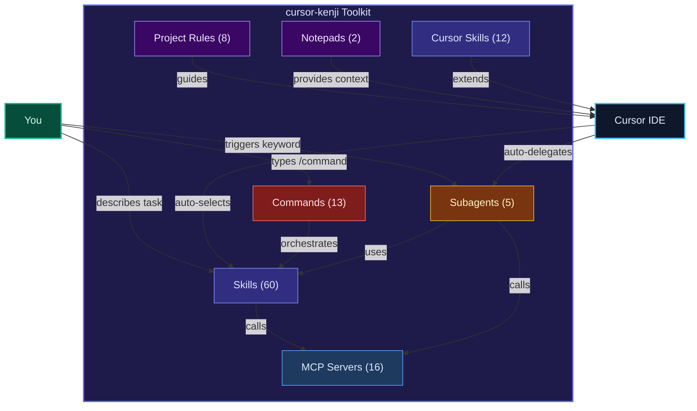
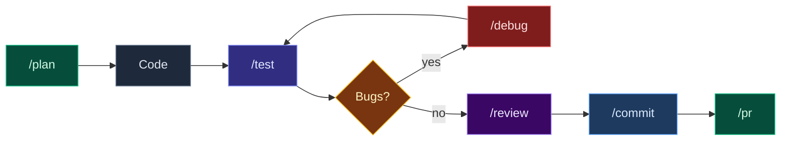

<p align="center">
  
</p>

<h1 align="center">cursor-kenji</h1>

<p align="center">
  <strong>Every Cursor AI workflow you'd build yourself — already built.</strong><br/>
  60 agent skills · 13 slash commands · 16 MCP servers · 12 Cursor extensions · 5 subagents
</p>

<p align="center">
  
  
  <a href="CHANGELOG.md"></a>
  
  
  
  
</p>

---

**cursor-kenji** is a production-ready toolkit of 60 Cursor agent skills, 13 slash commands, and 5 pre-built subagents for React / Next.js / Supabase development. Install once — the agent picks the right skill automatically.

---

## 30-second install

```bash
npx skills add kensaurus/cursor-kenji
```

That's it. Restart Cursor. Done. The agent now has 60 skills it picks automatically.

> No Cursor? **[Download Cursor free](https://cursor.com)** (it's VS Code with AI built in).
> Don't have `skills`? Run `npm install -g skills` first, or use the manual install below.

---

## Quick Start

> New to Cursor? Read [docs/GETTING-STARTED.md](docs/GETTING-STARTED.md) — plain-language walkthrough.

### Via skills.sh (recommended)

```bash
npx skills add kensaurus/cursor-kenji
```

Installs all 60 skills to `~/.cursor/skills/` (or `~/.agents/skills/`) automatically.

Also install [Mushi Mushi skills](https://github.com/kensaurus/mushi-mushi) for bug-report triage + fix dispatch from inside Cursor:
```bash
npx skills add kensaurus/mushi-mushi
```

### Via npm (`npx @kensaurus/cursor-kenji`)

The npm installer copies skills, commands, agents, and rules into `~/.cursor/`. It
has two modes:

```bash
npx @kensaurus/cursor-kenji            # merge: add/overwrite this repo's items, keep your others
npx @kensaurus/cursor-kenji --clean    # mirror: make ~/.cursor EXACTLY match this repo
npx @kensaurus/cursor-kenji --dry-run  # preview without changing anything
```

- **merge** (default) — overwrites same-named items and leaves everything else in
  `~/.cursor` untouched. Safe for a shared machine with skills from other sources.
- **`--clean` / mirror** — wipes `~/.cursor/{skills,commands,agents,rules}` so they
  contain *only* what this repo ships (no overlap, no duplicates). Your previous
  contents are backed up to `~/.cursor/.cursor-kenji-backups/<timestamp>/` first
  (add `--no-backup` to skip). `mcp.json` is never touched, so your API keys are safe.

From a clone, the same operations are available as npm scripts:

```bash
npm run install:cursor            # merge
npm run install:cursor:clean      # mirror (with backup)
npm run install:cursor:dry        # preview merge
npm run install:cursor:clean:dry  # preview mirror
```

### Manual install

```bash
git clone https://github.com/kensaurus/cursor-kenji.git
cd cursor-kenji
./install.sh
```

<details>
<summary>Or one-liner (curl)</summary>

```bash
curl -sSL https://raw.githubusercontent.com/kensaurus/cursor-kenji/main/install.sh | bash
```

</details>

**After install:**
1. Restart Cursor to pick up skills
2. Edit `~/.cursor/mcp.json` — replace `YOUR_*` placeholders with real keys
3. Try it: describe any task in chat. Skills auto-trigger from keywords.
4. Optional: `source ~/cursor-kenji/shell-aliases/cursor-helpers.sh`

**Keep it fresh:** `npx skills add kensaurus/cursor-kenji` (or `cd ~/cursor-kenji && git pull && ./install.sh`)

---

## What's Inside

| | Count | What it does |
|:--|------:|:-------------|
| **Skills** | 60 | Auto-triggering agent capabilities (audits, enhance, debug, test, build) |
| **Cursor Skills** | 12 | IDE-specific tools (canvas, hooks, rules, PR splitter) |
| **Commands** | 13 | Slash commands for repeatable workflows (`/commit`, `/pr`, `/research`) |
| **Subagents** | 5 | Background autonomous agents (code-reviewer, debugger, db-migrator…) |
| **MCP Servers** | 16 | External integrations: Supabase · GitHub · Sentry · Playwright · AWS · Slack |
| **Project Rules** | 8 | Drop-in `.mdc` files for any project's `.cursor/rules/` |
| **Notepads** | 2 | Reusable context templates (architecture, design tokens) |
| **Shell Aliases** | 8 | Terminal shortcuts (`newskill`, `cursor-sync`, `gc`, `gp`) |

---

## How It All Fits Together



---

## How to Use

**One mental model:** describe the task → Cursor auto-selects a skill. Or type `/command` for a known workflow.

| Primitive | How to invoke | Example |
|:----------|:--------------|:--------|
| **Skill** | Just describe the task — Cursor matches trigger keywords | "make `/dashboard` feel less AI-generated" → `enhance-web-ux` |
| **Command** | Type `/<name>` in chat | `/commit`, `/research`, `/pr` |
| **Subagent** | Mention a trigger keyword | "review this PR" → `code-reviewer` auto-delegates |
| **Rule** | Drop `.mdc` into any project's `.cursor/rules/` | Always-on conventions, no re-prompting |

### Trigger phrase cheat sheet

| You say | Skill that fires |
|:--------|:----------------|
| "this page feels AI-generated, fix it" | `enhance-web-ux` |
| "make `/settings` more polished, less crowded" | `enhance-web-ui` |
| "build a landing page that doesn't look like AI slop" | `enhance-web-landing` |
| "redesign this site to feel premium, keep functionality" | `enhance-web-redesign` |
| "polish this React Native screen, feels clunky on iOS" | `mobile-rn-screen` |
| "Capacitor app looks great on web but cramped on mobile" | `enhance-capacitor-ui` |
| "build this feature properly" / "this keeps breaking" | `workflow-spec-tdd` |
| "add push notifications / deep links / ship OTA / App Store" | `mobile-capacitor-platform` |
| "the RN app is janky / slow to start / bundle is huge" | `mobile-rn-performance` |
| "build an ingestion pipeline / cron double-counts / backfill" | `data-pipeline` |
| "add logging / instrument this / why can't I debug prod" | `backend-observability` |
| "give the README a hero image and screenshots" | `enhance-readme` |
| "audit the UX of the checkout flow" | `audit-ux` |
| "split this branch into smaller PRs" | `split-to-prs` |
| "agent keeps hanging on browser steps" | `protocol-browser-anti-stall` |
| "is mushi working" / "mushi health check" / "check mushi pipeline" | `mushi-health` |
| "test mushi integration" / "verify full mushi pipeline" / "mushi e2e" | `mushi-integration` |

> **Force a specific skill:** *"use `enhance-web-ux` on `/dashboard`"*

### Daily workflow



---

## Skill Chaining — improve & iterate any repo

The real power isn't one skill — it's **chaining** them so the output of one becomes
the input of the next. You can run a chain two ways:

- **One prompt** — name the whole pipeline and let the agent walk it:
  *"Adopt this repo: research the stack, housekeep, then audit code-quality →
  security → performance, refactor the worst offenders, add tests, and open a PR."*
- **Step by step** — run each skill/command, review the diff, then continue. Best
  when stakes are high or the repo is unfamiliar.

> Rule of thumb: **audit → plan → change behind tests → verify → commit.** Never let
> a chain *change* code before something can *prove* the change is safe.

### The core iterate-a-repo loop

```mermaid
flowchart LR
  R["/research<br/>understand stack"] --> H["workflow-housekeep<br/>dead code, deps"]
  H --> A["audit-* <br/>quality / security / perf"]
  A --> P["/plan<br/>prioritize fixes"]
  P --> T["workflow-spec-tdd<br/>lock behavior in tests"]
  T --> RF["workflow-refactor<br/>make the change"]
  RF --> V["test-playwright<br/>verify like a user"]
  V --> RV["code-reviewer<br/>subagent review"]
  RV --> C["/commit → /pr"]
  C -. next slice .-> A

  style R fill:#064e3b,stroke:#10b981,color:#d1fae5
  style H fill:#1e293b,stroke:#64748b,color:#e2e8f0
  style A fill:#3b0764,stroke:#a78bfa,color:#ede9fe
  style P fill:#064e3b,stroke:#10b981,color:#d1fae5
  style T fill:#312e81,stroke:#818cf8,color:#e0e7ff
  style RF fill:#78350f,stroke:#fbbf24,color:#fef3c7
  style V fill:#312e81,stroke:#818cf8,color:#e0e7ff
  style RV fill:#3b0764,stroke:#a78bfa,color:#ede9fe
  style C fill:#1e3a5f,stroke:#60a5fa,color:#dbeafe
```



### Recipes

**1. Adopt & harden an inherited codebase**
`/research` → `workflow-housekeep` → `audit-code-quality` → `audit-security` →
`audit-performance` → `/plan` → `workflow-refactor` → `test-unit` →
`code-reviewer` (subagent) → `/commit` → `/pr`
*Use when:* you just cloned a repo you didn't write and need a safe map + a first
round of cleanup without breaking anything.

**2. Ship a feature the disciplined way (spec → TDD → verify)**
`design-prd` → `workflow-spec-tdd` → *(implement)* → `test-playwright` →
`backend-observability` → `deploy-verify` → `/commit` → `/pr`
*Use when:* "build this properly" / "this keeps breaking." Tests are written
**before** code, so the feature is done only when the suite is green end-to-end.

**3. Make a page stop looking AI-generated**
`audit-ux` → `audit-uiux-design-system` → `enhance-web-ux` → `enhance-web-ui` →
`test-playwright` → `/commit`
*Use when:* "this screen feels clunky / crowded / generic." Audits first so the
enhancement targets real heuristic + design-token violations, then verify live.

**4. Fix a production incident & prevent recurrence**
`debug-sentry-monitor` → `debug-error` (or `debug-fe-be-integration`) →
`debugger` (subagent) → *(fix)* → `test-unit` (regression test) → `deploy-verify` →
`/commit`
*Use when:* something is on fire in prod. Triage from real error data, root-cause,
fix, then lock the bug out with a test before redeploying.

**5. Cut a clean npm / package release**
`audit-code-quality` → `test-unit` → `enhance-readme` (or `docs-writer`) →
`deploy-npm` → `deploy-checker` (subagent)
*Use when:* you're publishing. Quality + docs + release checklist in one pass.

**6. Land a big change as small, reviewable PRs**
`workflow-refactor` → `split-to-prs` → `workflow-pr` → `babysit`
*Use when:* a branch grew too large. Split into stacked PRs, then keep each one
merge-ready (CI green, conflicts resolved) automatically.

> **Tip:** chain *audits in parallel* with `workflow-parallel-agents` — run
> `audit-security`, `audit-performance`, and `audit-code-quality` as separate agents,
> then merge their findings into a single `/plan` before you touch code.

---

## Skills (60)

> **Note:** The `file-docx`, `file-pdf`, `file-pptx`, and `file-xlsx` skills (Anthropic proprietary, source-available only) have been removed from this public repo. Keep personal copies in `~/.cursor/skills/` if needed.

### Naming taxonomy

Every skill name is `<prefix>-<topic>`. 14 prefixes, one concern each:

| Prefix | Purpose |
|:-------|:--------|
| `audit-` | Quality/security assessments |
| `backend-` | Server-side patterns (DB, observability, realtime) |
| `data-` | Pipelines, ETL, visualization |
| `debug-` | Reproduce → isolate → fix failures |
| `deploy-` | Release, publish, post-deploy verify |
| `design-` | Create new visual/API surfaces |
| `docs-` | Write or co-author documentation |
| `enhance-` | Improve existing web/mobile UI & UX |
| `meta-` | Skills and MCP authoring |
| `mobile-` | React Native, Capacitor, emulator |
| `mushi-` | Mushi Mushi integration — health, pipeline, TDD |
| `protocol-` | Procedural guardrails (browser anti-stall, etc.) |
| `test-` | QA, unit tests, acceptance tests |
| `workflow-` | Dev-process skills (git, refactor, PR, spec-TDD) |

### Enhance — make pages feel hand-crafted

Pick by surface:

| Surface | Skill |
|:--------|:------|
| Web product page — composition, hierarchy, motion | `enhance-web-ui` |
| Web product page — UX heuristics, flows, data wiring | `enhance-web-ux` |
| Web landing / marketing / portfolio | `enhance-web-landing` |
| Existing site upgrade (audit-first, preserve behaviour) | `enhance-web-redesign` |
| 3D / WebGL / cinematic scroll on an existing site | `enhance-web-web3d` |
| React Native screen (Expo / bare) | `mobile-rn-screen` |
| Capacitor / hybrid app (one web app on iOS + Android) | `enhance-capacitor-ui` |
| Repo README showcase | `enhance-readme` |

### Design & Frontend

| Skill | What it does |
|:------|:-------------|
| `design-frontend` | Production-grade UI — avoids generic AI aesthetics |
| `design-system` | Component libraries, tokens, variants, CVA |
| `design-motion` | Framer Motion, CSS animations, GSAP micro-interactions, gamification, Easter eggs |
| `enhance-web-web3d` | WebGL, Three.js, shaders, particles, Canvas 2D |
| `enhance-web-ui` | Incremental UI/UX improvements and polish |
| `design-mobile-first` | Touch-optimized, responsive, PWA patterns |
| `design-theme` | Apply cohesive visual themes across artifacts |
| `mobile-capacitor-platform` | Capacitor plugins, OTA updates, deep links, push, store submission, Apple preflight |
| `mobile-rn-performance` | React Native perf/build/upgrade — FPS, Hermes, TTI, bundle size, FlashList, Reanimated |

### Data & Creative

| Skill | What it does |
|:------|:-------------|
| `data-visualization` | Recharts, D3.js, sparklines, real-time charts |
| `design-generative-art` | Generative art, flow fields, L-systems, circle packing |
| `design-canvas` | Museum-quality visual design in `.png` and `.pdf` formats |

### Backend & Database

| Skill | What it does |
|:------|:-------------|
| `backend-patterns` | Server Actions, tRPC, Edge Functions, caching, jobs |
| `backend-db-performance` | Indexes, N+1 fixes, RLS performance, query tuning |
| `backend-realtime` | WebSocket, Supabase Realtime, SSE, live data |
| `data-pipeline` | ETL / edge-function / `pg_cron` correctness — idempotency, atomic writes, backfills, dead-letter |
| `backend-observability` | Error↔trace↔log correlation, structured logs, PII redaction, OTel spans, LLM traces, SLO design |

### Architecture & Quality

| Skill | What it does |
|:------|:-------------|
| `design-api` | REST conventions, error schemas, pagination, versioning |
| `backend-error-handling` | Error boundaries, Server Action errors, toast patterns |
| `audit-code-quality` | Detect and fix React / TypeScript anti-patterns, naming, imports, organization |
| `audit-code-review` | Thorough PR reviews — correctness, security, perf, a11y |
| `workflow-refactor` | Safe, incremental code transformations |
| `audit-performance` | Core Web Vitals, bundle analysis, runtime profiling |
| `audit-security` | OWASP Top 10, auth flows, RLS, secrets management |
| `audit-accessibility` | WCAG 2.1 AA, screen reader, keyboard navigation, ARIA |

### Audits & Monitoring

| Skill | What it does |
|:------|:-------------|
| `audit-db-schema` | Schema audit — naming, types, constraints, indexes, RLS, migrations |
| `audit-fe-api` | Frontend API calls vs backend — contract alignment, caching, error handling |
| `audit-langfuse-llm` | PDCA audit for LLM features — traces, prompts, costs, evals, grounding |
| `audit-uiux-design-system` | Visual token compliance — colors, spacing, components, WCAG |
| `audit-ux` | Generic UX audit — NN/g 10 heuristics, Laws of UX, Intuit Content Design, HEART |
| `debug-sentry-monitor` | Sentry triage, root cause analysis, noise filtering, architecture audit |
| `deploy-verify` | Post-deploy smoke test — Sentry + Supabase + Langfuse + Playwright, ship-or-rollback verdict |

### Debugging

| Skill | What it does |
|:------|:-------------|
| `debug-error` | Systematic debugging — reproduce, isolate, research, fix, verify, prevent |
| `debug-fe-be-integration` | FE/BE integration debug — backend logs, API mismatches, both-side fixes |

### Testing & QA

| Skill | What it does |
|:------|:-------------|
| `test-unit` | Auto-detect framework, research patterns, Sentry coverage gaps, write tests |
| `test-qa` | Comprehensive QA via browser MCP — CRUD lifecycle, data pipeline, UX quality |
| `test-playwright` | PDCA loop closer — drive localhost like a real user, fix pain points as you go |
| `mobile-emulator-test` | Native build QA on Android emulator — adb walk + Supabase + Sentry MCPs |
| `mobile-emulator-start` | Boot Metro + Android emulator in the correct order — prevents "Cannot connect to Expo CLI" races |
| `workflow-pr` | PR lifecycle — validation, bot feedback, merge criteria |
| `protocol-browser-anti-stall` | Anti-hang protocol for browser automation sessions |

### Engineering Practices

| Skill | What it does |
|:------|:-------------|
| `workflow-spec-tdd` | Anti-vibe-coding: brainstorm → spec → plan → RED/GREEN/REFACTOR → self-review |
| `workflow-parallel-agents` | Run agents in parallel via git worktrees, cloud agents, multi-model comparison |
| `create-hook` | Build Cursor Agent Hooks — auto-formatters, security gates, secret scanners |
| `workflow-coding-discipline` | Behavioral guardrails (Think before coding, Simplicity first, Surgical changes) |

### Product & Documentation

| Skill | What it does |
|:------|:-------------|
| `design-prd` | Generate PRDs via structured conversation — competitive research, technical feasibility |
| `docs-writer` | Write READMEs, API docs, architecture docs, code comments |
| `docs-coauthor` | Structured co-authoring for specs, PRDs, RFCs |
| `workflow-git-commit` | Conventional commits, branching, PRs, releases |
| `workflow-housekeep` | Full-cycle repo maintenance — README sync, dead file cleanup, dependency updates |

### Mushi Mushi

| Skill | What it does |
|:------|:-------------|
| `mushi-health` | Pass/fail health check — CLI, edge functions, BYOK key pool, QA cron running |
| `mushi-integration` | Full end-to-end smoke test — bug capture → triage → story map → TDD gen → run → PDCA |

### Meta & Tooling

| Skill | What it does |
|:------|:-------------|
| `meta-skill-creator` | Guide for creating new Agent Skills |
| `meta-mcp-builder` | Build MCP servers for LLM tool integration |

<details>
<summary><strong>Cursor-Specific Skills (12)</strong></summary>

| Skill | What it does |
|:------|:-------------|
| `babysit` | Keep a PR merge-ready — triage comments, resolve conflicts, fix CI in a loop |
| `canvas` | Live React canvas beside chat — rich data visualizations, audit reports, interactive tools |
| `create-hook` | Create Cursor hooks — scripts/prompts for before/after agent events |
| `create-rule` | Create `.cursor/rules/` files for persistent AI guidance |
| `create-skill` | Create new Agent Skills in `~/.cursor/skills/` |
| `create-subagent` | Create custom subagents in `.cursor/agents/` |
| `migrate-to-skills` | Convert rules/commands to Skills format |
| `shell` | Direct shell execution without interpretation |
| `split-to-prs` | Slice one pile of work into small reviewable PRs — safe snapshot, no destructive git ops |
| `statusline` | Configure CLI status line — model, context usage, git info |
| `update-cli-config` | Modify CLI settings — permissions, sandbox, vim mode |
| `update-cursor-settings` | Modify Cursor/VSCode `settings.json` |

</details>

---

## Commands (13)

| Command | When to use | What it does |
|:--------|:------------|:-------------|
| `/plan` | Before coding | Research codebase, clarify requirements, produce an approved plan before writing code |
| `/commit` | After coding | Fix build errors, lint, type check, commit & push |
| `/pr` | Ready to ship | Checks pass → commit → push → open PR with description |
| `/fix-issue [#]` | Bug reports | Fetch GitHub issue → find relevant code → implement fix → open PR |
| `/debug` | Tricky bugs | Hypothesis-driven debugging with runtime instrumentation |
| `/review` | Before merge | Agent review + manual checklist: correctness, security, perf, a11y |
| `/test` | Before commit | Run test suite, verify quality, check coverage |
| `/update-deps` | Maintenance | Safely update dependencies one at a time with changelog review |
| `/research` | Before coding | Scrape latest docs, patterns, and solutions via Firecrawl |
| `/readme` | End of session | Sync all READMEs to reflect session changes |
| `/refactor` | Long files | Split into clean, modular architecture without losing any code |
| `/mcp` | Dev workflow | MCP-powered development reference and tool guide |
| `/uiux` | UI review | Enforce design system, fix rogue styling, standardize interactions |

**Bundle — `native-rn-monorepo`:** 9 extra commands (`/android-*`, `/ios-ci-*`, `/rn-*`) + 5 rules for an RN + Web monorepo where iOS verification runs on CI (not locally). Copy into any project:

```bash
cp ~/cursor-kenji/commands/native-rn-monorepo/*.md  <project>/.cursor/commands/
cp ~/cursor-kenji/rules/native-rn-monorepo/*.mdc    <project>/.cursor/rules/
```

---

## Subagents (5)

Cursor auto-delegates to these when it detects the right keywords.

| Agent | Triggers on | Output |
|:------|:------------|:-------|
| `code-reviewer` | Code changes, "review" | Quality, security, types, anti-patterns |
| `debugger` | Errors, exceptions | Root cause analysis, isolate, fix, verify |
| `db-migrator` | "migration", "new table" | SQL, RLS policies, indexes, type generation |
| `deploy-checker` | "deploy", "ship it" | 8-check validation pipeline |
| `perf-monitor` | "slow", "optimize" | Bundle, render, data fetching audit |

---

## MCP Servers (16)

Copy a template to `~/.cursor/mcp.json` and fill in your keys:

```bash
cp ~/cursor-kenji/mcp/mcp.json.template ~/.cursor/mcp.json      # Essential 5
cp ~/cursor-kenji/mcp/mcp-full.json.template ~/.cursor/mcp.json  # All 16
```

**Tier 1 — Essential (no key needed except Firecrawl + Supabase)**

| Server | Key? | What it does |
|:-------|:-----|:-------------|
| Sequential Thinking | No | Step-by-step reasoning for complex tasks |
| Context7 | No | Live, up-to-date library documentation |
| Firecrawl | Yes | Web research and doc scraping |
| Supabase | Yes | DB access, auth, storage, migrations |
| Chrome DevTools | No* | Browser testing, console, screenshots |

**Tier 2 — Dev power-ups**

| Server | Key? | What it does |
|:-------|:-----|:-------------|
| GitHub | PAT | Repos, issues, PRs, code search |
| GitHub Official | PAT | Official Go-based server (Docker) |
| Playwright | No | Browser automation, E2E, screenshots |
| Postgres | Conn | Direct PostgreSQL queries and schema |
| Memory | No | Persistent memory across sessions |

**Tier 3 — Cloud & infrastructure**

| Server | Key? | What it does |
|:-------|:-----|:-------------|
| AWS Lambda | Profile | Functions, deployments, logs |
| AWS S3 | Profile | Bucket management, file ops |
| AWS CloudWatch | Profile | Log queries, metrics, alarms |
| Redis | URL | Key-value store operations |

**Tier 4 — Productivity**

| Server | Key? | What it does |
|:-------|:-----|:-------------|
| Slack | Bot token | Post messages, read channels |
| Notion | Yes | Pages, databases, content |

See [`mcp/README.md`](mcp/README.md) for full setup instructions.

---

## Project Rules Starter Pack

Drop into any project's `.cursor/rules/` for instant AI guidance:

```bash
cp ~/cursor-kenji/rules/project-starter/*.mdc your-project/.cursor/rules/
```

| Rule | Enforces |
|:-----|:---------|
| `supabase.mdc` | Typed clients, RLS mandatory, migration patterns |
| `components.mdc` | Reuse primitives, Server Components, a11y |
| `typescript.mdc` | No `any`, Zod validation, ActionResult pattern |
| `tailwind.mdc` | Design tokens, `cn()`, design-mobile-first, motion preferences |
| `git.mdc` | Conventional commits, branch naming, no secrets |
| `data-fetching.mdc` | TanStack Query, prefetch, query key factories |

**Global rules** (apply across every project):

| Rule | Enforces |
|:-----|:---------|
| `senior-engineer.md` | Full-stack execution protocol with MCP tool usage |
| `full-stack-ship-discipline.mdc` | Every UI task is full-stack until verified end-to-end — migrations must deploy in the same chat |
| `shell-first-search.md` | Route routine search to `Shell` instead of `Grep`/`Glob` (prevents Windows hang) |

---

## Shell Helpers

```bash
source ~/cursor-kenji/shell-aliases/cursor-helpers.sh
```

| Command | What it does |
|:--------|:-------------|
| `newskill <name>` | Create a new skill with template |
| `lsskills` | List all installed skills with descriptions |
| `cursor-sync` | Pull latest + reinstall |
| `cursor-dev` | Open Cursor + Chrome DevTools |
| `newrule <name>` | Create a project rule with template |
| `newagent <name>` | Create a subagent with template |
| `gc <type> <msg>` | Conventional commit shortcut |
| `gp` | Push current branch |

---

## Repository Layout

<details>
<summary>Full directory tree</summary>

```
cursor-kenji/
├── skills/                  # 60 Agent Skills (each has SKILL.md)
│   ├── enhance-web-ui/      # Composition, hierarchy, spacing, motion
│   ├── enhance-web-ux/      # NN/g heuristic-grounded UX enhancement
│   ├── enhance-web-landing/ # Anti-slop landing/portfolio design
│   ├── enhance-web-redesign/# Audit-first redesign of existing sites
│   ├── enhance-web-web3d/   # 3D/WebGL + GSAP cinematic motion
│   ├── mobile-rn-screen/       # React Native screen polish
│   ├── enhance-capacitor-ui/# Cross-surface hybrid app architecture
│   ├── enhance-readme/      # Hero + tour + GIF for any README
│   ├── workflow-spec-tdd/   # Anti-vibe-coding: spec → plan → TDD → review
│   ├── data-pipeline/       # ETL/edge-function/cron correctness
│   ├── backend-observability/  # Build-time logging + tracing
│   ├── mobile-capacitor-platform/ # Capacitor plugins, OTA, store submission
│   ├── mobile-rn-performance/  # React Native perf, bundle, upgrade depth
│   ├── test-playwright/     # PDCA: drive localhost as a user + fix
│   ├── mobile-emulator-start/ # Metro + Android emulator bring-up
│   ├── deploy-npm/          # Changesets + npm OIDC release loop
│   └── ...55 more skills
├── skills-cursor/           # 12 Cursor-specific Skills
│   ├── babysit/
│   ├── canvas/
│   ├── create-hook/
│   ├── create-rule/
│   ├── create-skill/
│   ├── split-to-prs/
│   └── ...6 more
├── commands/                # 13 Slash Commands (.md files)
├── agents/                  # 5 Subagents
├── rules/
│   ├── senior-engineer.md
│   ├── full-stack-ship-discipline.mdc
│   ├── shell-first-search.md
│   ├── project-starter/     # 6 drop-in project rule templates
│   └── native-rn-monorepo/  # RN + Web monorepo bundle
├── notepads/                # Reusable context (architecture, design-tokens)
├── shell-aliases/
│   └── cursor-helpers.sh    # 8 terminal shortcuts
├── mcp/
│   ├── mcp.json.template    # Essential 5 servers
│   ├── mcp-full.json.template  # All 16 servers
│   └── README.md
├── docs/
│   ├── CATALOG.md           # Full reference with trigger phrases
│   └── CONTRIBUTING.md      # Detailed contributor guide
├── .github/
│   ├── ISSUE_TEMPLATE/      # Bug report + skill request forms
│   └── PULL_REQUEST_TEMPLATE.md
├── scripts/
│   └── check-skill-count.mjs  # Enforces README count matches actual skills
├── install.sh               # One-command installer
├── CHANGELOG.md             # Full version history
├── CONTRIBUTING.md          # Quick contributor guide
├── SECURITY.md              # Vulnerability reporting
├── CITATION.cff             # How to cite this toolkit
└── LICENSE                  # MIT
```

</details>

---

## Design Principles

| # | Principle |
|---|:----------|
| 1 | **Check Existing First** — scan before creating. Never duplicate. |
| 2 | **Production-Ready** — no placeholders. Code that ships. |
| 3 | **Modular & Composable** — skills cross-reference. Mix and match. |
| 4 | **Creative Yet Disciplined** — bold aesthetics, solid engineering. |
| 5 | **Modern Stack** — React 19, Next.js 15+, Tailwind v4, strict TS. |
| 6 | **Accessible by Default** — WCAG 2.1 AA is non-negotiable. |
| 7 | **Performance Aware** — every pattern considers Web Vitals. |

---

## Contributing

New skills, commands, rules, and MCP configs are welcome. The fastest path:

```bash
# Add a skill
mkdir -p skills/my-skill-name
# Write skills/my-skill-name/SKILL.md (see CONTRIBUTING.md for the template)
npm run check:skills
# Open a PR — template is pre-filled
```

See [CONTRIBUTING.md](CONTRIBUTING.md) for the full guide, [docs/CATALOG.md](docs/CATALOG.md) for the complete trigger phrase reference, and [docs/TRIGGER-CHEATSHEET.md](docs/TRIGGER-CHEATSHEET.md) for a plain-English "say X → skill Y fires" lookup table.

---

## Alternatives & see also

- **[awesome-cursorrules](https://github.com/PatrickJS/awesome-cursorrules)** — curated `.cursorrules` / `.cursor/rules` collection
- **[skills.sh](https://skills.sh)** — the skills registry this repo is listed on
- **[cursor.directory](https://cursor.directory)** — Cursor plugin and rules directory
- **[agentskills.io](https://agentskills.io)** — community agent skill index

cursor-kenji differs from cursorrules collections in that it ships *executable* skill files (not static rules), MCP server configs, slash commands, and subagent definitions in one installable package.

---

## Also by @kensaurus

Other free apps and tools from the same Tokyo studio — all built with the skills in this repo.

### Mushi Mushi 🐛 — bug reporting + AI auto-fix

Drop in a shake-to-report widget → AI-classified + deduped bug reports → optional agent opens a draft PR. Complements Sentry; never replaces it.

```bash
npx mushi-mushi   # React / Next.js / Vue / Svelte / Angular / RN / Expo / Capacitor
```

[kensaur.us/mushi-mushi](https://kensaur.us/mushi-mushi) · [GitHub](https://github.com/kensaurus/mushi-mushi) · [npm](https://www.npmjs.com/package/mushi-mushi) · free tier 1,000 reports/month · MIT SDK

> cursor-kenji's `deploy-npm` skill was built for Mushi's Changesets + OIDC monorepo. `debug-sentry-monitor` and `test-playwright` pair naturally with it. Use `mushi-health` to verify the pipeline is running and `mushi-integration` to smoke-test the full TDD loop.

### Mobile apps — iOS & Android

| App | What it does | Links |
|:----|:-------------|:------|
| **[glot.it — Learn Thai Free](https://kensaur.us/glot-it/)** | 161 lessons, AI roleplay chat, pitch-contour tone mirror, offline-first. Actually free. | [iOS](https://apps.apple.com/us/app/glot-it/id6761582648) · [Android](https://play.google.com/store/apps/details?id=com.glotit.app) |
| **[yen-yen — Expense Tracker](https://kensaur.us/yen-yen/)** | Kakeibo-style household ledger. No bank password, no ads, multi-currency + historical FX. | [iOS](https://apps.apple.com/app/id6764548441) · [Android](https://play.google.com/store/apps/details?id=app.yenyen) |
| **[Help Her Take Photo](https://kensaur.us/help-her-take-photo/)** | Two phones → remote photo studio. Live preview + remote shutter. No account. | [iOS](https://apps.apple.com/app/help-her-take-photo/id6762513666) · [Android](https://play.google.com/store/apps/details?id=com.kensaurus.helphertakephoto) |
| **[The Wanting Mind — Free Book](https://kensaur.us/the-wanting-mind/)** | 147,000-word interactive book. 3D knowledge graph, 12 narrators, karaoke highlight, EN/JA/ZH/TH. No ads, no paywalls. | [iOS](https://apps.apple.com/us/app/the-wanting-mind/id6761361305) · [Android](https://play.google.com/store/apps/details?id=us.kensaur.thewantingmind) |

---

<p align="center">
  <strong>MIT License</strong> — use freely, modify freely, share freely.<br/>
  <em>Built by <a href="https://github.com/kensaurus">@kensaurus</a> · <a href="https://kensaur.us/mushi-mushi">Mushi Mushi</a> · <a href="CHANGELOG.md">What's new</a> · <a href="https://github.com/kensaurus/cursor-kenji/discussions">Discussions</a></em>
</p>
