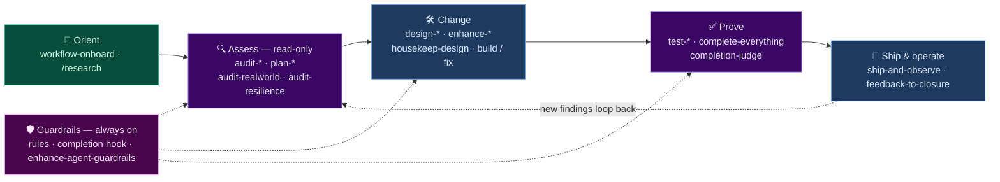

<p align="center">
  
</p>

<h1 align="center">cursor-kenji</h1>

<p align="center">
  <strong>Agent skills, slash commands, and MCP configs for Cursor.</strong><br/>
  106 agent skills · 36 slash commands · 16 MCP servers · 12 Cursor skills · 6 subagents
</p>

<p align="center">
  <a href="https://www.npmjs.com/package/@kensaurus/cursor-kenji"></a>
  
</p>

---

**cursor-kenji** ships **106 Cursor agent skills**, 36 slash commands, and 6 subagents for React / Next.js / Supabase projects. Install once — describe a task in chat and the matching skill auto-triggers.

Skills conform to the [Agent Skills specification](https://agentskills.io/specification) and pass automated validation on every commit (`npm test` — **118** installable skills including Cursor IDE tools). MCP templates pin semver versions to reduce supply-chain drift ([CSA on package hallucination / slopsquatting](https://cloudsecurityalliance.org/blog/product-news/2025/03/06/slopsquatting-ai-code-assistants-and-package-hallucinations)).

```bash
npx skills add kensaurus/cursor-kenji
```

Restart Cursor. Done.

> No Cursor? **[Download Cursor](https://cursor.com)** · No `skills` CLI? `npm install -g skills` first, or use [manual install](#manual-install) below.

---

## Quick Start

| Method | Command |
|:-------|:--------|
| **skills.sh** (recommended) | `npx skills add kensaurus/cursor-kenji` |
| **npm installer** | `npx @kensaurus/cursor-kenji` |
| **Clone** | `git clone … && ./install.sh` |

**npm installer modes:**

```bash
npx @kensaurus/cursor-kenji            # merge — add/overwrite this repo's items (Cursor)
npx @kensaurus/cursor-kenji --auto     # detect installed tools and install to each
npx @kensaurus/cursor-kenji --claude   # install for Claude Code (~/.claude/) instead
npx @kensaurus/cursor-kenji --codex    # install for Codex CLI (~/.codex/AGENTS.md + prompts)
npx @kensaurus/cursor-kenji --gemini   # install for Gemini CLI (~/.gemini/GEMINI.md + commands)
npx @kensaurus/cursor-kenji --all      # install for all four supported tools in one run
npx @kensaurus/cursor-kenji --clean    # mirror ~/.cursor to match this repo (backup first)
npx @kensaurus/cursor-kenji --dry-run  # preview
npx @kensaurus/cursor-kenji --skill audit-ux   # single skill
npx @kensaurus/cursor-kenji --link     # dev: symlink for live skill authoring
```

**`--auto` is the easiest way to cover everything you use** — it probes `~/.cursor`, `~/.claude`, `~/.codex`, and `~/.gemini` and installs the right artifacts to each installed tool. A bare invocation stays Cursor-only for backward compatibility.

From a clone: `npm run install:cursor` · `npm test` validates skills + count + install smoke test.

**Optional — [Mushi Mushi](https://github.com/kensaurus/mushi-mushi)** bug-report triage + AI draft PRs (pairs with `mushi-health`, `test-playwright`):

```bash
npx skills add kensaurus/mushi-mushi
```

**After install:** (1) Restart Cursor (2) Copy `mcp/mcp.json.template` → `~/.cursor/mcp.json`, fill `YOUR_*` keys (3) Describe any task — skills match on keywords.

**Authoring skills?** Each skill must pass [Agent Skills spec](https://agentskills.io/specification) validation (`npm run validate:skills`): `name` matches directory, `description` ≤ 1024 chars, body < 500 lines.

### Claude Code

One-click, no clone needed (works on Windows too):

```bash
npx @kensaurus/cursor-kenji --claude   # Claude Code only
npx @kensaurus/cursor-kenji --all      # all four supported tools
```

All skills, commands, agents, and rules install to Claude Code (`~/.claude/`), with `.mdc` rules installed as `.md`. Skills appear as `/slash-commands` — type `/` inside any `claude` session.

From a clone, the bash installer does the same:

```bash
# Install for Claude Code only
./install.sh --claude

# Install for both Cursor and Claude Code (default)
./install.sh
```

```bash
# Inside Claude Code — use skills as slash commands
/workflow-build-feature
/debug-error the login endpoint returns 401
/plan-security-audit
/docs-writer
```

Skills are read from `~/.claude/skills/<name>/SKILL.md`. No restart required when you re-run the installer — Claude Code picks up file changes at the start of each new session.

### Codex CLI & Gemini CLI

Codex CLI (OpenAI) and Gemini CLI have **no skills system** — they each read a single global context file. cursor-kenji maps to what they actually load:

```bash
npx @kensaurus/cursor-kenji --codex    # Codex CLI
npx @kensaurus/cursor-kenji --gemini   # Gemini CLI
```

| | Codex CLI | Gemini CLI |
|:--|:--|:--|
| **Rules → context file** | `~/.codex/AGENTS.md` | `~/.gemini/GEMINI.md` |
| **Portable commands** | `~/.codex/prompts/*.md` | `~/.gemini/commands/*.toml` |

The rules are merged from `rules/` into one auto-loaded Markdown file (the skill-routing index is omitted — nothing in these tools would load it). Three self-contained playbooks — `plan`, `research`, `fix-issue` — ship as native custom prompts/commands. Skills and subagents are **not** written there, because neither tool has a loader for them (writing them would be dead files). An existing `AGENTS.md`/`GEMINI.md` is backed up (`.bak-<stamp>`) before an update, and regeneration is idempotent.

> The bash `install.sh --codex`/`--gemini` delegates to the Node installer (needs Node ≥ 18) so the merge/port logic has a single source of truth.

### Manual install

```bash
git clone https://github.com/kensaurus/cursor-kenji.git && cd cursor-kenji && ./install.sh
```

<details>
<summary>One-liner (curl)</summary>

```bash
curl -sSL https://raw.githubusercontent.com/kensaurus/cursor-kenji/main/install.sh | bash
```

</details>

**Keep fresh:** `npx skills add kensaurus/cursor-kenji` or `git pull && ./install.sh`

---

## What's Inside

| | Count | What it does |
|:--|------:|:-------------|
| **Skills** | 106 | Auto-triggering capabilities (audit, enhance, debug, test, build, plan) |
| **Cursor Skills** | 12 | IDE tools (canvas, hooks, rules, PR splitter) |
| **Commands** | 36 | Slash workflows (`/commit`, `/pr`, `/burndown-full`, `/thirdparty-web-interface-guidelines`) |
| **Subagents** | 6 | Background agents (code-reviewer, debugger, db-migrator…) |
| **Completion hook** | 1 | Opt-in stop gate: continues only unfinished durable closure state |
| **MCP Servers** | 16 | Supabase · GitHub · Sentry · Playwright · AWS · Slack |
| **Project Rules** | 6 | Drop-in `.mdc` for `.cursor/rules/` (plus 3 global, 5 RN bundle optional) |
| **Notepads** | 2 | Context templates (architecture, design tokens) |
| **Shell Aliases** | 8 | `newskill`, `cursor-sync`, `gc`, `gp` |

Full skill list + trigger phrases → **[docs/CATALOG.md](docs/CATALOG.md)** · Plain lookup → **[docs/TRIGGER-CHEATSHEET.md](docs/TRIGGER-CHEATSHEET.md)**

---

## Workflows

You rarely run one skill alone — you **chain** them around a build loop. Each family owns a stage; guardrails run across every stage so a fast (vibe-coding) session can't silently regress. The rule of thumb: **assess before you change, prove before you ship, and never let a session skip a stage.**

### The mental model — how the families work against each other


```mermaid
flowchart LR
  O["🧭 Orient<br/>workflow-onboard · /research"]
  A["🔍 Assess — read-only<br/>audit-* · plan-*<br/>audit-realworld · audit-resilience"]
  C["🛠️ Change<br/>design-* · enhance-*<br/>housekeep-design · build / fix"]
  P["✅ Prove<br/>test-* · complete-everything<br/>completion-judge"]
  S["🚀 Ship & operate<br/>ship-and-observe · feedback-to-closure"]
  G["🛡️ Guardrails — always on<br/>rules · completion hook · enhance-agent-guardrails"]

  O --> A --> C --> P --> S
  S -. "new findings loop back" .-> A
  G -.-> A
  G -.-> C
  G -.-> P

  style O fill:#064e3b,stroke:#10b981,color:#d1fae5
  style A fill:#3b0764,stroke:#a78bfa,color:#ede9fe
  style C fill:#1e3a5f,stroke:#60a5fa,color:#dbeafe
  style P fill:#3b0764,stroke:#a78bfa,color:#ede9fe
  style S fill:#1e3a5f,stroke:#60a5fa,color:#dbeafe
  style G fill:#4a044e,stroke:#f0abfc,color:#fae8ff
```

- **Orient** — understand the repo before touching it.
- **Assess** — measure, don't guess. `audit-*` may fix inline; `plan-*` only plans until you approve. `audit-realworld` checks full-stack feature parity; `audit-resilience` checks the non-functional "80%" (timeouts, retries, idempotency, PII).
- **Change** — `design-*` builds new, `enhance-*` improves what exists (motion, forms, UI, UX, SEO), `housekeep-design` consolidates a drifted design system into one SSOT.
- **Prove** — `test-*` plus the no-false-done trio: `verification-before-completion` → `completion-judge` → `complete-everything`.
- **Ship & operate** — release, watch, and feed findings back into Assess.
- **Guardrails** — `enhance-agent-guardrails` installs the rules + hooks + CI gates that keep the loop from regressing between sessions.

### Start here — by use case

| Your situation | Chain (→ hands off to) |
|:---------------|:-----------------------|
| New to this repo | `workflow-onboard` → `/research` |
| Inherited a messy / drifted design system | `audit-uiux-design-system` → `plan-uiux-unification` → **`housekeep-design`** |
| Make the app feel alive | **`enhance-motion`** (existing app) · `design-motion` (from scratch) |
| Forms are clunky or inaccessible | **`enhance-web-forms`** → `audit-accessibility` |
| "Is it production-ready?" | **`audit-resilience`** + **`audit-realworld`** → `workflow-quality-gate` |
| Stop AI / vibe-coding regressions | **`enhance-agent-guardrails`** → `plan-security-audit` |
| Close everything, zero deferrals | **`complete-everything`** → `completion-judge` |
| Ship it and watch it | `workflow-ship-and-observe` → `debug-sentry-monitor` → `workflow-feedback-to-closure` |

### Bundled workflows

| Say this | Bundle | What runs |
|----------|--------|-----------|
| "complete everything" | `complete-everything` | recover parked work → implement all → full verification → independent judge |
| "make the repo green" | `workflow-green-repo` | discover gates → enumerate failures → batch fix → prove green |
| "ship it / go live" | `workflow-ship-and-observe` | preflight → deploy → verify live revision → observe → stable/rollback |
| "triage this feedback" | `workflow-feedback-to-closure` | gather → dedupe → tickets → fix → verify live → close |
| "build a feature" | `workflow-build-feature` | spec → TDD → unit → smoke → PR |
| "fix this and ship" | `workflow-fix-and-ship` | debug → fix → regression → PR → deploy |
| "is this ready?" | `workflow-quality-gate` | red-team → security → bundle → perf → unit |
| "prepare for launch" | `workflow-launch-ready` | SEO + PWA + bundle + i18n + quality gate |
| "orient me" | `workflow-onboard` | codebase briefing in ~5 min |

### Plan loops (audit only — approve before execution)

**17 `plan-*` skills** in grouped loops — see **[docs/PLAN-LOOPS.md](docs/PLAN-LOOPS.md)** for diagrams, slash aliases (`/uiux-plan`, `/capacitor-plan`, …), and execution mapping.

| Loop | Skills | When |
|------|--------|------|
| Six-skill | uiux → stub → test-coverage → perf ∥ security → docs-sync | Inherited codebase / UI hardening |
| Pre-launch hardening | input-validation → secrets → RLS → data-integrity → dependency-provenance | Supabase/Stripe, pre-open-source |
| Observability & spend | error-handling + llm-cost-guardrails | LLM features, Sentry/Langfuse gaps |
| Mobile gate | capacitor-hardening → mobile-readiness | Capacitor/hybrid pre-store |
| Growth gate | aeo-readiness | AI citation visibility |

**One-shot (six-skill plan only):**

```
Run the six-skill plan loop — no changes until I approve each phase:
plan-uiux-unification → plan-stub-checker → plan-test-coverage →
plan-perf-audit + plan-security-audit (parallel) → plan-docs-sync.
```

More copy-paste recipes (adopt repo, de-slop a page, pre-launch sweep, split PRs) → **[docs/CATALOG.md#skill-composition-patterns](docs/CATALOG.md#skill-composition-patterns)** · New to Cursor? → **[docs/GETTING-STARTED.md](docs/GETTING-STARTED.md)**

---

## How to Use

| Primitive | Invoke | Example |
|:----------|:-------|:--------|
| **Skill** | Describe the task | "audit my security" → `audit-security` |
| **Command** | `/name` in chat | `/commit`, `/research`, `/pr` |
| **Subagent** | Mention trigger keyword | "review this PR" → `code-reviewer` |
| **Rule** | Copy `.mdc` into project | Always-on conventions |

**Force a skill:** *"use `enhance-web-ux` on `/dashboard`"*

---

## Skill taxonomy

Every skill carries two tags: a **family** (`<prefix>-<topic>`) and a **lifecycle stage** (from the loop above). Read the table as "which stage does this family live in". Full entries with triggers → **[docs/CATALOG.md](docs/CATALOG.md)**.

| Prefix | Stage | Purpose | Examples |
|:-------|:------|:--------|:---------|
| `audit-` | 🔍 Assess | Read-only assessments (may fix inline) | `audit-security`, `audit-resilience`, `audit-realworld` |
| `plan-` | 🔍 Assess | Audit-and-plan burndowns — approve before execute (17) | `plan-stub-checker`, `plan-rls-audit`, `plan-security-audit` |
| `enhance-` | 🛠️ Change | Improve existing UI/UX/motion/forms/SEO/PWA | `enhance-motion`, `enhance-web-forms`, `enhance-web-ux` |
| `design-` | 🛠️ Change | New surfaces from scratch | `design-frontend`, `design-motion`, `design-system` |
| `backend-` | 🛠️ Change | Server patterns & resilience | `backend-patterns`, `backend-observability` |
| `mobile-` | 🛠️ Change | RN / Capacitor / emulator | `mobile-rn-screen`, `mobile-capacitor-platform` |
| `docs-` | 🛠️ Change | Documentation | `docs-writer`, `docs-coauthor` |
| `workflow-` | ♻️ Spans | Multi-phase process bundles | `workflow-build-feature`, `workflow-spec-tdd`, `workflow-housekeep` |
| `test-` | ✅ Prove | QA and unit tests | `test-playwright`, `test-red-team`, `test-unit` |
| `deploy-` | 🚀 Ship | Release verify | `deploy-verify`, `deploy-npm` |
| `debug-` | 🚀 Operate | Failures and integration | `debug-error`, `debug-sentry-monitor` |
| `mushi-` | 🚀 Operate | Mushi Mushi integration | `mushi-health`, `mushi-integration` |
| `protocol-` | 🛡️ Guardrail | Session guardrails | `protocol-browser-anti-stall` |
| `meta-` | ✍️ Author | Author skills/MCP | `meta-skill-creator`, `meta-mcp-builder` |
| `thirdparty-` | Varies | Upstream-maintained (vendored) | `thirdparty-emil-design-eng`, `thirdparty-ui-ux-pro-max`, `thirdparty-web-interface-guidelines` |

> `housekeep-design` (design-system consolidation) is the execution arm of `plan-uiux-unification`; it lives in the 🛠️ Change stage alongside `enhance-*`.

> **Third-party skills:** prefixed `thirdparty-*` with `ATTRIBUTION.md` — do not add Kenji-specific sections to upstream bodies. Full guide → **[docs/THIRD-PARTY-SKILLS.md](docs/THIRD-PARTY-SKILLS.md)**.

> **Note:** Anthropic `file-docx/pdf/pptx/xlsx` skills are not in this public repo. Keep personal copies in `~/.cursor/skills/` if needed.

**Cursor-specific skills (12):** `babysit`, `canvas`, `create-hook`, `create-rule`, `create-skill`, `split-to-prs`, … — see [CATALOG.md](docs/CATALOG.md).

---

## Commands (36)

| Command | When | What |
|:--------|:-----|:-----|
| `/burndown-full` | Partial refactor stopped early | Drive plan to 100% repo coverage via MATCH/DONE + verification gate |
| `/complete-everything` | Plan marked done with deferrals | Close planned, parked, and discovered work; run the full applicable test ladder |
| `/green-repo` | Whole-repo debt cleanup (authorized) | Drive typecheck/lint/test/build to green from a fresh run |
| `/ship-and-observe` | Deploy to production | Verify the live revision, observe the stability window, roll back if needed |
| `/feedback-to-closure` | Incoming reports/QA/Sentry | Dedupe into durable tickets → fix → production-verified closure |
| `/plan` | Before coding | Research + approved plan |
| `/commit` | After coding | Lint, typecheck, commit |
| `/pr` | Ready to ship | Push + open PR |
| `/fix-issue [#]` | Bug reports | Issue → fix → PR |
| `/debug` | Tricky bugs | Instrumented debugging |
| `/review` | Before merge | Agent + manual review |
| `/test` | Before commit | Test suite + coverage |
| `/update-deps` | Maintenance | Safe dep updates |
| `/research` | Before coding | Firecrawl doc research |
| `/readme` | End of session | Sync READMEs |
| `/refactor` | Long files | Modular split |
| `/mcp` | MCP workflow | Tool reference |
| `/uiux` | UI review | Design-system enforcement |
| `/thirdparty-web-interface-guidelines` | Vercel UI audit | Review files against [Web Interface Guidelines](https://vercel.com/design/guidelines) |
| `/*-plan` (17 aliases) | Audit before changing | Thin pointers to the `plan-*` skills (`/uiux-plan`, `/security-plan`, …) — audit + plan only. See [CATALOG](docs/CATALOG.md#pointer-delegates-to-skill) |

**RN monorepo bundle:** copy `commands/native-rn-monorepo/` + `rules/native-rn-monorepo/` into your project (iOS builds on CI, not locally).

---

## Subagents (6)

| Agent | Triggers on | Output |
|:------|:------------|:-------|
| `code-reviewer` | "review", code changes | Quality, security, types |
| `debugger` | Errors, exceptions | Root cause + fix |
| `db-migrator` | "migration", "new table" | SQL, RLS, indexes |
| `deploy-checker` | "deploy", "ship it" | Pre-deploy validation |
| `perf-monitor` | "slow", "optimize" | Perf audit |
| `completion-judge` | Plan/burndown closure claim | PASS / CONTINUE / BLOCKED against plan, state, diff, and fresh evidence |

`complete-everything` uses two enforcement layers beyond prompt text: the
packaged Cursor stop hook auto-continues unfinished actionable state files, and
`completion-judge` independently rejects stale or incomplete closure claims.
Claude Code 2.1.139+ users can launch the same run with `/goal` as documented in
the skill.

---

## MCP servers (16)

```bash
cp ~/cursor-kenji/mcp/mcp.json.template ~/.cursor/mcp.json      # essential 5
cp ~/cursor-kenji/mcp/mcp-full.json.template ~/.cursor/mcp.json  # all 16
```

Replace `YOUR_*` placeholders with real keys. Setup details → **[mcp/README.md](mcp/README.md)**

| Tier | Servers | Keys? |
|:-----|:--------|:------|
| Essential | Sequential Thinking, Context7, Firecrawl, Supabase, Playwright | Firecrawl + Supabase |
| Dev | GitHub, Playwright, Postgres, Memory | PAT / conn string |
| Cloud | AWS Lambda, S3, CloudWatch, Redis | AWS profile / URL |
| Productivity | Slack, Notion | Bot token / API key |

---

## Project rules

```bash
cp ~/cursor-kenji/rules/project-starter/*.mdc your-project/.cursor/rules/
```

| Rule | Enforces |
|:-----|:---------|
| `supabase.mdc` | Typed clients, RLS, migrations |
| `typescript.mdc` | No `any`, Zod, ActionResult |
| `components.mdc` | Primitives, Server Components, a11y |
| `tailwind.mdc` | Tokens, mobile-first |
| `git.mdc` | Conventional commits, no secrets |

Global rules in this repo: `full-stack-ship-discipline.mdc`, `composer-2.5-execution.mdc`, `skill-workflows.mdc`.

> **Plan with a strong model, execute with Composer 2.5.** The 17 `plan-*` skills are authored/reviewed with a stronger reasoning model; `composer-2.5-execution.mdc` constrains how approved plans are implemented.

**Project constitution:** copy [docs/AGENTS.template.md](docs/AGENTS.template.md) to your app repo as `AGENTS.md` for always-on agent discipline.

---

## Shell helpers

```bash
source ~/cursor-kenji/shell-aliases/cursor-helpers.sh
```

| Command | Action |
|:--------|:-------|
| `newskill <name>` | Create skill template |
| `lsskills` | List installed skills |
| `cursor-sync` | Pull repo + reinstall |
| `cursor-dev` | Open Chrome (debug port) + Cursor |
| `newrule <name>` | Create project rule template |
| `newagent <name>` | Create subagent template |
| `gc <type> <msg>` | Conventional commit |
| `gp` | Push current branch |

Full definitions in [shell-aliases/cursor-helpers.sh](shell-aliases/cursor-helpers.sh) (clone-only; not in npm tarball).

---

## Repository layout

```
cursor-kenji/
├── skills/           # 106 Agent Skills (SKILL.md each)
├── skills-cursor/    # 12 Cursor-specific skills
├── commands/         # 36 slash commands
├── agents/           # 6 subagents
├── hooks/            # opt-in completion stop gate
├── rules/            # Global + project-starter rules
├── mcp/              # MCP templates
├── docs/             # CATALOG, PLAN-LOOPS, GETTING-STARTED, …
├── notepads/         # Context templates (clone-only)
├── shell-aliases/    # Bash helpers (clone-only)
├── scripts/          # validate-skills, check-skill-count, install tests
└── bin/install.mjs   # npm installer
```

---

## Design principles

| # | Principle | Enforced by |
|---|:----------|:------------|
| 1 | Check existing first | `workflow-housekeep`, `plan-stub-checker` |
| 2 | CI-validated examples | `workflow-spec-tdd`, skill validation CI |
| 3 | Modular & composable | `skill-workflows.mdc`, bundled workflows |
| 4 | Audit before change | 17 `plan-*` skills, `/plan` |
| 5 | Verify end-to-end | `full-stack-ship-discipline.mdc`, `test-playwright` |
| 6 | Accessible by default | `audit-accessibility`, project-starter rules |
| 7 | Performance aware | `audit-performance`, `audit-bundle-size` |

---

## Contributing

```bash
mkdir -p skills/my-skill && vim skills/my-skill/SKILL.md
npm run test   # validate + count + install smoke
```

See [CONTRIBUTING.md](CONTRIBUTING.md), [docs/README.md](docs/README.md), [docs/DISTRIBUTION.md](docs/DISTRIBUTION.md), [llms.txt](llms.txt), [docs/CATALOG.md](docs/CATALOG.md), [docs/TRIGGER-CHEATSHEET.md](docs/TRIGGER-CHEATSHEET.md).

---

## FAQ

**What is cursor-kenji?**  
A installable toolkit of [Agent Skills](https://agentskills.io)-compatible markdown skills, slash commands, subagents, and MCP templates for [Cursor](https://cursor.com). One command installs everything into `~/.cursor/` and `~/.agents/skills/`.

**How do I install?**  
`npx skills add kensaurus/cursor-kenji` (recommended) or `npx @kensaurus/cursor-kenji`. Restart Cursor after install.

**How many skills?**  
**106** agent skills in `skills/` plus **12** Cursor-specific skills in `skills-cursor/` (**118** total). Counts are derived from the filesystem and synced by `npm run check:skills`.

**How do skills trigger?**  
Cursor matches your chat message against each skill's YAML `description` keywords. Force one with *"use \`audit-security\` on this repo"*. Full trigger list: [docs/CATALOG.md](docs/CATALOG.md).

**What's the difference between `audit-*` and `plan-*`?**  
`audit-*` skills assess and may fix inline. `plan-*` skills produce a `plan-{name}.md` burndown only — you approve each phase before any code changes. See [docs/PLAN-LOOPS.md](docs/PLAN-LOOPS.md).

**Where do MCP API keys go?**  
Copy `mcp/mcp.json.template` to `~/.cursor/mcp.json` and fill `YOUR_*` placeholders — never commit real keys. See [SECURITY.md](SECURITY.md) and [mcp/README.md](mcp/README.md).

**Is there machine-readable docs for AI crawlers?**  
Yes — [llms.txt](llms.txt) at the repo root links to canonical docs surfaces.

---

## Alternatives

- [awesome-cursorrules](https://github.com/PatrickJS/awesome-cursorrules) — curated rules collections
- [skills.sh](https://skills.sh) — skills registry (`npx skills add kensaurus/cursor-kenji`)
- [agentskills.io](https://agentskills.io) — Agent Skills spec + index
- [npm](https://www.npmjs.com/package/@kensaurus/cursor-kenji) · [Cursor Marketplace](https://cursor.com/marketplace) · [cursor.directory](https://cursor.directory/)

cursor-kenji ships executable skills, MCP configs, commands, and subagents in one installable package — not static rules alone. Full listing status → **[docs/DISTRIBUTION.md](docs/DISTRIBUTION.md)**.

---

## Also by @kensaurus

**[Mushi Mushi](https://kensaur.us/mushi-mushi)** — shake-to-report bugs, AI triage, optional draft PR. `npx mushi-mushi` · pairs with `mushi-health`, `debug-sentry-monitor`, `test-playwright`.

| App | Links |
|:----|:------|
| [glot.it — Learn Thai](https://kensaur.us/glot-it/) | [iOS](https://apps.apple.com/us/app/glot-it/id6761582648) · [Android](https://play.google.com/store/apps/details?id=com.glotit.app) |
| [yen-yen — Expense Tracker](https://kensaur.us/yen-yen/) | [iOS](https://apps.apple.com/app/id6764548441) · [Android](https://play.google.com/store/apps/details?id=app.yenyen) |
| [Help Her Take Photo](https://kensaur.us/help-her-take-photo/) | [iOS](https://apps.apple.com/app/help-her-take-photo/id6762513666) · [Android](https://play.google.com/store/apps/details?id=com.kensaurus.helphertakephoto) |
| [The Wanting Mind — Free Book](https://kensaur.us/the-wanting-mind/) | [iOS](https://apps.apple.com/us/app/the-wanting-mind/id6761361305) · [Android](https://play.google.com/store/apps/details?id=us.kensaur.thewantingmind) |

---

<p align="center">
  <strong>MIT License</strong> · Apache-2.0 portions noted in <a href="NOTICE">NOTICE</a><br/>
  <em><a href="https://github.com/kensaurus">@kensaurus</a> · <a href="CHANGELOG.md">Changelog</a> · <a href="https://github.com/kensaurus/cursor-kenji/discussions">Discussions</a></em>
</p>
