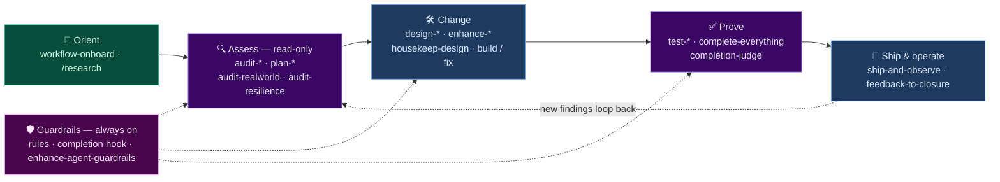

<p align="center">
  
</p>

<h1 align="center">cursor-kenji</h1>

<p align="center">
  <strong>Agent skills, slash commands, and MCP configs for Cursor.</strong><br/>
  109 agent skills · 36 slash commands · 16 MCP servers · 12 Cursor skills · 6 subagents<br/><br/>
  <em>Tell your AI editor what you want in plain English — the matching expert playbook runs automatically. No prompt-engineering.</em>
</p>

<p align="center">
  <a href="https://www.npmjs.com/package/@kensaurus/cursor-kenji"></a>
  
</p>

---

**cursor-kenji** gives your AI editor a library of expert playbooks, so instead of improvising it follows a proven, repeatable process. It ships **109 Cursor agent skills**, 36 slash commands, and 6 subagents, tuned for React / Next.js / Supabase but useful on any stack. Install once, then just tell the editor what you want. The matching skill runs itself.

> **New to AI skills?** Think of each skill as a ready-made playbook your editor opens on its own. You say what you want in plain English, like *"audit my security"*, *"make this form accessible"*, or *"clean up the design system"*, and the right playbook takes over. No prompt-engineering. No names to memorize.

**Who's it for?** Anyone using [Cursor](https://cursor.com) or [Claude Code](https://www.anthropic.com/claude-code), plus Codex and Gemini CLI. Brand new to Cursor? Start with the **[plain-language guide →](docs/GETTING-STARTED.md)**.

**The five building blocks.** Here's what those numbers actually mean:

| Building block | In plain English | You trigger it by… |
|:--|:--|:--|
| **Skill** | An auto-triggering playbook for one job (audit, build, fix, enhance) | describing the task in chat |
| **Command** | A `/shortcut` for a frequent action | typing `/commit`, `/pr`, `/plan` |
| **Subagent** | A background helper that runs a focused sub-task | mentioning it — *"review this PR"* |
| **Rule** | An always-on convention the AI must obey | dropping a `.mdc` file in your project |
| **MCP server** | A live connection to an outside tool (database, GitHub, browser) | copying an MCP template + your keys |

Everything here follows the [Agent Skills spec](https://agentskills.io/specification) and is validated on every commit, so nothing ships broken (`npm test` covers all **121** installable skills, Cursor IDE tools included). MCP templates pin exact versions to keep you safe from [package-hallucination attacks](https://cloudsecurityalliance.org/blog/product-news/2025/03/06/slopsquatting-ai-code-assistants-and-package-hallucinations).

```bash
npx skills add kensaurus/cursor-kenji
```

Restart Cursor. Done.

> No Cursor? **[Download Cursor](https://cursor.com)** · No `skills` CLI? `npm install -g skills` first, or use [manual install](#manual-install) below.

---

## Quick Start

Pick whichever fits how you work. The first one covers most people.

| Method | Command |
|:-------|:--------|
| **skills.sh** (recommended) | `npx skills add kensaurus/cursor-kenji` |
| **npm installer** | `npx @kensaurus/cursor-kenji` |
| **Clone** | `git clone … && ./install.sh` |

**npm installer modes:**

```bash
npx @kensaurus/cursor-kenji            # merge — add/overwrite this repo's items (Cursor)
npx @kensaurus/cursor-kenji --auto     # detect installed tools and install to each
npx @kensaurus/cursor-kenji --claude   # install for Claude Code (~/.claude/) instead
npx @kensaurus/cursor-kenji --codex    # install for Codex CLI (~/.codex/AGENTS.md + prompts)
npx @kensaurus/cursor-kenji --gemini   # install for Gemini CLI (~/.gemini/GEMINI.md + commands)
npx @kensaurus/cursor-kenji --all      # install for all four supported tools in one run
npx @kensaurus/cursor-kenji --clean    # mirror ~/.cursor to match this repo (backup first)
npx @kensaurus/cursor-kenji --dry-run  # preview
npx @kensaurus/cursor-kenji --skill audit-ux   # single skill
npx @kensaurus/cursor-kenji --link     # dev: symlink for live skill authoring
```

**Use more than one AI tool? Reach for `--auto`.** It checks `~/.cursor`, `~/.claude`, `~/.codex`, and `~/.gemini`, then installs the right files to each one it finds. Running the bare command stays Cursor-only, so nothing changes for existing setups.

From a clone: `npm run install:cursor` · `npm test` validates skills + count + install smoke test.

**Optional — [Mushi Mushi](https://github.com/kensaurus/mushi-mushi)** bug-report triage + AI draft PRs (pairs with `mushi-health`, `test-playwright`):

```bash
npx skills add kensaurus/mushi-mushi
```

**After install:** (1) Restart Cursor (2) Copy `mcp/mcp.json.template` → `~/.cursor/mcp.json`, fill `YOUR_*` keys (3) Describe any task — skills match on keywords.

**Authoring skills?** Each skill must pass [Agent Skills spec](https://agentskills.io/specification) validation (`npm run validate:skills`): `name` matches directory, `description` ≤ 1024 chars, body < 500 lines.

### Claude Code

One-click, no clone needed (works on Windows too):

```bash
npx @kensaurus/cursor-kenji --claude   # Claude Code only
npx @kensaurus/cursor-kenji --all      # all four supported tools
```

All skills, commands, agents, and rules install to Claude Code (`~/.claude/`), with `.mdc` rules installed as `.md`. Skills appear as `/slash-commands` — type `/` inside any `claude` session.

From a clone, the bash installer does the same:

```bash
# Install for Claude Code only
./install.sh --claude

# Install for both Cursor and Claude Code (default)
./install.sh
```

```bash
# Inside Claude Code — use skills as slash commands
/workflow-build-feature
/debug-error the login endpoint returns 401
/plan-security-audit
/docs-writer
```

Skills are read from `~/.claude/skills/<name>/SKILL.md`. No restart required when you re-run the installer — Claude Code picks up file changes at the start of each new session.

### Codex CLI & Gemini CLI

Codex CLI and Gemini CLI don't have a skills system yet. Each reads a single global context file instead, so cursor-kenji maps to exactly what they load:

```bash
npx @kensaurus/cursor-kenji --codex    # Codex CLI
npx @kensaurus/cursor-kenji --gemini   # Gemini CLI
```

| | Codex CLI | Gemini CLI |
|:--|:--|:--|
| **Rules → context file** | `~/.codex/AGENTS.md` | `~/.gemini/GEMINI.md` |
| **Portable commands** | `~/.codex/prompts/*.md` | `~/.gemini/commands/*.toml` |

Your `rules/` get merged into that one auto-loaded file (the skill-routing index is skipped, since nothing here would load it). Three standalone playbooks — `plan`, `research`, and `fix-issue` — ship as native prompts/commands. Skills and subagents aren't written out, because neither tool can load them, so they'd only be dead files. Any existing `AGENTS.md` or `GEMINI.md` is backed up as `.bak-<stamp>` first, and re-running the installer is always safe.

> The bash `install.sh --codex`/`--gemini` delegates to the Node installer (needs Node ≥ 18) so the merge/port logic has a single source of truth.

### Manual install

```bash
git clone https://github.com/kensaurus/cursor-kenji.git && cd cursor-kenji && ./install.sh
```

<details>
<summary>One-liner (curl)</summary>

```bash
curl -sSL https://raw.githubusercontent.com/kensaurus/cursor-kenji/main/install.sh | bash
```

</details>

**Keep fresh:** `npx skills add kensaurus/cursor-kenji` or `git pull && ./install.sh`

---

## What's Inside

The whole kit, at a glance:

| | Count | What it does |
|:--|------:|:-------------|
| **Skills** | 109 | Auto-triggering capabilities (audit, enhance, debug, test, build, plan) |
| **Cursor Skills** | 12 | IDE tools (canvas, hooks, rules, PR splitter) |
| **Commands** | 36 | Slash workflows (`/commit`, `/pr`, `/burndown-full`, `/thirdparty-web-interface-guidelines`) |
| **Subagents** | 6 | Background agents (code-reviewer, debugger, db-migrator…) |
| **Completion hook** | 1 | Opt-in stop gate: continues only unfinished durable closure state |
| **MCP Servers** | 16 | Supabase · GitHub · Sentry · Playwright · AWS · Slack |
| **Project Rules** | 6 | Drop-in `.mdc` for `.cursor/rules/` (plus 3 global, 5 RN bundle optional) |
| **Notepads** | 2 | Context templates (architecture, design tokens) |
| **Shell Aliases** | 8 | `newskill`, `cursor-sync`, `gc`, `gp` |

Want every skill spelled out? Expand the groups below — or jump to **[Every skill, in plain English](#every-skill-in-plain-english)**. Trigger phrases live in **[docs/CATALOG.md](docs/CATALOG.md)** · quick lookup in **[docs/TRIGGER-CHEATSHEET.md](docs/TRIGGER-CHEATSHEET.md)**.

---

## Every skill, in plain English

Here's the whole library — grouped by the families above, each with a one-line summary. You don't memorize these; you just describe your task and Cursor matches the right one. Want the trigger phrases too? They live in **[docs/CATALOG.md](docs/CATALOG.md)**.

<!-- SKILL-INDEX:START -->

_Auto-generated from each skill's `SKILL.md` — run `npm run gen:skill-index` after adding a skill. Click any group to expand._

<details>
<summary><strong>🔍 Audit — read-only assessments</strong> (17)</summary>

- `audit-accessibility` — Automated WCAG 2.2 accessibility audit using Playwright browser MCP to crawl every page, inject axe-core via browser_evaluate, test keyboard navigation,…
- `audit-backend-architecture` — Read-only audit AND decision advisor for backend/distributed-systems architecture, topology-gated so a Next.js/Supabase monolith and a Kubernetes fleet…
- `audit-bundle-size` — Analyse and shrink JavaScript bundle size for any web app
- `audit-cicd` — Audit CI/CD pipelines (GitHub Actions) for cost, speed, and safety
- `audit-code-quality` — Detect and fix code anti-patterns, and audit codebase consistency
- `audit-code-review` — Review code for quality, security, and maintainability following best practices
- `audit-db-schema` — Audit database schema for consistency, validation, and industry standards
- `audit-fe-api` — Audit frontend API calls against backend implementation for any project
- `audit-i18n` — Audit and fix internationalisation for any web or mobile app
- `audit-langfuse-llm` — Run a PDCA quality audit on LLM/AI features: traces, prompts, costs, evals, grounding, hallucination
- `audit-payment-system` — Read-only audit for payment/money-movement systems, scope-gated so a simple Stripe-Checkout site and an in-house ledger/gateway each see only relevant…
- `audit-performance` — Audit and optimize application performance
- `audit-realworld` — Audit a full-stack app against the RealWorld ("Conduit") reference — its formal API spec, shared Bruno/Hurl E2E suite, and closest-stack reference…
- `audit-resilience` — Read-only audit for the non-functional "20%" AI agents systematically skip: timeouts, retries with backoff+jitter, circuit breakers, idempotency keys,…
- `audit-security` — Audit code for security vulnerabilities and best practices
- `audit-uiux-design-system` — Audit visual UI coherency, design token compliance, and component modularity against a design system for any project
- `audit-ux` — Audit user experience quality using research-backed frameworks: Nielsen Norman Group's 10 usability heuristics, Intuit Content Design System for…

</details>

<details>
<summary><strong>📋 Plan — audit + approve before executing</strong> (17)</summary>

- `plan-aeo-readiness` — Audit a site for answer-engine and generative-engine visibility (citation by ChatGPT, Claude, Perplexity, AI Overviews), then produce a phased improvement…
- `plan-antislop` — Audit a codebase, UI, or copy for machine-generated tells across prose, visual/UI, code, and structure/IA, then produce a phased de-slop burndown
- `plan-capacitor-hardening` — Audit a Capacitor/Ionic hybrid app for native-layer security gaps, then produce a phased hardening plan
- `plan-data-integrity` — Audit a project for destructive-operation and migration safety gaps, then produce a phased safeguard plan
- `plan-dependency-provenance` — Audit dependencies for hallucinated or slopsquatted packages, supply-chain risk, and licensing/provenance gaps, then produce a phased remediation plan
- `plan-docs-sync` — Audit documentation against actual code behavior and plan corrections — no rewrites in this pass
- `plan-error-handling` — Audit a codebase for silent failures, swallowed exceptions, and observability gaps across Sentry and Langfuse, then produce a phased fix plan
- `plan-input-validation` — Audit every trust boundary for unvalidated input, injection, and forged-request gaps, then produce a phased hardening plan
- `plan-llm-cost-guardrails` — Audit an LLM-powered app for runaway-cost and quota-abuse exposure, then produce a phased guardrail plan
- `plan-mobile-readiness` — Audit a Capacitor/React Native app for App Store and Google Play submission readiness, then produce a phased pre-submission plan
- `plan-perf-audit` — Measure-don't-guess performance audit across web, mobile, backend, and data layers — produces burndown and optimization plan with no fixes in this pass
- `plan-rls-audit` — Audit a Supabase/Postgres project for Row-Level Security and access-control gaps, then produce a phased remediation plan
- `plan-secrets-audit` — Audit a codebase and git history for exposed credentials and mis-scoped keys, then produce a phased rotation-and-remediation plan
- `plan-security-audit` — OWASP Top 10 security audit with Supabase-first methodology — RLS pass, bundle/secret scan, auth-path tracing, dependency CVEs
- `plan-stub-checker` — Exhaustive audit for stubs, dead buttons, fake/placeholder components, unwired handlers, dead links, orphans, and severed integrations — produces a…
- `plan-test-coverage` — User-story-driven test coverage audit and plan — no test writing in this pass
- `plan-uiux-unification` — Exhaustive, non-destructive UI/UX and design-system audit that produces a burndown and unification plan — no code changes until each phase is approved

</details>

<details>
<summary><strong>🎨 Enhance — improve what already exists</strong> (12)</summary>

- `enhance-agent-guardrails` — Install guardrails-as-code into a repo so AI/vibe-coding can't keep reintroducing the same classes of problems (leaked secrets, injection, off-system…
- `enhance-capacitor-ui` — Cross-surface UIUX separation skill for hybrid web apps that ship as PWA + iOS + Android via Capacitor (or Tauri / Expo Web / Ionic / RN-Web)
- `enhance-motion` — Audit an existing app's design system and current motion, then apply coherent, performant, accessible motion using the right-sized 2026 stack —…
- `enhance-pwa` — Add or upgrade PWA features to any web app: service worker, offline mode, install prompt, push notifications, and background sync
- `enhance-readme` — Turn a plain-text README into a visually rich showcase with a theme-aware hero image, a feature tour grid, an optional animated guided-tour GIF, and…
- `enhance-web-forms` — Build or upgrade web forms to production quality: accessible structure (labels, fieldsets, autocomplete, correct input types), schema-driven validation…
- `enhance-web-landing` — Build landing pages, portfolios, and marketing sites that don't look AI-generated
- `enhance-web-redesign` — Upgrades existing websites and apps to premium quality
- `enhance-web-seo` — Audit and fix SEO for any web app. Checks meta tags, Open Graph and Twitter Card tags, JSON-LD structured data, robots.txt, sitemap.xml, canonical URLs,…
- `enhance-web-ui` — Artistic, research-grounded UI enhancement skill for making an existing page feel intentional, spacious, and human-crafted
- `enhance-web-ux` — Generative, NN/g-grounded page enhancement skill
- `enhance-web-web3d` — Add 3D and scroll-driven motion to an existing website or web app — Three.js / React Three Fiber for the scene, GSAP ScrollTrigger for scroll-driven…

</details>

<details>
<summary><strong>✨ Design — build new surfaces</strong> (10)</summary>

- `design-api` — Design RESTful and GraphQL APIs following current best practices for naming, versioning, error shapes, and auth patterns
- `design-canvas` — Create museum-quality visual art in .png and .pdf formats using design philosophy
- `design-email` — Design and implement transactional and marketing email templates
- `design-frontend` — Create distinctive, production-grade frontend interfaces that avoid generic AI aesthetics
- `design-generative-art` — Create algorithmic art using p5.js, Canvas API, or SVG with seeded randomness and interactive parameters
- `design-mobile-first` — Designs mobile-first responsive interfaces with touch optimization — breakpoint strategy, touch targets, safe areas, and gesture handling, enhanced…
- `design-motion` — Design and implement purposeful motion — micro-interactions, page transitions, scroll animations, and hover effects — using Framer Motion, CSS animations,…
- `design-prd` — Generate Product Requirements Documents through structured conversation for any project
- `design-system` — Build and maintain cohesive design systems and component libraries with tokens, theming, and documented variants
- `design-theme` — Apply cohesive visual themes to artifacts (slides, docs, landing pages)

</details>

<details>
<summary><strong>🧱 Backend — server & data-layer patterns</strong> (5)</summary>

- `backend-db-performance` — Optimize database queries, schemas, and performance
- `backend-error-handling` — Implement solid error handling patterns
- `backend-observability` — Instrument features so errors, traces, and logs are correlated from the first line
- `backend-patterns` — Apply modern backend patterns — auth middleware, caching strategies, background queues, rate limiting, and serverless/edge function design — across stacks…
- `backend-realtime` — Implement real-time features using WebSockets, Supabase Realtime, Server-Sent Events, and live data

</details>

<details>
<summary><strong>📱 Mobile — React Native / Capacitor</strong> (5)</summary>

- `mobile-capacitor-platform` — Handle Capacitor platform depth beyond UI: plugins, OTA, deep links, push, offline, native CI/CD, App Store / Play Store submission, Apple preflight,…
- `mobile-emulator-start` — Boots a clean Android emulator + Metro (Expo dev-client / bare React Native) with the right ordering: inspect existing IDE terminals first, kill stale…
- `mobile-emulator-test` — QA a native Android build end-to-end on the emulator
- `mobile-rn-performance` — Fix React Native / Expo performance, build, and upgrade issues
- `mobile-rn-screen` — Polish an existing React Native screen to feel intentional, native, and human-crafted

</details>

<details>
<summary><strong>📊 Data — visualization & pipelines</strong> (2)</summary>

- `data-pipeline` — Wire ETL, ingestion, cron, edge-function, and queue jobs correctly
- `data-visualization` — Build interactive, accessible charts, graphs, and data dashboards using Recharts, D3, or Victory

</details>

<details>
<summary><strong>📚 Docs — documentation</strong> (2)</summary>

- `docs-coauthor` — Co-author structured documents (specs, PRDs, RFCs, ADRs) through a 3-stage workflow: context gathering, drafting, and reader testing
- `docs-writer` — Write clear, developer-friendly documentation — READMEs, API references, code comments, and changelog entries — tailored to the audience and the project's…

</details>

<details>
<summary><strong>🧹 Housekeeping — consolidate drift</strong> (1)</summary>

- `housekeep-design` — Consolidate a design system that has drifted across many vibe-coding sessions and developer handoffs into one single source of truth

</details>

<details>
<summary><strong>🔗 Workflows — multi-step bundles</strong> (17)</summary>

- `workflow-build-feature` — End-to-end feature build workflow: spec → TDD → implement → smoke test → PR
- `workflow-coding-discipline` — Apply behavioral guardrails when writing, editing, refactoring, or debugging code
- `workflow-environment-ready` — Prove the working environment is actually runnable before starting a long or autonomous task, so a multi-hour run does not fail at the finish line on a…
- `workflow-feature-flag` — Plan and execute a disciplined feature-flag rollout for any app
- `workflow-feedback-to-closure` — Turn raw feedback — bug reports, user complaints, review comments, Sentry issues, QA findings, audit/red-team output — into deduplicated, durable,…
- `workflow-fix-and-ship` — Complete bug-fix lifecycle in one sweep: triage production signals (Sentry / logs) → reproduce → fix (debug-error) → verify full-stack (test-playwright) →…
- `workflow-git-commit` — Generate clear, descriptive commit messages following conventional commits format
- `workflow-green-repo` — Drive an entire repository to a fully green baseline — typecheck, lint, tests, and build all passing from a clean checkout — when the user has explicitly…
- `workflow-housekeep` — Repo housekeeping: sync READMEs to match current architecture, remove dead files (logs, screenshots, deprecated code, build artifacts), update…
- `workflow-launch-ready` — Full launch preparation sweep for a new app or major release
- `workflow-onboard` — First-contact orientation for an unfamiliar codebase
- `workflow-parallel-agents` — Run multiple agents in parallel via git worktrees, cloud agents, or multi-model comparison
- `workflow-pr` — Manage the full PR lifecycle — create, review, address bot feedback, resolve conflicts, and merge
- `workflow-quality-gate` — Pre-release quality gate that sequences test-red-team, audit-security, audit-bundle-size, audit-performance, and test-unit into a single sweep
- `workflow-refactor` — Guide for refactoring code to improve quality without changing behavior
- `workflow-ship-and-observe` — Take merged, repository-green code all the way to a verified, monitored production release for any app stack
- `workflow-spec-tdd` — Stop vibe-coding with a spec → plan → TDD loop before writing a line

</details>

<details>
<summary><strong>✅ Test & QA</strong> (4)</summary>

- `test-playwright` — Close the PDCA loop on the work you just did
- `test-qa` — Generic webapp QA fallback — use only when no project-specific QA skill applies (project-local QA skills take precedence; use mobile-emulator-test for…
- `test-red-team` — Adversarial red-team of a running web, React Native, or Capacitor hybrid app
- `test-unit` — Write effective unit tests with best practices for any project

</details>

<details>
<summary><strong>🚀 Deploy — release & verify</strong> (2)</summary>

- `deploy-npm` — Release npm packages end-to-end: Changesets version bump, CHANGELOG update, GitHub Actions OIDC publish, and post-release verification
- `deploy-verify` — Post-deploy smoke test combining all 5 MCPs (Sentry + Supabase + Langfuse CLI + Playwright + Firecrawl) into one workflow

</details>

<details>
<summary><strong>🐛 Debug & operate</strong> (3)</summary>

- `debug-error` — Systematic debugging workflow for errors and bugs
- `debug-fe-be-integration` — Debug frontend-backend integration issues for any project by analyzing backend logs, identifying incorrect API calls, and fixing both sides
- `debug-sentry-monitor` — Monitor, triage, fix, and proactively enhance Sentry error monitoring for any project

</details>

<details>
<summary><strong>🦟 Mushi Mushi integration</strong> (2)</summary>

- `mushi-health` — Pass/fail health check across every Mushi Mushi pipeline component — CLI credentials, API reachability, edge functions, BYOK key pool, QA cron
- `mushi-integration` — Full end-to-end Mushi Mushi integration smoke test: bug capture → AI triage → story mapping → TDD test generation → approval → execution → PDCA cycle

</details>

<details>
<summary><strong>🛡️ Protocols — session guardrails</strong> (1)</summary>

- `protocol-browser-anti-stall` — Prevent browser automation from freezing, getting stuck, or waiting excessively during page navigation and interaction, and enforce manual, headed,…

</details>

<details>
<summary><strong>✍️ Authoring — build skills & MCP</strong> (2)</summary>

- `meta-mcp-builder` — Scaffold and implement Model Context Protocol (MCP) servers that expose external services, APIs, and data sources as typed tools and resources for LLM…
- `meta-skill-creator` — Create or update Cursor agent skills (SKILL.md)

</details>

<details>
<summary><strong>🤝 Third-party (vendored, upstream-maintained)</strong> (3)</summary>

- `thirdparty-emil-design-eng` — Third-party skill — Emil Kowalski's design engineering philosophy (UI polish, component design, animation craft)
- `thirdparty-ui-ux-pro-max` — Third-party skill — design intelligence for professional UI/UX (the full style catalog, palettes, typography, UX guidelines)
- `thirdparty-web-interface-guidelines` — Third-party skill — reviews UI code for Vercel Web Interface Guidelines compliance (accessibility, focus, forms, animation, performance, copy)

</details>

<details>
<summary><strong>🧩 Core & cross-cutting</strong> (4)</summary>

- `burndown-full` — Drive a planned change to 100% coverage across an entire codebase when a prior agent run stopped early
- `complete-everything` — Close an approved plan with zero plan-related deferrals: implement every unfinished item, absorb every connected out-of-scope/follow-up/nice-to-have item…
- `iterate-agent-harness` — Turn an agent's own failure — a premature stop, a false "done", a reward- hacked check, a missed file, a broken handoff — into a durable improvement to…
- `iterate-post-launch` — Close the post-launch improvement loop for any shipped app

</details>

<details>
<summary><strong>🖱️ Cursor IDE skills</strong> (12)</summary>

- `babysit` — Keep a PR merge-ready by triaging comments, resolving clear conflicts, and fixing CI in a loop
- `canvas` — A Cursor Canvas is a live React app the user opens beside the chat
- `create-hook` — Create Cursor hooks
- `create-rule` — Create Cursor rules for persistent AI guidance
- `create-skill` — Guide users through creating effective Agent Skills for Cursor
- `create-subagent` — Create custom subagents for specialized AI tasks
- `migrate-to-skills` — Convert 'Applied intelligently' Cursor rules (.cursor/rules/*.mdc) and slash commands (.cursor/commands/*.md) to Agent Skills format (.cursor/skills/)
- `shell` — Run the rest of a /shell request as a literal shell command
- `split-to-prs` — Split current work into small reviewable PRs
- `statusline` — Configure a custom status line in the CLI
- `update-cli-config` — View and modify Cursor CLI configuration in ~/.cursor/cli-config.json
- `update-cursor-settings` — Modify Cursor/VSCode user settings in settings.json

</details>

<!-- SKILL-INDEX:END -->

---

## Workflows

You rarely run just one skill. You **chain** them around a simple build loop: each family owns a stage, and guardrails run across all of them so a fast, vibe-coding session can't quietly break things. The rule of thumb is easy to remember — **assess before you change, prove before you ship, and never skip a stage.**

### The mental model

Here's how the families hand off to each other:


```mermaid
flowchart LR
  O["🧭 Orient<br/>workflow-onboard · /research"]
  A["🔍 Assess — read-only<br/>audit-* · plan-*<br/>audit-realworld · audit-resilience"]
  C["🛠️ Change<br/>design-* · enhance-*<br/>housekeep-design · build / fix"]
  P["✅ Prove<br/>test-* · complete-everything<br/>completion-judge"]
  S["🚀 Ship & operate<br/>ship-and-observe · feedback-to-closure"]
  G["🛡️ Guardrails — always on<br/>rules · completion hook · enhance-agent-guardrails"]

  O --> A --> C --> P --> S
  S -. "new findings loop back" .-> A
  G -.-> A
  G -.-> C
  G -.-> P

  style O fill:#064e3b,stroke:#10b981,color:#d1fae5
  style A fill:#3b0764,stroke:#a78bfa,color:#ede9fe
  style C fill:#1e3a5f,stroke:#60a5fa,color:#dbeafe
  style P fill:#3b0764,stroke:#a78bfa,color:#ede9fe
  style S fill:#1e3a5f,stroke:#60a5fa,color:#dbeafe
  style G fill:#4a044e,stroke:#f0abfc,color:#fae8ff
```

- **Orient** — get to know the repo before you touch it.
- **Assess** — measure, don't guess. `audit-*` skills can fix things inline; `plan-*` skills only plan until you approve. A few specialists go deep:
  - `audit-realworld` — checks full-stack feature parity.
  - `audit-resilience` — covers the non-functional work most agents skip: timeouts, retries, idempotency, PII.
  - `audit-backend-architecture` — reviews distributed-systems patterns (gateway, BFF, outbox, saga, cache-aside, and friends) and tells you which to adopt next versus skip as over-engineering.
  - `audit-payment-system` — checks money-movement correctness: double-charge protection, ledgers, webhooks, reconciliation, PCI.
- **Change** — `design-*` builds something new, `enhance-*` improves what's already there (motion, forms, UI, UX, SEO), and `housekeep-design` merges a drifted design system back into one source of truth.
- **Prove** — `test-*` skills, plus the no-false-done trio: `verification-before-completion` → `completion-judge` → `complete-everything`.
- **Ship & operate** — release it, watch it, and feed anything you learn back into Assess.
- **Guardrails** — `enhance-agent-guardrails` installs the rules, hooks, and CI gates that stop the loop from regressing between sessions.

### Start here, by situation

Find the row that sounds like your day, then follow the chain:

| Your situation | Chain (→ hands off to) |
|:---------------|:-----------------------|
| New to this repo | `workflow-onboard` → `/research` |
| Inherited a messy / drifted design system | `audit-uiux-design-system` → `plan-uiux-unification` → **`housekeep-design`** |
| Make the app feel alive | **`enhance-motion`** (existing app) · `design-motion` (from scratch) |
| Forms are clunky or inaccessible | **`enhance-web-forms`** → `audit-accessibility` |
| "Is it production-ready?" | **`audit-resilience`** + **`audit-realworld`** → `workflow-quality-gate` |
| Backend architecture — which pattern to use / am I over-engineering? | **`audit-backend-architecture`** → `backend-patterns` |
| Payment flow — double-charge, ledger, webhook, PCI safe? | **`audit-payment-system`** → `audit-security` / `audit-resilience` |
| Stop AI / vibe-coding regressions | **`enhance-agent-guardrails`** → `plan-security-audit` |
| Close everything, zero deferrals | **`complete-everything`** → `completion-judge` |
| Ship it and watch it | `workflow-ship-and-observe` → `debug-sentry-monitor` → `workflow-feedback-to-closure` |

### Bundled workflows

Say the phrase, and the whole sequence runs for you:

| Say this | Bundle | What runs |
|----------|--------|-----------|
| "complete everything" | `complete-everything` | recover parked work → implement all → full verification → independent judge |
| "make the repo green" | `workflow-green-repo` | discover gates → enumerate failures → batch fix → prove green |
| "ship it / go live" | `workflow-ship-and-observe` | preflight → deploy → verify live revision → observe → stable/rollback |
| "triage this feedback" | `workflow-feedback-to-closure` | gather → dedupe → tickets → fix → verify live → close |
| "build a feature" | `workflow-build-feature` | spec → TDD → unit → smoke → PR |
| "fix this and ship" | `workflow-fix-and-ship` | debug → fix → regression → PR → deploy |
| "is this ready?" | `workflow-quality-gate` | red-team → security → bundle → perf → unit |
| "prepare for launch" | `workflow-launch-ready` | SEO + PWA + bundle + i18n + quality gate |
| "orient me" | `workflow-onboard` | codebase briefing in ~5 min |

### Plan loops (audit only — approve before execution)

These **17 `plan-*` skills** come in grouped loops. Each one audits, then hands you a plan — nothing changes until you approve it. See **[docs/PLAN-LOOPS.md](docs/PLAN-LOOPS.md)** for diagrams, slash aliases (`/uiux-plan`, `/capacitor-plan`, …), and how each maps to execution.

| Loop | Skills | When |
|------|--------|------|
| Six-skill | uiux → stub → test-coverage → perf ∥ security → docs-sync | Inherited codebase / UI hardening |
| Pre-launch hardening | input-validation → secrets → RLS → data-integrity → dependency-provenance | Supabase/Stripe, pre-open-source |
| Observability & spend | error-handling + llm-cost-guardrails | LLM features, Sentry/Langfuse gaps |
| Mobile gate | capacitor-hardening → mobile-readiness | Capacitor/hybrid pre-store |
| Growth gate | aeo-readiness | AI citation visibility |

**One-shot (six-skill plan only):**

```
Run the six-skill plan loop — no changes until I approve each phase:
plan-uiux-unification → plan-stub-checker → plan-test-coverage →
plan-perf-audit + plan-security-audit (parallel) → plan-docs-sync.
```

More copy-paste recipes (adopt repo, de-slop a page, pre-launch sweep, split PRs) → **[docs/CATALOG.md#skill-composition-patterns](docs/CATALOG.md#skill-composition-patterns)** · New to Cursor? → **[docs/GETTING-STARTED.md](docs/GETTING-STARTED.md)**

---

## How to Use

Four kinds of building blocks, four ways to reach them:

| Primitive | Invoke | Example |
|:----------|:-------|:--------|
| **Skill** | Describe the task | "audit my security" → `audit-security` |
| **Command** | `/name` in chat | `/commit`, `/research`, `/pr` |
| **Subagent** | Mention trigger keyword | "review this PR" → `code-reviewer` |
| **Rule** | Copy `.mdc` into project | Always-on conventions |

**Force a skill:** *"use `enhance-web-ux` on `/dashboard`"*

---

## Skill taxonomy

Every skill has two labels: a **family** (its `<prefix>-<topic>` name) and a **lifecycle stage** (from the loop above). The table below shows which stage each family lives in. For the full entries with trigger phrases, see **[docs/CATALOG.md](docs/CATALOG.md)**.

| Prefix | Stage | Purpose | Examples |
|:-------|:------|:--------|:---------|
| `audit-` | 🔍 Assess | Read-only assessments (may fix inline) | `audit-security`, `audit-resilience`, `audit-realworld` |
| `plan-` | 🔍 Assess | Audit-and-plan burndowns — approve before execute (17) | `plan-stub-checker`, `plan-rls-audit`, `plan-security-audit` |
| `enhance-` | 🛠️ Change | Improve existing UI/UX/motion/forms/SEO/PWA | `enhance-motion`, `enhance-web-forms`, `enhance-web-ux` |
| `design-` | 🛠️ Change | New surfaces from scratch | `design-frontend`, `design-motion`, `design-system` |
| `backend-` | 🛠️ Change | Server patterns & resilience | `backend-patterns`, `backend-observability` |
| `mobile-` | 🛠️ Change | RN / Capacitor / emulator | `mobile-rn-screen`, `mobile-capacitor-platform` |
| `docs-` | 🛠️ Change | Documentation | `docs-writer`, `docs-coauthor` |
| `workflow-` | ♻️ Spans | Multi-phase process bundles | `workflow-build-feature`, `workflow-spec-tdd`, `workflow-housekeep` |
| `test-` | ✅ Prove | QA and unit tests | `test-playwright`, `test-red-team`, `test-unit` |
| `deploy-` | 🚀 Ship | Release verify | `deploy-verify`, `deploy-npm` |
| `debug-` | 🚀 Operate | Failures and integration | `debug-error`, `debug-sentry-monitor` |
| `mushi-` | 🚀 Operate | Mushi Mushi integration | `mushi-health`, `mushi-integration` |
| `protocol-` | 🛡️ Guardrail | Session guardrails | `protocol-browser-anti-stall` |
| `meta-` | ✍️ Author | Author skills/MCP | `meta-skill-creator`, `meta-mcp-builder` |
| `thirdparty-` | Varies | Upstream-maintained (vendored) | `thirdparty-emil-design-eng`, `thirdparty-ui-ux-pro-max`, `thirdparty-web-interface-guidelines` |

> `housekeep-design` (design-system consolidation) is the execution arm of `plan-uiux-unification`; it lives in the 🛠️ Change stage alongside `enhance-*`.

> **Third-party skills:** prefixed `thirdparty-*` with `ATTRIBUTION.md` — do not add Kenji-specific sections to upstream bodies. Full guide → **[docs/THIRD-PARTY-SKILLS.md](docs/THIRD-PARTY-SKILLS.md)**.

> **Note:** Anthropic `file-docx/pdf/pptx/xlsx` skills are not in this public repo. Keep personal copies in `~/.cursor/skills/` if needed.

**Cursor-specific skills (12):** `babysit`, `canvas`, `create-hook`, `create-rule`, `create-skill`, `split-to-prs`, … — see [CATALOG.md](docs/CATALOG.md).

---

## Commands (36)

Commands are shortcuts for the things you do constantly. Type `/` in chat to see them all.

| Command | When | What |
|:--------|:-----|:-----|
| `/burndown-full` | Partial refactor stopped early | Drive plan to 100% repo coverage via MATCH/DONE + verification gate |
| `/complete-everything` | Plan marked done with deferrals | Close planned, parked, and discovered work; run the full applicable test ladder |
| `/green-repo` | Whole-repo debt cleanup (authorized) | Drive typecheck/lint/test/build to green from a fresh run |
| `/ship-and-observe` | Deploy to production | Verify the live revision, observe the stability window, roll back if needed |
| `/feedback-to-closure` | Incoming reports/QA/Sentry | Dedupe into durable tickets → fix → production-verified closure |
| `/plan` | Before coding | Research + approved plan |
| `/commit` | After coding | Lint, typecheck, commit |
| `/pr` | Ready to ship | Push + open PR |
| `/fix-issue [#]` | Bug reports | Issue → fix → PR |
| `/debug-issue` | Tricky bugs | Instrumented debugging |
| `/review-code` | Before merge | Agent + manual review |
| `/test` | Before commit | Test suite + coverage |
| `/update-deps` | Maintenance | Safe dep updates |
| `/research` | Before coding | Firecrawl doc research |
| `/readme` | End of session | Sync READMEs |
| `/refactor` | Long files | Modular split |
| `/mcp-guide` | MCP workflow | Tool reference (renamed to avoid Claude Code's built-in `/mcp`) |
| `/uiux` | UI review | Design-system enforcement |
| `/thirdparty-web-interface-guidelines` | Vercel UI audit | Review files against [Web Interface Guidelines](https://vercel.com/design/guidelines) |
| `/*-plan` (17 aliases) | Audit before changing | Thin pointers to the `plan-*` skills (`/uiux-plan`, `/security-plan`, …) — audit + plan only. See [CATALOG](docs/CATALOG.md#pointer-delegates-to-skill) |

**RN monorepo bundle:** copy `commands/native-rn-monorepo/` + `rules/native-rn-monorepo/` into your project (iOS builds on CI, not locally).

---

## Subagents (6)

Subagents are focused helpers that peel off to handle one job and report back. Just mention what you need and the right one steps in.

| Agent | Triggers on | Output |
|:------|:------------|:-------|
| `code-reviewer` | "review", code changes | Quality, security, types |
| `debugger` | Errors, exceptions | Root cause + fix |
| `db-migrator` | "migration", "new table" | SQL, RLS, indexes |
| `deploy-checker` | "deploy", "ship it" | Pre-deploy validation |
| `perf-monitor` | "slow", "optimize" | Perf audit |
| `completion-judge` | Plan/burndown closure claim | PASS / CONTINUE / BLOCKED against plan, state, diff, and fresh evidence |

Beyond the prompt itself, `complete-everything` leans on two safety nets: a packaged Cursor stop hook that auto-continues any unfinished work, and `completion-judge`, which independently rejects stale or premature "done" claims. On Claude Code 2.1.139+ you can kick off the same run with `/goal` (see the skill for details).

---

## MCP servers (16)

MCP servers connect your editor to the outside world — your database, GitHub, a browser, and more. Copy a template and drop in your keys:

```bash
cp ~/cursor-kenji/mcp/mcp.json.template ~/.cursor/mcp.json      # essential 5
cp ~/cursor-kenji/mcp/mcp-full.json.template ~/.cursor/mcp.json  # all 16
```

Replace `YOUR_*` placeholders with real keys. Setup details → **[mcp/README.md](mcp/README.md)**

| Tier | Servers | Keys? |
|:-----|:--------|:------|
| Essential | Sequential Thinking, Context7, Firecrawl, Supabase, Playwright | Firecrawl + Supabase |
| Dev | GitHub, Playwright, Postgres, Memory | PAT / conn string |
| Cloud | AWS Lambda, S3, CloudWatch, Redis | AWS profile / URL |
| Productivity | Slack, Notion | Bot token / API key |

---

## Project rules

Rules are always-on conventions your editor follows inside a project. Copy the starters into any repo:

```bash
cp ~/cursor-kenji/rules/project-starter/*.mdc your-project/.cursor/rules/
```

| Rule | Enforces |
|:-----|:---------|
| `supabase.mdc` | Typed clients, RLS, migrations |
| `typescript.mdc` | No `any`, Zod, ActionResult |
| `components.mdc` | Primitives, Server Components, a11y |
| `tailwind.mdc` | Tokens, mobile-first |
| `git.mdc` | Conventional commits, no secrets |

Global rules in this repo: `full-stack-ship-discipline.mdc`, `composer-2.5-execution.mdc`, `skill-workflows.mdc`.

> **Plan with a strong model, execute with Composer 2.5.** The 17 `plan-*` skills are authored/reviewed with a stronger reasoning model; `composer-2.5-execution.mdc` constrains how approved plans are implemented.

**Project constitution:** copy [docs/AGENTS.template.md](docs/AGENTS.template.md) to your app repo as `AGENTS.md` for always-on agent discipline.

---

## Shell helpers

If you live in the terminal, these bash aliases speed up authoring and syncing:

```bash
source ~/cursor-kenji/shell-aliases/cursor-helpers.sh
```

| Command | Action |
|:--------|:-------|
| `newskill <name>` | Create skill template |
| `lsskills` | List installed skills |
| `cursor-sync` | Pull repo + reinstall |
| `cursor-dev` | Open Chrome (debug port) + Cursor |
| `newrule <name>` | Create project rule template |
| `newagent <name>` | Create subagent template |
| `gc <type> <msg>` | Conventional commit |
| `gp` | Push current branch |

Full definitions in [shell-aliases/cursor-helpers.sh](shell-aliases/cursor-helpers.sh) (clone-only; not in npm tarball).

---

## Repository layout

Where everything lives:

```
cursor-kenji/
├── skills/           # 109 Agent Skills (SKILL.md each)
├── skills-cursor/    # 12 Cursor-specific skills
├── commands/         # 36 slash commands
├── agents/           # 6 subagents
├── hooks/            # opt-in completion stop gate
├── rules/            # Global + project-starter rules
├── mcp/              # MCP templates
├── docs/             # CATALOG, PLAN-LOOPS, GETTING-STARTED, …
├── notepads/         # Context templates (clone-only)
├── shell-aliases/    # Bash helpers (clone-only)
├── scripts/          # validate-skills, check-skill-count, install tests
└── bin/install.mjs   # npm installer
```

---

## Design principles

A few opinions this project keeps coming back to — and what keeps them honest:

| # | Principle | Enforced by |
|---|:----------|:------------|
| 1 | Check existing first | `workflow-housekeep`, `plan-stub-checker` |
| 2 | CI-validated examples | `workflow-spec-tdd`, skill validation CI |
| 3 | Modular & composable | `skill-workflows.mdc`, bundled workflows |
| 4 | Audit before change | 17 `plan-*` skills, `/plan` |
| 5 | Verify end-to-end | `full-stack-ship-discipline.mdc`, `test-playwright` |
| 6 | Accessible by default | `audit-accessibility`, project-starter rules |
| 7 | Performance aware | `audit-performance`, `audit-bundle-size` |

---

## Contributing

Adding your own skill is two steps — write it, then let the checks confirm it's valid:

```bash
mkdir -p skills/my-skill && vim skills/my-skill/SKILL.md
npm run test   # validate + count + install smoke
```

See [CONTRIBUTING.md](CONTRIBUTING.md), [docs/README.md](docs/README.md), [docs/DISTRIBUTION.md](docs/DISTRIBUTION.md), [llms.txt](llms.txt), [docs/CATALOG.md](docs/CATALOG.md), [docs/TRIGGER-CHEATSHEET.md](docs/TRIGGER-CHEATSHEET.md).

---

## FAQ

**What is cursor-kenji?**  
It's an installable toolkit of [Agent Skills](https://agentskills.io)-compatible skills, slash commands, subagents, and MCP templates for [Cursor](https://cursor.com). One command drops everything into `~/.cursor/` and `~/.agents/skills/`.

**How do I install?**  
`npx skills add kensaurus/cursor-kenji` (recommended) or `npx @kensaurus/cursor-kenji`. Restart Cursor after install.

**How many skills?**  
**109** agent skills in `skills/` plus **12** Cursor-specific skills in `skills-cursor/` (**121** total). Counts are derived from the filesystem and synced by `npm run check:skills`.

**How do skills trigger?**  
Cursor matches your chat message against each skill's YAML `description` keywords. Force one with *"use \`audit-security\` on this repo"*. Full trigger list: [docs/CATALOG.md](docs/CATALOG.md).

**What's the difference between `audit-*` and `plan-*`?**  
`audit-*` skills assess and may fix inline. `plan-*` skills produce a `plan-{name}.md` burndown only — you approve each phase before any code changes. See [docs/PLAN-LOOPS.md](docs/PLAN-LOOPS.md).

**Where do MCP API keys go?**  
Copy `mcp/mcp.json.template` to `~/.cursor/mcp.json` and fill `YOUR_*` placeholders — never commit real keys. See [SECURITY.md](SECURITY.md) and [mcp/README.md](mcp/README.md).

**Is there machine-readable docs for AI crawlers?**  
Yes — [llms.txt](llms.txt) at the repo root links to canonical docs surfaces.

---

## Alternatives

Not quite what you're after? A few good neighbors:

- [awesome-cursorrules](https://github.com/PatrickJS/awesome-cursorrules) — curated rules collections
- [skills.sh](https://skills.sh) — skills registry (`npx skills add kensaurus/cursor-kenji`)
- [agentskills.io](https://agentskills.io) — Agent Skills spec + index
- [npm](https://www.npmjs.com/package/@kensaurus/cursor-kenji) · [Cursor Marketplace](https://cursor.com/marketplace) · [cursor.directory](https://cursor.directory/)

cursor-kenji ships executable skills, MCP configs, commands, and subagents in one installable package — not static rules alone. Full listing status → **[docs/DISTRIBUTION.md](docs/DISTRIBUTION.md)**.

---

## Also by @kensaurus

**[Mushi Mushi](https://kensaur.us/mushi-mushi)** — shake-to-report bugs, AI triage, optional draft PR. `npx mushi-mushi` · pairs with `mushi-health`, `debug-sentry-monitor`, `test-playwright`.

| App | Links |
|:----|:------|
| [glot.it — Learn Thai](https://kensaur.us/glot-it/) | [iOS](https://apps.apple.com/us/app/glot-it/id6761582648) · [Android](https://play.google.com/store/apps/details?id=com.glotit.app) |
| [yen-yen — Expense Tracker](https://kensaur.us/yen-yen/) | [iOS](https://apps.apple.com/app/id6764548441) · [Android](https://play.google.com/store/apps/details?id=app.yenyen) |
| [Help Her Take Photo](https://kensaur.us/help-her-take-photo/) | [iOS](https://apps.apple.com/app/help-her-take-photo/id6762513666) · [Android](https://play.google.com/store/apps/details?id=com.kensaurus.helphertakephoto) |
| [The Wanting Mind — Free Book](https://kensaur.us/the-wanting-mind/) | [iOS](https://apps.apple.com/us/app/the-wanting-mind/id6761361305) · [Android](https://play.google.com/store/apps/details?id=us.kensaur.thewantingmind) |
| [How to Talk to Girls](https://talk.kensaur.us/) | [Live demo](https://talk.kensaur.us/) |

---

<p align="center">
  <strong>MIT License</strong> · Apache-2.0 portions noted in <a href="NOTICE">NOTICE</a><br/>
  <em><a href="https://github.com/kensaurus">@kensaurus</a> · <a href="CHANGELOG.md">Changelog</a> · <a href="https://github.com/kensaurus/cursor-kenji/discussions">Discussions</a></em>
</p>
