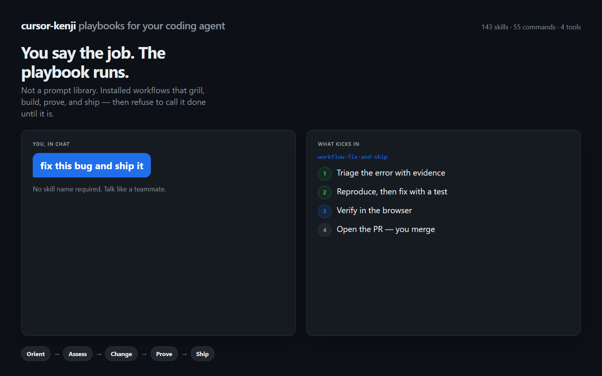
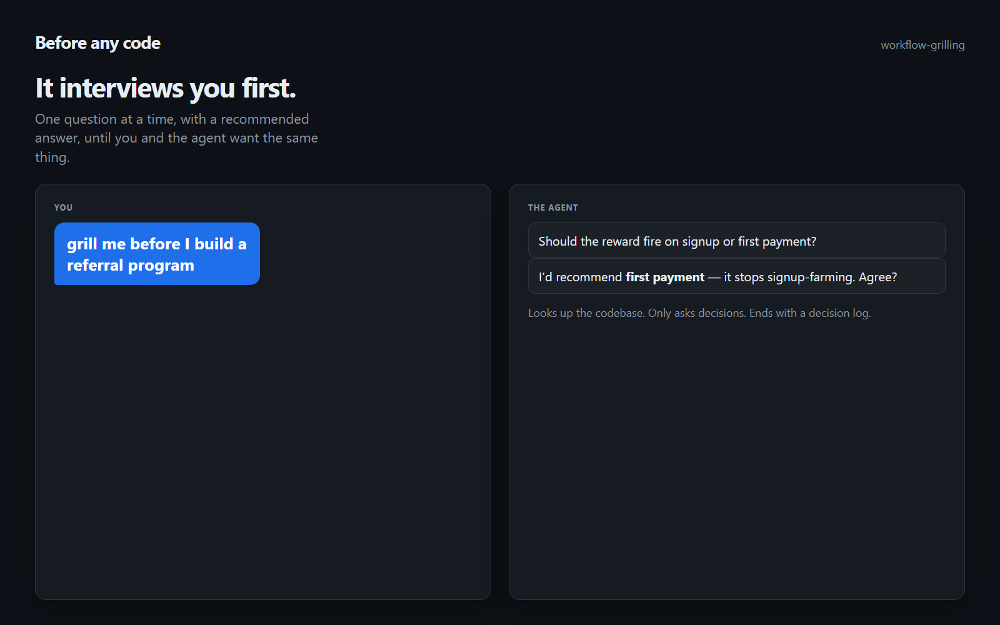
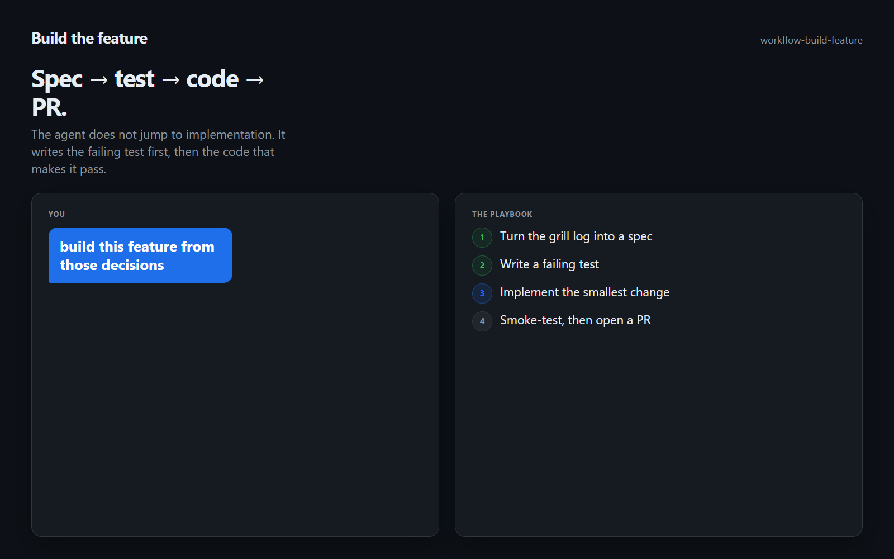
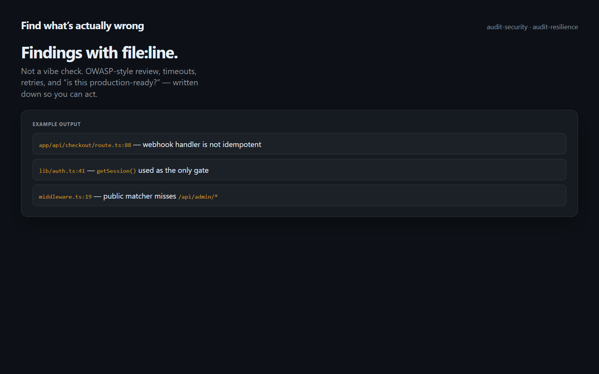
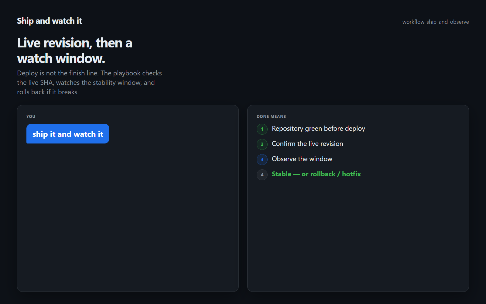

<div align="center">


# cursor-kenji

**You say the job. The playbook runs.**

145 agent skills · 57 slash commands · 16 MCP servers · 12 Cursor skills · 6 subagents — for React / Next.js / Supabase, usable on almost any stack.

<p>
  <a href="https://www.npmjs.com/package/@kensaurus/cursor-kenji"></a>
  <a href="https://www.skills.sh/kensaurus/cursor-kenji"></a>
  
</p>

<a href="docs/GETTING-STARTED.md" title="First-time guide">
  <picture>
    <source media="(prefers-color-scheme: dark)" srcset="docs/screenshots/hero-dark.png">
    <source media="(prefers-color-scheme: light)" srcset="docs/screenshots/hero-light.png">
    
  </picture>
</a>

<sub>↑ what happens after install · follows your GitHub theme · not a hosted app</sub>

</div>

**Why it exists** — Coding agents skip the unglamorous parts: interview you first, write the failing test, watch production, refuse “done” with leftovers. These playbooks don’t skip.

**Who it’s for** — People shipping in Cursor, Claude Code, Codex CLI, or Gemini CLI. Tuned for React / Next.js / Supabase. Works on other stacks.

**What it’s not** — A Cursor replacement, a prompt paste-bin, or 157 names to memorize. Install once. Talk like a teammate.

## Install (30 seconds)

```bash
npx @kensaurus/cursor-kenji --all
```

That merge-installs skills **and** slash commands (and agents/rules) into every tool it supports, then hash-checks the copies. Restart Cursor. Done.

> Skills only (no `/commands`)? `npx skills add kensaurus/cursor-kenji` — Vercel skills CLI, project-local by default (`-g` for `~/.cursor/skills`). Its `--all` means “all skills to all agents”, not Cursor+Claude+Codex+Gemini.
>
> No Cursor yet? **[Download it](https://cursor.com)**. Claude Code plugin: `/plugin marketplace add kensaurus/cursor-kenji` then `/plugin install cursor-kenji@cursor-kenji`. Flag list and clone install → [Quick Start](#quick-start). Brand new? **[Plain-language guide →](docs/GETTING-STARTED.md)**.

## What should I say?

| You say… | What kicks in | What you get |
|:---------|:--------------|:-------------|
| *"orient me"* | `workflow-onboard` | A short tour of the codebase |
| *"grill me before I build"* | `workflow-grilling` | One question at a time until you're aligned |
| *"build this feature"* | `workflow-build-feature` | Spec → tests → code → smoke → PR |
| *"fix this bug and ship it"* | `workflow-fix-and-ship` | Debug → fix → verify → PR → deploy |
| *"audit my security"* | `audit-security` | OWASP-style findings with file:line |
| *"is this production-ready?"* | `audit-resilience` + `audit-realworld` | Timeouts, retries, parity checks |
| *"complete everything"* | `complete-everything` | No parked leftovers — judge verifies "done" |
| *"ship it and watch it"* | `workflow-ship-and-observe` | Deploy → verify live → observe / rollback |

Highest-impact combo: `monkey-test as guest and logged-in, ticket every real bug, then lock a Playwright pass on the worst ones` → `test-exploratory` → `workflow-feedback-to-closure` → `test-playwright`.

Full menu → [Every skill](#every-skill-in-plain-english). Trigger phrases → [docs/CATALOG.md](docs/CATALOG.md). Combos → [docs/CATALOG.md — Skill Composition](docs/CATALOG.md#skill-composition-patterns).

## Tour

Four rooms. Same rule: you talk, a named playbook runs.

<table>
  <tr>
    <td width="50%" align="center">
      <a href="docs/GETTING-STARTED.md#a-typical-session">
        
      </a>
      <br>
      <sub><b>Grill</b> · <code>workflow-grilling</code> — one question at a time until you share a decision log</sub>
    </td>
    <td width="50%" align="center">
      <a href="docs/CATALOG.md#workflow-build-feature">
        
      </a>
      <br>
      <sub><b>Build</b> · <code>workflow-build-feature</code> — spec → failing test → code → smoke → PR</sub>
    </td>
  </tr>
  <tr>
    <td width="50%" align="center">
      <a href="docs/CATALOG.md#audit-security">
        
      </a>
      <br>
      <sub><b>Audit</b> · <code>audit-security</code> — OWASP-style findings with file:line, not a vibe check</sub>
    </td>
    <td width="50%" align="center">
      <a href="docs/CATALOG.md#workflow-ship-and-observe">
        
      </a>
      <br>
      <sub><b>Ship</b> · <code>workflow-ship-and-observe</code> — confirm the live SHA, watch, rollback if it breaks</sub>
    </td>
  </tr>
</table>

## The building blocks

| Thing | What it is | How you use it |
|:------|:-----------|:---------------|
| **Skill** | A playbook for one job | Describe the job in chat |
| **Command** | A shortcut | Type `/commit`, `/pr`, `/plan` |
| **Subagent** | A helper that peels off one task | Say *"review this PR"* |
| **Rule** | A house rule the AI always obeys | Drop a `.mdc` into your project |
| **MCP server** | A connection to your database / GitHub / browser | Copy a template + set env vars |

Everything follows the [Agent Skills spec](https://agentskills.io/specification) and is checked on every commit (`npm test` covers all **157** installable skills). MCP templates pin exact versions against [package-hallucination attacks](https://cloudsecurityalliance.org/blog/product-news/2025/03/06/slopsquatting-ai-code-assistants-and-package-hallucinations).

## How it works

Look → change → prove → ship, with guardrails on the whole time:

```text
   Orient          Assess           Change           Prove            Ship
(get to know) → (measure first) → (build/fix) → (test for real) → (go live)
```

| Stage | Skill families |
|:------|:---------------|
| **Orient** | `workflow-onboard`, `/research` |
| **Assess** | `audit-*`, `plan-*`, `/grill-me` |
| **Change** | `design-*`, `enhance-*`, `backend-*`, `housekeep-design` |
| **Prove** | `test-*`, `complete-everything`, `completion-judge` |
| **Ship** | `workflow-ship-and-observe`, `deploy-*`, `debug-*` |
| **Guardrails** | rules, completion hook, `enhance-agent-guardrails`, `/handoff` |

Assess before you change. Prove before you ship.

The 21 `plan-*` skills audit first and wait for your approval. See [docs/PLAN-LOOPS.md](docs/PLAN-LOOPS.md).

## What's Inside

| | Count | What it does |
|:--|------:|:-------------|
| **Skills** | 145 | Auto-triggering playbooks (audit, enhance, debug, test, build, plan) |
| **Cursor Skills** | 12 | IDE tools (canvas, hooks, rules, PR splitter) |
| **Commands** | 57 | Slash shortcuts (`/commit`, `/pr`, `/burndown-full`, …) |
| **Subagents** | 6 | Background helpers (code-reviewer, debugger, db-migrator…) |
| **Completion hook** | 1 | Opt-in stop gate: continues only unfinished durable closure state |
| **MCP Servers** | 16 | Full template: Supabase · GitHub · Playwright · AWS · Slack (essential is 3) |
| **Project Rules** | 7 | Drop-in `.mdc` for `.cursor/rules/` (plus 5 global, 5 RN bundle optional) |
| **Notepads** | 2 | Context templates (architecture, design tokens) |
| **Shell Aliases** | 8 | `newskill`, `cursor-sync`, `gc`, `gp` |

Trigger phrases → **[docs/CATALOG.md](docs/CATALOG.md)** · quick lookup → **[docs/TRIGGER-CHEATSHEET.md](docs/TRIGGER-CHEATSHEET.md)**.

---

## Quick Start

| Method | Command | What it installs |
|:-------|:--------|:-----------------|
| **npm installer** (full pack) | `npx @kensaurus/cursor-kenji --all` | Skills + commands + agents + rules. `--all` = Cursor + Claude + Codex + Gemini |
| **skills.sh** (skills only) | `npx skills add kensaurus/cursor-kenji` | `SKILL.md` folders only. Default is the current project; add `-g` for `~/.cursor/skills`. Does **not** write `~/.cursor/commands` |
| **Clone** | `git clone … && ./install.sh` | Same as the npm installer (`--cursor --claude` with no args) |
| **Claude Code plugin** | `/plugin marketplace add kensaurus/cursor-kenji` then `/plugin install cursor-kenji@cursor-kenji` | This repo as a marketplace. Not the Anthropic community catalog until they list it |

**npm installer modes:**

```bash
npx @kensaurus/cursor-kenji            # merge — add/overwrite this repo's items (Cursor)
npx @kensaurus/cursor-kenji --auto     # detect installed tools and install to each
npx @kensaurus/cursor-kenji --claude   # install for Claude Code (~/.claude/) instead
npx @kensaurus/cursor-kenji --codex    # install for Codex CLI (~/.codex/AGENTS.md + prompts)
npx @kensaurus/cursor-kenji --gemini   # install for Gemini CLI (~/.gemini/GEMINI.md + commands)
npx @kensaurus/cursor-kenji --all      # install for all four supported tools in one run
npx @kensaurus/cursor-kenji --clean    # mirror ~/.cursor to match this repo (backup first)
npx @kensaurus/cursor-kenji --dry-run  # preview
npx @kensaurus/cursor-kenji --verify   # hash-check dests against this package (no writes)
npx @kensaurus/cursor-kenji --skill audit-ux   # single skill
npx @kensaurus/cursor-kenji --link     # dev: symlink for live skill authoring
```

More flags (`--restore`, `--only`, `--no-agents-mirror`): `npx @kensaurus/cursor-kenji --help`.

**Use more than one AI tool? Reach for `--auto`.** It checks `~/.cursor`, `~/.claude`, `~/.codex`, and `~/.gemini`, then installs the right files to each one it finds. The bare command stays Cursor-only.

From a clone: `npm run install:cursor` · `node bin/install.mjs --all` · `npm test` validates skills + count + install smoke test.

From any folder: `npx @kensaurus/cursor-kenji --all`. From a clone, `node bin/install.mjs --all` also works (Windows ships `cursor-kenji.cmd` so `npx` from the repo folder works too).

**Optional — [Mushi Mushi](https://github.com/kensaurus/mushi-mushi)** bug-report triage (pairs with `mushi-health`, `test-playwright`):

```bash
npx skills add kensaurus/mushi-mushi
```

**After install:** (1) Restart Cursor (2) Copy `mcp/mcp.json.template` → `~/.cursor/mcp.json` and set `FIRECRAWL_API_KEY`, `CONTEXT7_API_KEY`, `SUPABASE_ACCESS_TOKEN`, `SUPABASE_PROJECT_REF` (3) Describe any task — skills match on keywords.

**Authoring skills?** Each skill must pass [Agent Skills spec](https://agentskills.io/specification) validation (`npm run validate:skills`): `name` matches directory, `description` ≤ 320 chars (house budget; spec max 1024), body < 500 lines.

### Claude Code

```bash
npx @kensaurus/cursor-kenji --claude   # Claude Code only
npx @kensaurus/cursor-kenji --all      # all four supported tools
```

All skills, commands, agents, and rules install to Claude Code (`~/.claude/`), with `.mdc` rules installed as `.md`. Skills appear as `/slash-commands`.

From a clone:

```bash
./install.sh --claude    # Claude Code only
./install.sh             # Cursor + Claude Code (default)
```

```bash
# Inside Claude Code
/workflow-build-feature
/debug-error the login endpoint returns 401
/plan-security-audit
```

Skills are read from `~/.claude/skills/<name>/SKILL.md`. No restart required when you re-run the installer — Claude Code picks up file changes at the start of each new session.

### Codex CLI & Gemini CLI

Codex CLI and Gemini CLI don't have a skills system yet. Each reads a single global context file instead:

```bash
npx @kensaurus/cursor-kenji --codex    # Codex CLI
npx @kensaurus/cursor-kenji --gemini   # Gemini CLI
```

| | Codex CLI | Gemini CLI |
|:--|:--|:--|
| **Rules → context file** | `~/.codex/AGENTS.md` | `~/.gemini/GEMINI.md` |
| **Portable commands** | `~/.codex/prompts/*.md` | `~/.gemini/commands/*.toml` |

Your `rules/` get merged into that one auto-loaded file (the skill-routing index is skipped). Three standalone playbooks — `plan`, `research`, and `fix-issue` — ship as native prompts/commands. Skills and subagents aren't written out, because neither tool can load them. Existing `AGENTS.md` or `GEMINI.md` is backed up as `.bak-<stamp>` first.

> The bash `install.sh --codex`/`--gemini` delegates to the Node installer (needs Node ≥ 18).

### Manual install

```bash
git clone https://github.com/kensaurus/cursor-kenji.git && cd cursor-kenji && ./install.sh
```

<details>
<summary>One-liner (curl)</summary>

```bash
curl -sSL https://raw.githubusercontent.com/kensaurus/cursor-kenji/main/install.sh | bash
```

</details>

**Keep fresh:** `npx @kensaurus/cursor-kenji --all && npx @kensaurus/cursor-kenji --verify --all` or `git pull && ./install.sh`

---

## Every skill, in plain English

You don't memorize names — describe the job in chat. Exact trigger phrases → **[docs/CATALOG.md](docs/CATALOG.md)**. Prefix / stage table → **[docs/CATALOG.md — Skill Taxonomy](docs/CATALOG.md#skill-taxonomy)**.

<!-- SKILL-INDEX:START -->

_Auto-generated from each skill's `SKILL.md` — run `npm run gen:skill-index` after adding a skill. **157 skills** listed below._

#### Skill families at a glance

| Family | Count | In one sentence |
|:-------|------:|:----------------|
| Audit — inspect; some then fix | **30** | Check the codebase — security, UX, analytics, IAP, the skill pack… |
| Plan — audit first, change only after you approve | **21** | Write a fix plan you approve before any code changes |
| Enhance — improve what already exists | **17** | Polish UI, forms, motion, SEO, PWA, email deliverability |
| Design — build something new | **10** | Create new UI, APIs, emails, themes from scratch |
| Backend — server & data patterns | **5** | Auth, caching, queues, realtime, observability |
| Mobile — React Native / Capacitor | **5** | RN screens, emulators, Capacitor, App Store prep |
| Data — charts & pipelines | **2** | Charts, dashboards, ETL / cron jobs |
| Docs — write it down clearly | **4** | READMEs, PRDs, RFCs with a reader-first voice |
| Housekeeping — consolidate or clear one drifted register | **4** | Consolidate one drifted register (gates, backlog, design tokens, dead code) |
| Workflows — multi-step recipes | **20** | End-to-end recipes (build, fix, ship, green the repo) |
| Test & QA — prove it works | **8** | Unit, Playwright, visual regression, load, red-team |
| Deploy — ship & verify | **2** | npm release + post-deploy smoke tests |
| Debug — find & fix what's broken | **3** | Errors, Sentry, frontend↔backend mismatches |
| Iterate — close the loop after launch | **2** | Post-launch feedback loops and agent-harness iteration |
| Mushi Mushi — bug triage helpers | **2** | Integrate the Mushi Mushi bug-report pipeline |
| Protocols — session guardrails | **1** | Keep browser automation from freezing |
| Authoring — build skills & MCP | **2** | Author new skills or MCP servers |
| Third-party (upstream-maintained) | **3** | Vendored upstream skills (Emil, UI/UX Pro Max, Vercel WIG) |
| Core & cross-cutting | **4** | Close everything, burndown, research, handoff |
| Cursor IDE skills | **12** | Canvas, hooks, rules, PR splitter, CLI helpers |
| **Total** | **157** | |

#### Full list (every skill)

### Audit — inspect; some then fix (30)

| Skill | What it does |
|:------|:-------------|
| `audit-accessibility` | Automated WCAG 2.2 accessibility audit using playwright-cli to crawl every page, inject axe-core via eval, test keyboard navigation, check… |
| `audit-analytics` | Read-only audit of product-analytics instrumentation: event taxonomy, funnel completeness, consent-gated firing, dead/duplicate/phantom… |
| `audit-auth-flows` | Read-only audit of app-layer auth — route×gate matrix, session lifecycle, OAuth, and provider traps (getSession vs getUser,… |
| `audit-backend-architecture` | Read-only audit and decision advisor for backend architecture, topology-gated by stack |
| `audit-bundle-size` | Analyse and shrink JavaScript bundle size for any web app |
| `audit-cicd` | Audit CI/CD pipelines (GitHub Actions) for cost, speed, and safety |
| `audit-code-quality` | Detect and fix repo-wide anti-patterns and consistency drift (naming, organisation, repeated smells) |
| `audit-code-review` | Review this PR or diff for quality, security, and maintainability |
| `audit-codemod-safety` | Read-only audit of a codemod or bulk mechanical transform for behavior-preservation — compiles/lints is not same-behavior |
| `audit-db-schema` | Audit database schema for consistency, validation, and industry standards |
| `audit-doctrine` | Read-only audit of custom lint/ratchet doctrine — is each rule right on the merits, not merely enforced |
| `audit-env-parity` | Read-only audit of config/env parity across dev, staging, and prod — missing or misnamed vars, drifted flags, hardcoded values, secrets… |
| `audit-fe-api` | Audit frontend API calls against backend implementation for contract alignment and network shape |
| `audit-gate-logic` | Read-only audit of CI gate logic — silent bypass, ratchet gaming, required-but-not, duplicate gates |
| `audit-i18n` | Audit and fix internationalisation for any web or mobile app |
| `audit-infra-cost` | Read-only audit of hosting, database, storage, egress, and serverless spend (Supabase, Vercel, S3/R2, edge) |
| `audit-langfuse-llm` | Run a PDCA quality audit on LLM/AI features: traces, prompts, costs, evals, grounding, hallucination |
| `audit-llm-security` | Read-only OWASP LLM Top 10 audit of app-facing AI: prompt injection, data leakage, unsafe output/agency, RAG risks, misinformation, and… |
| `audit-monetization-iap` | Read-only audit of mobile IAP and subscriptions — StoreKit 2, Play Billing, or RevenueCat — for server receipt validation, restore,… |
| `audit-payment-system` | Read-only audit for payment/money-movement systems, scope-gated so a Stripe-Checkout site and an in-house ledger each see only relevant… |
| `audit-performance` | Audit runtime performance (CWV, load priority) |
| `audit-realworld` | Read-only full-stack conformance audit against RealWorld ("Conduit"): formal API spec, shared E2E suite, and closest-stack reference |
| `audit-resilience` | Read-only production-resilience audit: timeouts, bounded retries, circuit breakers, idempotency, rate limits, graceful degradation, PII |
| `audit-responsive` | Audit-and-fix linearized mobile layouts at every breakpoint — desktop is not a wide phone |
| `audit-security` | Static OWASP review of app code (injection, headers, deps) |
| `audit-skill-conflicts` | Read-only audit of an agent-skill pack for contradictory directives, overlapping triggers, stale cross-refs, and context bloat |
| `audit-ui-states` | Read-only audit of unhappy-path UI states vibe-coding skips — empty, loading, error, offline, zero-results, permission, overflow — then… |
| `audit-uiux-design-system` | Audit visual-system coherence: tokens, component variants, color/type/ spacing, dark mode |
| `audit-ux` | Per-page UX audit using NN/g heuristics, Intuit microcopy, and Google HEART |
| `audit-ux-journeys` | Cross-page UX audit for user stories, task completion, and information architecture — the layer audit-ux (per-page heuristics) skips |

### Plan — audit first, change only after you approve (21)

| Skill | What it does |
|:------|:-------------|
| `plan-aeo-readiness` | Audit a site for answer-engine / GEO citation readiness (ChatGPT, Perplexity, AI Overviews), then a phased plan |
| `plan-antislop` | Plan-only authenticity / AI-slop audit across prose, UI, code, and IA |
| `plan-aso` | Audit App Store and Google Play listings for discoverability and conversion — keywords, localized metadata, screenshots, ratings prompts —… |
| `plan-backup-dr` | Audit whether a project can actually recover from data loss — not just whether backups exist — then emit a phased DR plan |
| `plan-capacitor-hardening` | Plan-only Capacitor/Ionic native-layer security audit: WebView, token storage, deep links/OAuth, cleartext traffic, exported activities |
| `plan-data-integrity` | Audit a project for destructive-operation and migration safety gaps, then produce a phased safeguard plan |
| `plan-dead-code` | Configuration-first dead-code audit — Knip baseline for unused files, exports and deps, plus duplication, debug residue, suppression debt,… |
| `plan-dependency-provenance` | Audit dependencies for hallucinated or slopsquatted packages, supply-chain risk, and licensing gaps, then a remediation plan |
| `plan-docs-sync` | Audit documentation against actual code behavior and plan corrections — no rewrites in this pass |
| `plan-error-handling` | Audit silent failures and observability gaps (Sentry/Langfuse), then a phased plan — no implementation |
| `plan-input-validation` | Plan-only trust-boundary audit for missing validation, injection, XSS, and forged requests across forms/APIs/webhooks |
| `plan-llm-cost-guardrails` | Audit an LLM-powered app for runaway-cost and quota-abuse exposure, then produce a phased guardrail plan |
| `plan-mobile-readiness` | Plan-only App Store/Google Play submission audit for Capacitor/React Native: manifests, permissions, privacy forms, signing/config, listing… |
| `plan-perf-audit` | Plan-only performance audit across web/mobile/backend/data; measures first and emits a burndown, no fixes |
| `plan-privacy-compliance` | Plan-only audit mapping real personal-data flows to the privacy policy, GDPR, Japan APPI, and store labels |
| `plan-rls-audit` | Audit a Supabase/Postgres project for Row-Level Security and access-control gaps, then produce a phased remediation plan |
| `plan-secrets-audit` | Audit the working tree and git history for exposed credentials and mis-scoped keys, then a rotate-vs-relocate plan |
| `plan-security-audit` | OWASP Top 10 + Supabase-first hardening burndown |
| `plan-stub-checker` | Exhaustive audit for stubs, dead buttons, fake components, unwired handlers, and dead links — then a wiring plan, no implementation |
| `plan-test-coverage` | User-story-driven test coverage audit and plan — no test writing in this pass |
| `plan-uiux-unification` | Non-destructive UI/UX and design-system audit that emits a unification burndown — no code until each phase is approved |

### Enhance — improve what already exists (17)

| Skill | What it does |
|:------|:-------------|
| `enhance-agent-guardrails` | Install guardrails-as-code so AI sessions cannot reintroduce leaked secrets, injection, or untested code |
| `enhance-arch-boundaries` | Install mechanically-enforced architecture boundaries (dependency-cruiser / eslint-boundaries) so layer direction, feature isolation, and… |
| `enhance-capacitor-ui` | Cross-surface UIUX separation skill for hybrid web apps that ship as PWA + iOS + Android via Capacitor (or Tauri / Expo Web / Ionic /… |
| `enhance-email-deliverability` | Audit and fix transactional/marketing deliverability — SPF, DKIM, DMARC, reputation, bounce/complaint handling, list hygiene, unsubscribe… |
| `enhance-motion` | Audit an existing app's design system and motion, then apply a coherent, performant, reduced-motion-safe pass |
| `enhance-pwa` | Add/upgrade PWA capabilities: manifest, service worker, offline mode, install prompt, push notifications, background sync |
| `enhance-readability` | Audit and fix how easily content is UNDERSTOOD: CPL/reading level, Gestalt grouping, deadspace, icons or a table that cuts verbosity |
| `enhance-readme` | Enhance an existing README with a theme-aware hero, feature tour, screenshots/GIF, accurate badges, and synced content |
| `enhance-skill-prompts` | Upgrade an existing SKILL.md prompt (not its behavior) to 2026 practice: degrees of freedom, structured CoT, one worked example,… |
| `enhance-web-forms` | Build or upgrade web forms to production quality: accessible structure, schema-driven validation, client↔server parity |
| `enhance-web-instant-nav` | Instant in-site nav: Speculation Rules, View Transitions, bfcache, 103 Early Hints |
| `enhance-web-landing` | Build landing pages, portfolios, and marketing sites that don't look AI-generated |
| `enhance-web-redesign` | Upgrade an existing site/app to premium quality |
| `enhance-web-seo` | Audit and fix SEO for any web app |
| `enhance-web-ui` | Polish an existing page's hierarchy, spacing, type, and visual personality |
| `enhance-web-ux` | NN/g-grounded enhancement of an existing page's flows — not a repo-wide slop audit |
| `enhance-web-web3d` | Add purposeful 3D/WebGL and scroll choreography to an existing site with Three.js/R3F, GSAP, or Motion |

### Design — build something new (10)

| Skill | What it does |
|:------|:-------------|
| `design-api` | Design RESTful and GraphQL APIs following current best practices for naming, versioning, error shapes, and auth patterns |
| `design-canvas` | Create museum-quality visual art in .png and .pdf formats using design philosophy |
| `design-email` | Design and implement transactional and marketing email templates |
| `design-frontend` | Create a new production-grade UI from scratch — not a polish pass |
| `design-generative-art` | Create original algorithmic visuals with p5.js, Canvas, or SVG using seeded randomness and interactive controls |
| `design-mobile-first` | Design mobile-first UIs: touch targets, safe areas, gestures, then enhance up |
| `design-motion` | Design and implement new isolated motion — micro-interactions, page transitions, scroll, hover — with Framer Motion, CSS, or GSAP |
| `design-prd` | Generate Product Requirements Documents through structured conversation for any project |
| `design-system` | Build a new design system (tokens, variants, theming) |
| `design-theme` | Apply cohesive visual themes to artifacts (slides, docs, landing pages) |

### Backend — server & data patterns (5)

| Skill | What it does |
|:------|:-------------|
| `backend-db-performance` | Optimize slow queries, indexes, and N+1s |
| `backend-error-handling` | Implement error-handling patterns (boundaries, toasts, API error shape) |
| `backend-observability` | Implement correlated errors, traces, and structured logs with PII redaction |
| `backend-patterns` | Apply backend patterns — queues, caching, rate limits, serverless/edge |
| `backend-realtime` | Implement real-time features using WebSockets, Supabase Realtime, Server-Sent Events, and live data |

### Mobile — React Native / Capacitor (5)

| Skill | What it does |
|:------|:-------------|
| `mobile-capacitor-platform` | Handle Capacitor platform depth beyond UI: plugins, OTA, deep links, push, offline, native CI/CD, App Store / Play Store submission, Apple… |
| `mobile-emulator-start` | Boot Android emulator + Metro (Expo / bare RN) in order: inspect IDE terminals, kill stale ports, pick an AVD |
| `mobile-emulator-test` | QA a native Android build end-to-end on the emulator |
| `mobile-rn-performance` | Fix React Native / Expo performance, build, and upgrade issues |
| `mobile-rn-screen` | Polish an existing React Native screen to feel intentional, native, and human-crafted |

### Data — charts & pipelines (2)

| Skill | What it does |
|:------|:-------------|
| `data-pipeline` | Wire ETL, ingestion, cron, edge-function, and queue jobs correctly |
| `data-visualization` | Build interactive, accessible charts, graphs, and data dashboards using Recharts, D3, or Victory |

### Docs — write it down clearly (4)

| Skill | What it does |
|:------|:-------------|
| `docs-adr` | Create and maintain lightweight Architecture Decision Records as agent-readable decision memory — what was decided, why, and which… |
| `docs-coauthor` | Co-author structured documents (specs, PRDs, RFCs) through a 3-stage workflow: context gathering, drafting, and reader testing |
| `docs-domain-modeling` | Build and sharpen a project's domain model — a CONTEXT.md glossary and ubiquitous language |
| `docs-writer` | Write developer docs: README content, API references, code comments, changelog entries |

### Housekeeping — consolidate or clear one drifted register (4)

| Skill | What it does |
|:------|:-------------|
| `housekeep-backlog` | Apply-now inventory of parked work — unfinished plans, deferred phases, TODO/FIXME, skipped tests, open findings — into a living BACKLOG.md… |
| `housekeep-dead-code` | Apply-now dead-code removal by category — one commit each, typecheck and tests between, bisect on red, then install the Knip ratchet so it… |
| `housekeep-design` | Apply-now consolidation of a drifted design system into one token/component SSOT |
| `housekeep-gates` | Apply-now consolidation of accreted CI gates, ratchets, and hooks into one aggregator required check |

### Workflows — multi-step recipes (20)

| Skill | What it does |
|:------|:-------------|
| `workflow-build-feature` | Build a feature end to end: spec-tdd → implement → test-unit → playwright → PR |
| `workflow-coding-discipline` | Apply behavioral guardrails when writing, editing, refactoring, or debugging code |
| `workflow-environment-ready` | Prove runtimes, installs, tools, services, env names, and repository verification commands work before a long/autonomous run |
| `workflow-feature-flag` | Plan and execute a disciplined feature-flag rollout for any app |
| `workflow-feedback-to-closure` | Turn raw feedback — bug reports, review comments, Sentry, QA, audit output — into deduplicated durable tickets and drive each to verified… |
| `workflow-fix-and-ship` | Complete one bug-fix lifecycle: triage → reproduce → debug-error → regression fix → test-playwright → workflow-pr; optional deploy verify |
| `workflow-git-commit` | Create one conventional commit from an already-scoped change: stage named files/hunks, write the message, commit, never push |
| `workflow-green-repo` | Drive an entire repository to a fully green baseline — typecheck, lint, tests, and build all passing from a clean checkout — when the user… |
| `workflow-grilling` | Grill the user relentlessly about a plan, decision, or idea — one question at a time — until shared understanding is reached |
| `workflow-housekeep` | Apply repository maintenance: sync README, remove confirmed dead artifacts, and safely update dependencies |
| `workflow-launch-ready` | Full launch preparation sweep for a new app or major release |
| `workflow-merge-conflicts` | Resolve an in-progress git merge or rebase conflict by tracing each side back to its original intent |
| `workflow-onboard` | First-contact orientation for an unfamiliar codebase |
| `workflow-parallel-agents` | Run multiple agents in parallel via git worktrees, cloud agents, or multi-model comparison |
| `workflow-pr` | Manage an existing PR lifecycle — review, bot feedback, conflicts, merge |
| `workflow-quality-gate` | Pre-release quality gate: test-red-team, audit-security, audit-bundle-size, audit-performance, test-unit |
| `workflow-refactor` | Scoped behavior-preserving refactor: map dependencies, change structure, run affected tests |
| `workflow-release-prep` | Apply-now: take the local working tree to a merge-ready PR against main — review, self-critique, split if needed, commit, push, open PR,… |
| `workflow-ship-and-observe` | Take merged, repository-green code all the way to a verified, monitored production release for any app stack |
| `workflow-spec-tdd` | Stop vibe-coding with a spec → plan → TDD loop before writing a line |

### Test & QA — prove it works (8)

| Skill | What it does |
|:------|:-------------|
| `test-exploratory` | Headed exploratory QA of a live app as guest then logged-in, followed by a diff; uses junk input and navigation abuse |
| `test-load` | Design and run a k6/Artillery load profile that measures throughput, latency percentiles, error rate, and the breaking point under… |
| `test-mutation` | Set up and run mutation testing (StrykerJS / mutmut) to measure whether tests assert behavior, not just execute lines |
| `test-playwright` | Close the PDCA loop on this session's diff |
| `test-qa` | Generic web-app CRUD/story QA fallback when no project-specific skill applies |
| `test-red-team` | Adversarial red-team of a running web, React Native, or Capacitor hybrid app |
| `test-unit` | Write unit/integration tests for a named module or change |
| `test-visual-regression` | Set up Playwright screenshot baselines and CI diffing so UI changes fail pixel-by-pixel instead of by eye |

### Deploy — ship & verify (2)

| Skill | What it does |
|:------|:-------------|
| `deploy-npm` | Release an npm package: version, CHANGELOG, publish, verify |
| `deploy-verify` | Post-deploy smoke test across browser, Sentry, Supabase, Langfuse, and the public web |

### Debug — find & fix what's broken (3)

| Skill | What it does |
|:------|:-------------|
| `debug-error` | Diagnose one error/bug with hypotheses and runtime evidence before fixing |
| `debug-fe-be-integration` | Diagnose and fix frontend↔backend contract failures by tracing client requests, server logs, validation, auth, and responses on both sides |
| `debug-sentry-monitor` | Operate Sentry: triage/fix unresolved issues, reduce noise, audit instrumentation, and monitor after deploy |

### Iterate — close the loop after launch (2)

| Skill | What it does |
|:------|:-------------|
| `iterate-agent-harness` | Turn an agent failure—premature stop, false completion, gamed check, missed file, broken handoff—into a durable rule/skill/hook/CI guard… |
| `iterate-post-launch` | Close the feedback loop for an already-live app: inspect production signals, prioritize top issues, fix, verify live, repeat |

### Mushi Mushi — bug triage helpers (2)

| Skill | What it does |
|:------|:-------------|
| `mushi-health` | Pass/fail health check across every Mushi Mushi pipeline component — CLI credentials, API reachability, edge functions, BYOK key pool, QA… |
| `mushi-integration` | Full end-to-end Mushi Mushi integration smoke test: bug capture → AI triage → story mapping → TDD test generation → approval → execution →… |

### Protocols — session guardrails (1)

| Skill | What it does |
|:------|:-------------|
| `protocol-browser-anti-stall` | Browser-session guardrail for Playwright CLI: use headed, named, isolated sessions; prevent parallel collisions and recover stalls without… |

### Authoring — build skills & MCP (2)

| Skill | What it does |
|:------|:-------------|
| `meta-mcp-builder` | Scaffold and implement Model Context Protocol (MCP) servers that expose external services, APIs, and data sources as typed tools and… |
| `meta-skill-creator` | Create or update a pack SKILL.md (frontmatter, house limits, T1–T6) |

### Third-party (upstream-maintained) (3)

| Skill | What it does |
|:------|:-------------|
| `thirdparty-emil-design-eng` | Third-party skill — Emil Kowalski's design-engineering notes (animation craft, Sonner-style components) |
| `thirdparty-ui-ux-pro-max` | Third-party skill — searchable style catalog, palettes, typography, and UX guidelines via Python scripts |
| `thirdparty-web-interface-guidelines` | Third-party skill — Vercel Web Interface Guidelines compliance (focus, forms, animation, copy) |

### Core & cross-cutting (4)

| Skill | What it does |
|:------|:-------------|
| `burndown-full` | Drive a planned mechanical change to 100% repo coverage when a prior run stopped early |
| `complete-everything` | Explicit closure mode for one approved plan: implement unfinished items plus connected deferrals, verify every acceptance criterion,… |
| `handoff` | Compact the current conversation into a handoff document a fresh agent can pick up |
| `research` | Research current best practices with Context7, Firecrawl, and official docs before a non-trivial change |

### Cursor IDE skills (12)

| Skill | What it does |
|:------|:-------------|
| `babysit` | Keep an already-open PR merge-ready: triage comments, resolve clear conflicts, fix CI |
| `canvas` | Create a live React canvas beside chat for standalone analytical artifacts that benefit from visual layout: quantitative/security/… |
| `create-hook` | Create Cursor hooks |
| `create-rule` | Create Cursor rules for persistent AI guidance |
| `create-skill` | Guide users through creating effective Agent Skills for Cursor |
| `create-subagent` | Create custom subagents for specialized AI tasks |
| `migrate-to-skills` | Convert 'Applied intelligently' Cursor rules (.cursor/rules/*.mdc) and slash commands (.cursor/commands/*.md) to Agent Skills format… |
| `shell` | Run the rest of a /shell request as a literal shell command |
| `split-to-prs` | Split current work into small reviewable PRs |
| `statusline` | Configure a custom status line in the CLI |
| `update-cli-config` | View and modify Cursor CLI configuration in ~/.cursor/cli-config.json |
| `update-cursor-settings` | Modify Cursor/VSCode user settings in settings.json |

<!-- SKILL-INDEX:END -->

---

## How to Use

| Primitive | Invoke | Example |
|:----------|:-------|:--------|
| **Skill** | Describe the task | "audit my security" → `audit-security` |
| **Command** | `/name` in chat | `/commit`, `/research`, `/pr` |
| **Subagent** | Mention trigger keyword | "review this PR" → `code-reviewer` |
| **Rule** | Copy `.mdc` into project | Always-on conventions |

**Force a skill:** *"use `enhance-web-ux` on `/dashboard`"*

> `housekeep-design` is the execution arm of `plan-uiux-unification`.
>
> **Third-party skills:** prefixed `thirdparty-*` with `ATTRIBUTION.md` — see **[docs/THIRD-PARTY-SKILLS.md](docs/THIRD-PARTY-SKILLS.md)**.
>
> Anthropic `file-docx/pdf/pptx/xlsx` skills are not in this public repo.

**Cursor-specific skills (12):** `babysit`, `canvas`, `create-hook`, `create-rule`, `create-skill`, `split-to-prs`, … — see [CATALOG.md](docs/CATALOG.md).

---

## Commands (57)

Type `/` in chat to see them all.

| Command | When | What |
|:--------|:-----|:-----|
| `/burndown-full` | Partial refactor stopped early | Drive plan to 100% repo coverage via MATCH/DONE + verification gate |
| `/complete-everything` | Plan marked done with deferrals | Close planned, parked, and discovered work; run the full applicable test ladder |
| `/green-repo` | Whole-repo debt cleanup (authorized) | Drive typecheck/lint/test/build to green from a fresh run |
| `/ship-and-observe` | Deploy to production | Verify the live revision, observe the stability window, roll back if needed |
| `/feedback-to-closure` | Incoming reports/QA/Sentry | Dedupe into durable tickets → fix → production-verified closure |
| `/plan` | Before coding | Research + approved plan |
| `/commit` | After coding | Lint, typecheck, commit |
| `/pr` | Ready to ship | Push + open PR |
| `/fix-issue [#]` | Bug reports | Issue → fix → PR |
| `/debug-issue` | Tricky bugs | Instrumented debugging |
| `/review-code` | Before merge | Agent + manual review |
| `/test` | Before commit | Test suite + coverage |
| `/update-deps` | Maintenance | Safe dep updates |
| `/research` | Before coding | Firecrawl doc research |
| `/readme` | End of session | Sync READMEs |
| `/refactor` | Long files | Modular split |
| `/mcp-guide` | MCP workflow | Tool reference (renamed to avoid Claude Code's built-in `/mcp`) |
| `/uiux` | UI review | Design-system enforcement |
| `/readability` | Dense / hard to read | CPL, Gestalt grouping, visuals that cut verbosity |
| `/instant-nav` | Fast first page, slow next | Speculation Rules, bfcache, Early Hints |
| `/responsive-audit` | Desktop looks like a phone | Breakpoint / linearized-layout audit |
| `/skill-conflicts` | Wrong skill fired / just added skills | Pack contradictions, overlapping triggers, stale refs |
| `/thirdparty-web-interface-guidelines` | Vercel UI audit | Review files against [Web Interface Guidelines](https://vercel.com/design/guidelines) |
| `/*-plan` (21 aliases) | Audit before changing | Thin pointers to the `plan-*` skills (`/uiux-plan`, `/privacy-plan`, `/backup-plan`, `/aso-plan`, …) — audit + plan only. See [CATALOG](docs/CATALOG.md#pointer-delegates-to-skill) |

**RN monorepo bundle:** copy `commands/native-rn-monorepo/` + `rules/native-rn-monorepo/` into your project (iOS builds on CI, not locally).

---

## Subagents (6)

| Agent | Triggers on | Output |
|:------|:------------|:-------|
| `code-reviewer` | "review", code changes | Quality, security, types |
| `debugger` | Errors, exceptions | Root cause + fix |
| `db-migrator` | "migration", "new table" | SQL, RLS, indexes |
| `deploy-checker` | "deploy", "ship it" | Pre-deploy validation |
| `perf-monitor` | "slow", "optimize" | Perf audit |
| `completion-judge` | Plan/burndown closure claim | PASS / CONTINUE / BLOCKED against plan, state, diff, and fresh evidence |

`complete-everything` also uses a packaged Cursor stop hook. On Claude Code 2.1.139+ you can kick off the same run with `/goal`.

---

## MCP servers (16)

```bash
cp ~/cursor-kenji/mcp/mcp.json.template ~/.cursor/mcp.json      # essential 3
cp ~/cursor-kenji/mcp/mcp-full.json.template ~/.cursor/mcp.json  # all 16
```

Set `FIRECRAWL_API_KEY`, `CONTEXT7_API_KEY`, `SUPABASE_ACCESS_TOKEN`, and `SUPABASE_PROJECT_REF` in the environment. Slack/Notion in the full template still use `YOUR_*`. Setup → **[mcp/README.md](mcp/README.md)**

| Tier | Servers | Keys? |
|:-----|:--------|:------|
| Essential | Firecrawl, Context7, Supabase | Firecrawl + Context7 + Supabase |
| Dev | GitHub, GitHub Official, Sequential Thinking, Playwright, Postgres, Memory, Chrome DevTools | PAT / conn string |
| Cloud | AWS Lambda, S3, CloudWatch, Redis | AWS profile / URL |
| Productivity | Slack, Notion | Bot token / API key |

---

## Project rules

```bash
cp ~/cursor-kenji/rules/project-starter/*.mdc your-project/.cursor/rules/
```

| Rule | Enforces |
|:-----|:---------|
| `supabase.mdc` | Typed clients, RLS, migrations |
| `typescript.mdc` | No `any`, Zod, ActionResult |
| `components.mdc` | Primitives, Server Components, a11y |
| `tailwind.mdc` | Tokens, mobile-first |
| `data-fetching.mdc` | TanStack Query, RSC prefetch, `'use cache'` |
| `web-performance.mdc` | LCP priority, INP yield, bfcache, budgets |
| `git.mdc` | Conventional commits, no secrets |

Global rules installed by the pack: `full-stack-ship-discipline.mdc`, `composer-2.5-execution.mdc`, `skill-workflows.mdc`, `senior-engineer.mdc`, `verification-before-completion.mdc`.

> **Plan with a strong model, execute with Composer 2.5.** The 21 `plan-*` skills are authored/reviewed with a stronger reasoning model; `composer-2.5-execution.mdc` constrains how approved plans are implemented.

**Project constitution:** copy [docs/AGENTS.template.md](docs/AGENTS.template.md) to your app repo as `AGENTS.md`.

---

## Shell helpers

```bash
source ~/cursor-kenji/shell-aliases/cursor-helpers.sh
```

| Command | Action |
|:--------|:-------|
| `newskill <name>` | Create skill template |
| `lsskills` | List installed skills |
| `cursor-sync` | Pull repo + reinstall |
| `cursor-dev` | Open Chrome (debug port) + Cursor |
| `newrule <name>` | Create project rule template |
| `newagent <name>` | Create subagent template |
| `gc <type> <msg>` | Conventional commit |
| `gp` | Push current branch |

Full definitions in [shell-aliases/cursor-helpers.sh](shell-aliases/cursor-helpers.sh) (clone-only; not in npm tarball).

---

## Repository layout

```
cursor-kenji/
├── skills/           # 145 Agent Skills (SKILL.md each)
├── skills-cursor/    # 12 Cursor-specific skills
├── commands/         # 57 slash commands
├── agents/           # 6 subagents
├── hooks/            # opt-in completion stop gate
├── rules/            # Global + project-starter rules
├── mcp/              # MCP templates
├── docs/             # CATALOG, PLAN-LOOPS, GETTING-STARTED, …
├── notepads/         # Context templates (clone-only)
├── shell-aliases/    # Bash helpers (clone-only)
├── scripts/          # validate-skills, check-skill-count, install tests
└── bin/install.mjs   # npm installer
```

---

## Contributing

```bash
mkdir -p skills/my-skill && vim skills/my-skill/SKILL.md
npm run test   # validate + count + install smoke
```

See [CONTRIBUTING.md](CONTRIBUTING.md), [docs/README.md](docs/README.md), [docs/DISTRIBUTION.md](docs/DISTRIBUTION.md), [llms.txt](llms.txt), [docs/CATALOG.md](docs/CATALOG.md), [docs/TRIGGER-CHEATSHEET.md](docs/TRIGGER-CHEATSHEET.md).

---

## FAQ

**What is cursor-kenji?**
You say the job in chat; a playbook runs. [Agent Skills](https://agentskills.io) plus slash commands, subagents, and MCP templates. One command installs them into `~/.cursor/` and `~/.agents/skills/`.

**How do I install?**
`npx @kensaurus/cursor-kenji --all` for skills **and** slash commands. `npx skills add kensaurus/cursor-kenji` installs skills only. Claude Code as a plugin: `/plugin marketplace add kensaurus/cursor-kenji`. Restart Cursor after install. Re-check with `npx @kensaurus/cursor-kenji --verify --all`.

**How many skills?**
**145** agent skills in `skills/` plus **12** Cursor-specific skills in `skills-cursor/` (**157** total). Counts come from the filesystem via `npm run check:skills`. See the [family counts table](#skill-families-at-a-glance).

**How do skills trigger?**
You talk normally. Cursor matches your words to each skill's YAML `description`. To force one: *"use \`audit-security\` on this repo"*. Full trigger list: [docs/CATALOG.md](docs/CATALOG.md).

**What's the difference between `audit-*` and `plan-*`?**
`audit-*` looks around and may fix things. `plan-*` only writes a `plan-{name}.md` burndown — **you** approve each phase before any code changes. See [docs/PLAN-LOOPS.md](docs/PLAN-LOOPS.md).

**Where do MCP API keys go?**
Copy `mcp/mcp.json.template` to `~/.cursor/mcp.json` and set the env vars above — never commit real keys. See [SECURITY.md](SECURITY.md) and [mcp/README.md](mcp/README.md).

**Is there machine-readable docs for AI crawlers?**
Yes — [llms.txt](llms.txt) at the repo root.

---

## Alternatives

- [awesome-cursorrules](https://github.com/PatrickJS/awesome-cursorrules) — curated rules collections
- [skills.sh](https://www.skills.sh/kensaurus/cursor-kenji) — this pack’s live skills page
- [SkillsMP](https://skillsmp.com/creators/kensaurus/cursor-kenji) — aggregator crawl of this repo
- [agentskills.io](https://agentskills.io) — Agent Skills spec (not a skill catalog)

cursor-kenji ships executable skills, MCP configs, commands, and subagents in one installable package — not static rules alone. What is actually listed vs submitted → **[docs/DISTRIBUTION.md](docs/DISTRIBUTION.md)**.

---

## More from KENSAURUS

| | App | What it is |
|---|---|---|
|  | [Glot It](https://kensaur.us/glot-it/?utm_source=github&utm_medium=readme) | Learn Thai — bite-size lessons, smart flashcards, and an AI tutor |
|  | [yen-yen](https://kensaur.us/yen-yen/?utm_source=github&utm_medium=readme) | Where did the money go? Now you'll know. A kakeibo for households |
|  | [The Wanting Mind](https://kensaur.us/the-wanting-mind/?utm_source=github&utm_medium=readme) | How the Battle Between Extraction and Generation Is Reshaping Our World — a 147,000-word interactive webbook with 268 concepts, 242 citations, and original illustrations |
|  | [Help Her Take Photo](https://kensaur.us/help-her-take-photo/?utm_source=github&utm_medium=readme) | Pair phones, direct the pose, nail the photo |
|  | [How to Talk to Girls](https://talk.kensaur.us/?utm_source=github&utm_medium=readme) | BYOK Claude practice coach for sticky chats |
|  | [一人社長 Solo Boss](https://solo-boss.kensaur.us/?utm_source=github&utm_medium=readme) | Bookkeeping and tax-filing co-pilot for one-person companies in Japan |
|  | [Tsumagoi Work&Camp 嬬恋牧場](https://tsumagoi.kensaur.us/?utm_source=github&utm_medium=readme) | Coworking camp at 1,444 m — [Instagram](https://www.instagram.com/tsumagoicamp/) · [Facebook](https://www.facebook.com/profile.php?id=61592113053042) · [Maps](https://maps.app.goo.gl/JCNnTfsdQVHCS1FA7) |
|  | [mushi-mushi](https://github.com/kensaurus/mushi-mushi) | Open-source in-app bug reporting SDK |
|  | [KENSAURUS](https://kensaur.us/?view=portfolio&utm_source=github&utm_medium=readme) | Everything else built under the same roof |

All apps live under [kensaur.us](https://kensaur.us).

---

<p align="center">
  <strong>MIT License</strong> · Apache-2.0 portions noted in <a href="NOTICE">NOTICE</a><br/>
  <em><a href="https://github.com/kensaurus">@kensaurus</a> · <a href="CHANGELOG.md">Changelog</a> · <a href="https://github.com/kensaurus/cursor-kenji/discussions">Discussions</a></em>
</p>
