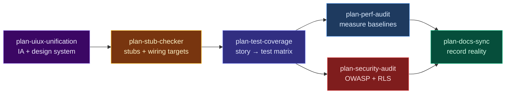

# Planning Skills — Link & Chain Guide

The `plan-*` skills are **audit-and-plan-only**: they produce burndowns and phased roadmaps.
Nothing ships until you approve. After approval, use the execution skills listed under each phase.

## The six-skill plan loop



### Order and why

| Step | Skill | What it plans | Run after |
|------|-------|---------------|-----------|
| 1 | `plan-uiux-unification` | IA, design-system drift, UI burndown | Onboarding or before a UI sweep |
| 2 | `plan-stub-checker` | Dead buttons, fake data, unwired handlers | UI plan or when "nothing works" |
| 3 | `plan-test-coverage` | Story→test matrix, fake-green, gaps | **Stub wiring approved** — lock behavior in tests |
| 4a | `plan-perf-audit` | Measured perf burndown (web/RN/API/DB) | Parallel with 4b after tests are specced |
| 4b | `plan-security-audit` | OWASP + Supabase RLS-first | Parallel with 4a |
| 5 | `plan-docs-sync` | Docs vs code drift | **Last** — docs describe shipped reality |

`plan-perf-audit` and `plan-security-audit` can run in parallel (different lenses, no ordering dependency).

## Execute after approval

| Plan skill | Execution skills |
|------------|------------------|
| `plan-uiux-unification` | `enhance-web-ux`, `enhance-web-ui`, `audit-accessibility` |
| `plan-stub-checker` | `debug-fe-be-integration`, `workflow-fix-and-ship` |
| `plan-test-coverage` | `test-unit`, `workflow-spec-tdd`, `test-playwright` |
| `plan-perf-audit` | `audit-performance`, `audit-bundle-size`, `backend-db-performance`, `mobile-rn-performance` |
| `plan-security-audit` | `audit-security`, `audit-db-schema` |
| `plan-docs-sync` | `docs-writer`, `workflow-housekeep` |

**Verify every execution phase:** `test-playwright` (live user paths) + `deploy-verify` (prod smoke).

## Slash aliases (CATALOG)

| Alias | Skill |
|-------|-------|
| `/uiux-plan` | `plan-uiux-unification` |
| `/stub-plan` | `plan-stub-checker` |
| `/test-plan` | `plan-test-coverage` |
| `/perf-plan` | `plan-perf-audit` |
| `/security-plan` | `plan-security-audit` |
| `/docs-plan` | `plan-docs-sync` |

## Copy-paste prompts

### Full six-skill loop (one message, plan only)

```
Run the full plan loop — audit only, no code/doc/test changes until I approve each phase:

1. plan-uiux-unification — IA + design-system burndown
2. plan-stub-checker — stubs, dead buttons, unwired handlers
3. plan-test-coverage — user stories from code, traceability matrix, fake-green scan
4. plan-perf-audit + plan-security-audit in parallel — measured perf + OWASP/RLS
5. plan-docs-sync — docs drift vs code (last)

Deliver one consolidated report with phased burndowns. Stop after planning.
```

### After stub wiring (lock-in step)

```
plan-stub-checker wiring is approved. Run plan-test-coverage: derive user stories from
code, build traceability matrix, find fake-green tests, burndown critical uncovered
flows including the stubs we just wired. Plan only — no new tests yet.
```

### Single skill

```
Use plan-test-coverage on this repo. Stories from real routes/handlers, traceability
matrix, multi-lens coverage (not just line %), fake-green detection. Plan only.
```

## Plan with a strong model, execute with the rule on

These `plan-*` skills are designed for a **two-model workflow**:

1. **Plan** — author and review the `plan-*.md` burndown with a stronger reasoning model (e.g. Opus 4.8). Planning is where architecture and scope decisions live.
2. **Execute** — hand the approved plan to Composer 2.5 for implementation, one burndown item at a time.

The execution handoff is governed by **`composer-2.5-execution.mdc`** (`alwaysApply: true` — it rides along automatically on every Composer run). It is tuned to Composer 2.5's known failure modes:

- **Anti-reward-hacking** — satisfy intent, never narrow/skip/`.only` tests or silence errors to go green
- **Anti-feature-deletion** — never simplify away working code/routes/props to pass checks
- **Checkpointing** — one unit at a time, stop at phase boundaries for review
- **Context + terminal discipline** — per-surface loading; dry-run destructive commands
- **STOP-and-ask** — auth, RLS, secrets, payments, migrations → consider routing back to the stronger model rather than executing directly

> The plan says **what** to do; the rule constrains **how** Composer is allowed to do it. They are two layers — keep both.

## Preservation contract (all plan skills)

Every `plan-*` skill shares the same discipline:

- **No removal** of features, tests, or docs without explicit approval proposal
- **No fabrication** — cite path:line; use `[NEEDS RUN]`, `[NEEDS VERIFICATION]`, `[NEEDS REAL TARGET]`, `[NEEDS PRODUCT INPUT]` when unknown
- **Plan only** — proposals with risk column and "what must keep working"
- **Approve then execute** — chain to execution skills above

## Related loops

| Loop | Entry | Use when |
|------|-------|----------|
| **Six-skill plan** | `plan-uiux-unification` | Inherited codebase, pre-launch hardening |
| `workflow-quality-gate` | `test-red-team` | Ship/no-ship verdict with fixes |
| `workflow-launch-ready` | SEO + PWA + … | Launch week |
| Core iterate | `/research` → audits → `/plan` → TDD | General improvement |

See [README — Skill Chaining](https://github.com/kensaurus/cursor-kenji#skill-chaining----improve--iterate-any-repo) for more recipes.
