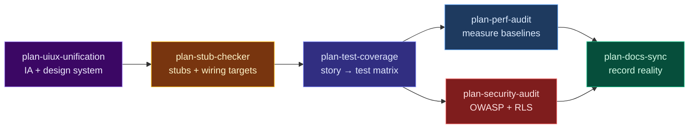

# Planning Skills — Link & Chain Guide

The `plan-*` skills are **audit-and-plan-only**: they produce burndowns and phased roadmaps.
Nothing ships until you approve. After approval, use the execution skills listed under each phase.

## The six-skill plan loop



### Order and why

| Step | Skill | What it plans | Run after |
|------|-------|---------------|-----------|
| 1 | `plan-uiux-unification` | IA, design-system drift, UI burndown | Onboarding or before a UI sweep |
| 1b | `plan-antislop` *(optional)* | AI slop across prose, visual, code, structure | After UI plan or pre-launch authenticity pass |
| 2 | `plan-stub-checker` | Dead buttons, fake data, unwired handlers | UI plan or when "nothing works" |
| 3 | `plan-test-coverage` | Story→test matrix, fake-green, gaps | **Stub wiring approved** — lock behavior in tests |
| 4a | `plan-perf-audit` | Measured perf burndown (web/RN/API/DB) | Parallel with 4b after tests are specced |
| 4b | `plan-security-audit` | OWASP + Supabase RLS-first | Parallel with 4a |
| 5 | `plan-docs-sync` | Docs vs code drift | **Last** — docs describe shipped reality |

`plan-perf-audit` and `plan-security-audit` can run in parallel (different lenses, no ordering dependency).

## Execute after approval

| Plan skill | Execution skills |
|------------|------------------|
| `plan-uiux-unification` | `enhance-web-ux`, `enhance-web-ui`, `audit-accessibility` |
| `plan-antislop` | `docs-writer`, `audit-i18n`, `enhance-web-ui`, `enhance-web-ux`, `enhance-web-landing`, `workflow-refactor` |
| `plan-stub-checker` | `debug-fe-be-integration`, `workflow-fix-and-ship` |
| `plan-test-coverage` | `test-unit`, `workflow-spec-tdd`, `test-playwright` |
| `plan-perf-audit` | `audit-performance`, `audit-bundle-size`, `backend-db-performance`, `mobile-rn-performance` |
| `plan-security-audit` | `audit-security`, `audit-db-schema` |
| `plan-docs-sync` | `docs-writer`, `workflow-housekeep` |
| `plan-rls-audit` | `db-migrator`, `backend-patterns`, `backend-db-performance`, `audit-security` |
| `plan-error-handling` | `backend-observability`, `audit-langfuse-llm`, `debug-sentry-monitor` |
| `plan-input-validation` | `backend-patterns`, `backend-error-handling`, `audit-security`, `audit-fe-api` |
| `plan-secrets-audit` | provider dashboards, Vercel/AWS env, `audit-security`, `create-hook` |
| `plan-data-integrity` | `db-migrator`, `backend-patterns`, infra config, `create-hook` |
| `plan-dependency-provenance` | `workflow-housekeep`, `create-hook`, `/update-deps`, `audit-security` |
| `plan-llm-cost-guardrails` | `backend-patterns`, `audit-langfuse-llm`, `backend-observability` |
| `plan-aeo-readiness` | `enhance-web-seo`, `docs-writer`, `enhance-web-landing` |
| `plan-mobile-readiness` | `mobile-capacitor-platform`, `enhance-capacitor-ui`, `plan-stub-checker`, `mobile-emulator-test` |
| `plan-capacitor-hardening` | `mobile-capacitor-platform`, `plan-secrets-audit`, `plan-input-validation`, `mobile-emulator-test` |

**Verify every execution phase:** `test-playwright` (live user paths) + `deploy-verify` (prod smoke).

## Plan skill map (17 skills — pick loops, don't run all at once)

| Group | Skills | When |
|-------|--------|------|
| **Six-skill loop** | uiux → stub → test-coverage → perf ∥ security → docs | Inherited codebase, UI/IA hardening |
| **Authenticity** | `plan-antislop` | "Feels AI-generated" — after UI plan or pre-launch |
| **Pre-launch hardening** | security spine + `plan-dependency-provenance` | Supabase/Stripe apps, vibe-coded repos, pre-open-source |
| **Observability & spend** | `plan-error-handling` + `plan-llm-cost-guardrails` | Sentry/Langfuse gaps, LLM features shipping |
| **Mobile gate** | `plan-capacitor-hardening` + `plan-mobile-readiness` | Capacitor/hybrid pre-store; native-layer security + paperwork |
| **Growth gate** | `plan-aeo-readiness` | AI citation / GEO — run as needed |

## Pre-launch hardening loop (security + supply chain)

Run layers that apply; cross-hand findings (e.g. exposed `service_role` →
`plan-rls-audit`; suspect package → never install to verify).

```
Entry          plan-input-validation
Credentials    plan-secrets-audit
Data access    plan-rls-audit
Blast radius   plan-data-integrity
Supply chain   plan-dependency-provenance
```

Copy-paste (plan only):

```
Run the pre-launch hardening loop — audit only, no changes until I approve each phase:
plan-input-validation → plan-secrets-audit → plan-rls-audit → plan-data-integrity → plan-dependency-provenance
Cross-hand findings between skills. One consolidated report per skill or merged burndown.
Stop after planning.
```

## Security spine (five layers — subset of hardening loop)

Distinct from the six-skill loop — maps to **layers**, not sequence. Run the layers
that apply; cross-hand findings between skills (e.g. exposed `service_role` from
`plan-secrets-audit` → `plan-rls-audit` to assess blast radius).

```
Entry (trust boundaries)     plan-input-validation
Credentials (rotate/relocate) plan-secrets-audit
Data access (RLS)            plan-rls-audit
Blast radius (destructive ops) plan-data-integrity
Observability (silent fails)  plan-error-handling
```

| Layer | Skill | Anchored to |
|-------|-------|-------------|
| Entry | `plan-input-validation` | Happy-path bias, XSS, CVE-2026-41432 webhook forgery |
| Credentials | `plan-secrets-audit` | Moltbook key leak, git-history permanence trap |
| Data access | `plan-rls-audit` | 88% RLS-off apps, CVE-2025-48757 inverted policies |
| Blast radius | `plan-data-integrity` | PocketOS/Railway Apr 2026 — prod + backups deleted in 9s |
| Observability | `plan-error-handling` | ~2× error-handling gaps in AI PRs, Langfuse eval gaps |
| Supply chain | `plan-dependency-provenance` | CSA 2026 slopsquatting — ~20% hallucinated deps, 43% recurring |

## Observability & spend loop

Visibility (`plan-error-handling`) and prevention (`plan-llm-cost-guardrails`) are
complementary — run both for LLM-powered apps.

```
Silent failures / Sentry / Langfuse gaps  →  plan-error-handling
Runaway token spend / no caps / no breaker →  plan-llm-cost-guardrails
```

Cross-hand: forged-webhook quota fraud and prompt-injection cost amplification →
`plan-input-validation`.

Slash aliases: `/error-plan`, `/cost-plan`

## Launch gates (run as needed)

Independent of the six-skill and hardening loops — run when you're about to ship.

| Gate | Skill | Trigger |
|------|-------|---------|
| Capacitor native security | `plan-capacitor-hardening` | WebView, secure storage, OAuth/deep links, OTA, cleartext |
| App Store / Play | `plan-mobile-readiness` | Pre-submission, privacy manifest, 2.5.2 thin-app |
| AI citation / GEO | `plan-aeo-readiness` | "Do ChatGPT/Perplexity cite me?", llms.txt, crawler block |

**Capacitor hybrid apps:** run `plan-capacitor-hardening` **before** `plan-mobile-readiness` — native-layer gaps are invisible to web-only review.

Copy-paste (mobile gate, plan only):

```
Run the mobile gate — audit only, no native/config changes until I approve each phase:
plan-capacitor-hardening → plan-mobile-readiness
Cross-hand: bundle secrets → plan-secrets-audit; deep-link input → plan-input-validation.
Stop after planning.
```

Slash aliases: `/capacitor-plan`, `/mobile-plan`, `/aeo-plan`

## Slash aliases (CATALOG)

| Alias | Skill |
|-------|-------|
| `/uiux-plan` | `plan-uiux-unification` |
| `/slop-plan` | `plan-antislop` |
| `/rls-plan` | `plan-rls-audit` |
| `/secrets-plan` | `plan-secrets-audit` |
| `/validation-plan` | `plan-input-validation` |
| `/integrity-plan` | `plan-data-integrity` |
| `/error-plan` | `plan-error-handling` |
| `/deps-plan` | `plan-dependency-provenance` |
| `/cost-plan` | `plan-llm-cost-guardrails` |
| `/aeo-plan` | `plan-aeo-readiness` |
| `/mobile-plan` | `plan-mobile-readiness` |
| `/capacitor-plan` | `plan-capacitor-hardening` |
| `/stub-plan` | `plan-stub-checker` |
| `/test-plan` | `plan-test-coverage` |
| `/perf-plan` | `plan-perf-audit` |
| `/security-plan` | `plan-security-audit` |
| `/docs-plan` | `plan-docs-sync` |

## Copy-paste prompts

### Full six-skill loop (one message, plan only)

```
Run the full plan loop — audit only, no code/doc/test changes until I approve each phase:

1. plan-uiux-unification — IA + design-system burndown
2. plan-stub-checker — stubs, dead buttons, unwired handlers
3. plan-test-coverage — user stories from code, traceability matrix, fake-green scan
4. plan-perf-audit + plan-security-audit in parallel — measured perf + OWASP/RLS
5. plan-docs-sync — docs drift vs code (last)

Deliver one consolidated report with phased burndowns. Stop after planning.
```

### After stub wiring (lock-in step)

```
plan-stub-checker wiring is approved. Run plan-test-coverage: derive user stories from
code, build traceability matrix, find fake-green tests, burndown critical uncovered
flows including the stubs we just wired. Plan only — no new tests yet.
```

### Single skill

```
Use plan-test-coverage on this repo. Stories from real routes/handlers, traceability
matrix, multi-lens coverage (not just line %), fake-green detection. Plan only.
```

## Plan with a strong model, execute with the rule on

These `plan-*` skills are designed for a **two-model workflow**:

1. **Plan** — author and review the `plan-*.md` burndown with a stronger reasoning model (e.g. Opus 4.8). Planning is where architecture and scope decisions live.
2. **Execute** — hand the approved plan to Composer 2.5 for implementation, one burndown item at a time.

The execution handoff is governed by **`composer-2.5-execution.mdc`** (`alwaysApply: true` — it rides along automatically on every Composer run). It is tuned to Composer 2.5's known failure modes:

- **Anti-reward-hacking** — satisfy intent, never narrow/skip/`.only` tests or silence errors to go green
- **Anti-feature-deletion** — never simplify away working code/routes/props to pass checks
- **Checkpointing** — one unit at a time, stop at phase boundaries for review
- **Context + terminal discipline** — per-surface loading; dry-run destructive commands
- **STOP-and-ask** — auth, RLS, secrets, payments, migrations → consider routing back to the stronger model rather than executing directly

> The plan says **what** to do; the rule constrains **how** Composer is allowed to do it. They are two layers — keep both.

## Preservation contract (all plan skills)

Every `plan-*` skill shares the same discipline:

- **No removal** of features, tests, or docs without explicit approval proposal
- **No fabrication** — cite path:line; use `[NEEDS RUN]`, `[NEEDS VERIFICATION]`, `[NEEDS REAL TARGET]`, `[NEEDS PRODUCT INPUT]` when unknown
- **Plan only** — proposals with risk column and "what must keep working"
- **Approve then execute** — chain to execution skills above

## Related loops

| Loop | Entry | Use when |
|------|-------|----------|
| **Six-skill plan** | `plan-uiux-unification` | Inherited codebase, UI/IA hardening |
| **Pre-launch hardening** | `plan-input-validation` | Supabase/Stripe, vibe-coded, pre-open-source |
| **Observability & spend** | `plan-error-handling` | Silent failures, LLM cost exposure |
| **Mobile gate** | `plan-capacitor-hardening` / `plan-mobile-readiness` | Capacitor pre-store, native security |
| **Growth gate** | `plan-aeo-readiness` | AI citation |
| `workflow-quality-gate` | `test-red-team` | Ship/no-ship verdict with fixes |
| `workflow-launch-ready` | SEO + PWA + … | Launch week |
| Core iterate | `/research` → audits → `/plan` → TDD | General improvement |

See [README — Skill Chaining](https://github.com/kensaurus/cursor-kenji#skill-chaining----improve--iterate-any-repo) for more recipes.
