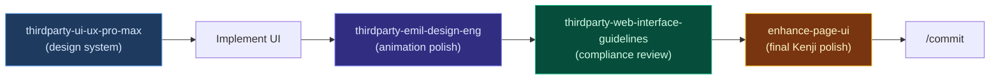

# Third-Party Skills

Upstream-maintained agent skills vendored into cursor_kenji. Each uses the **`thirdparty-`** directory prefix so they are visually distinct from Kenji-curated skills in `lsskills`, README tables, and agent skill lists.

## Current inventory

| Local name | Upstream | License | Requires |
|------------|----------|---------|----------|
| `thirdparty-emil-design-eng` | [emilkowalski/skills](https://github.com/emilkowalski/skills) | See upstream | — |
| `thirdparty-ui-ux-pro-max` | [nextlevelbuilder/ui-ux-pro-max-skill](https://github.com/nextlevelbuilder/ui-ux-pro-max-skill) | MIT | Python 3.x |
| `thirdparty-web-interface-guidelines` | [vercel-labs/web-interface-guidelines](https://github.com/vercel-labs/web-interface-guidelines) | See upstream | — |

Each skill directory contains:

- `SKILL.md` — upstream content + attribution callout and **Source** footer
- `ATTRIBUTION.md` — upstream URL, update policy, local naming rationale

Companion slash command (installed by `./install.sh`):

| Command file | Invoke | Upstream |
|--------------|--------|----------|
| `commands/thirdparty-web-interface-guidelines.md` | `/thirdparty-web-interface-guidelines <file>` | [Vercel Web Interface Guidelines](https://vercel.com/design/guidelines) |

## How they install

`./install.sh` copies all `skills/*/` to `~/.cursor/skills/`, syncs to `~/.agents/skills/`, and installs commands to `~/.cursor/commands/` — including the three `thirdparty-*` skills and `/thirdparty-web-interface-guidelines`.

`./install.sh` copies all `skills/*/` to `~/.cursor/skills/` and reports:

```text
[+] Installed 106 skills to ~/.cursor/skills
[+] Third-party skills: 3 (prefixed thirdparty-*)
[+] Installed 15 commands to ~/.cursor/commands
```

Third-party skills ship in the same pipeline as Kenji-curated skills — no separate install step.

## Usage examples

### Emil design engineering

Natural language:

```text
Review this dropdown animation using thirdparty-emil-design-eng
```

Expect Before/After markdown tables when reviewing UI code.

### UI UX Pro Max — design system generator

```bash
python3 ~/.cursor/skills/thirdparty-ui-ux-pro-max/scripts/search.py \
  "SaaS dashboard fintech" --design-system -p "MyApp"
```

Natural language:

```text
Build a landing page for a wellness spa using thirdparty-ui-ux-pro-max
```

### Vercel Web Interface Guidelines

Skill (auto-trigger): mention "Vercel guidelines" or "web interface guidelines".

Slash command:

```text
/thirdparty-web-interface-guidelines src/components/Button.tsx
```

## Recommended UI pipeline

Combine Kenji-curated and third-party skills:



Alternative audit-first path:

`audit-ux` → `enhance-page-ux` → `thirdparty-emil-design-eng` → `thirdparty-web-interface-guidelines`

## Adding a new third-party skill

1. Create `skills/thirdparty-<short-name>/`
2. Add `SKILL.md` with:
   - `name: thirdparty-<short-name>` in frontmatter
   - `description` starting with "Third-party skill — …"
   - Callout: `> **Third-party skill** (upstream-maintained)`
   - **Source** footer with upstream link
3. Add `ATTRIBUTION.md` (see existing examples)
4. Update `docs/CATALOG.md`, `docs/THIRD-PARTY-SKILLS.md`, README third-party table
5. Run `./install.sh` and verify with `lsskills`

**Do not** add Kenji "Check Existing First" sections to upstream skill bodies.

## Updating from upstream

### thirdparty-emil-design-eng

```bash
curl -fsSL \
  "https://raw.githubusercontent.com/emilkowalski/skills/main/skills/emil-design-eng/SKILL.md" \
  -o /tmp/emil-SKILL.md
# Merge into skills/thirdparty-emil-design-eng/SKILL.md — preserve prefix, callout, footer
```

### thirdparty-ui-ux-pro-max

```bash
tmpdir=$(mktemp -d) && cd "$tmpdir"
npx uipro-cli@latest init --ai cursor
rsync -a --exclude __pycache__ \
  .cursor/skills/ui-ux-pro-max/data \
  .cursor/skills/ui-ux-pro-max/scripts \
  ~/cursor_kenji/skills/thirdparty-ui-ux-pro-max/
# Merge SKILL.md; fix paths to thirdparty-ui-ux-pro-max
```

### thirdparty-web-interface-guidelines

```bash
curl -fsSL \
  "https://raw.githubusercontent.com/vercel-labs/web-interface-guidelines/main/command.md" \
  -o /tmp/vercel-guidelines.md
# Update SKILL.md body and commands/thirdparty-web-interface-guidelines.md
```

After any update: `./install.sh`, restart Cursor, smoke-test one trigger per skill.

## Naming rationale

| Without prefix | Problem |
|----------------|---------|
| `emil-design-eng` | Looks Kenji-authored; hard to know update source |
| `ui-ux-pro-max` | Collides with upstream docs/tooling names |
| `web-interface-guidelines` | Same as Vercel's official command name |

The `thirdparty-` prefix makes ownership and update responsibility obvious in file trees, `lsskills` output, and agent skill pickers.
